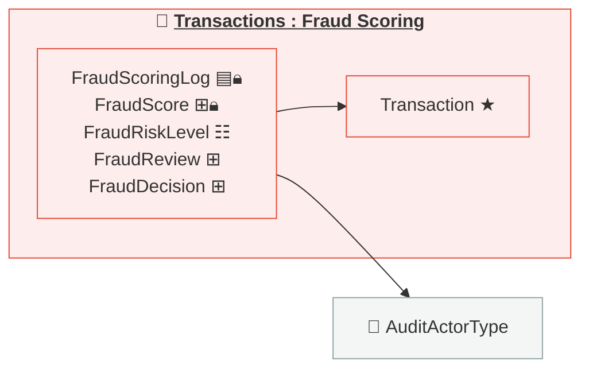

```mermaid
flowchart LR
	subgraph TRANSACTION_DOMAIN["<b>🔴&nbsp;<u>Transactions : Fraud Scoring</u></b>"]
		direction LR
		T_TRANSACTION_SUBDOMAIN["Transaction&nbsp;★"]
		
		T_FRAUD_SUBDOMAIN["FraudScoringLog&nbsp;▤🔒︎︎<br/>FraudScore&nbsp;⊞🔒︎︎<br/>FraudRiskLevel&nbsp;☷<br/>FraudReview&nbsp;⊞<br/>FraudDecision&nbsp;⊞"]
	end
	
	ACTOR_MIRROR_S["🔘&nbsp;AuditActorType"]

    T_FRAUD_SUBDOMAIN --> ACTOR_MIRROR_S
    T_FRAUD_SUBDOMAIN --> T_TRANSACTION_SUBDOMAIN
    
    style ACTOR_MIRROR_S fill:#F4F6F6,stroke:#95A5A6,stroke-width:1px
    style TRANSACTION_DOMAIN fill:#FDEDEC,stroke:#E74C3C,stroke-width:1px
    style T_TRANSACTION_SUBDOMAIN fill:#FDEDEC,stroke:#E74C3C,stroke-width:1px
    style T_FRAUD_SUBDOMAIN fill:#FDEDEC,stroke:#E74C3C,stroke-width:1px
```