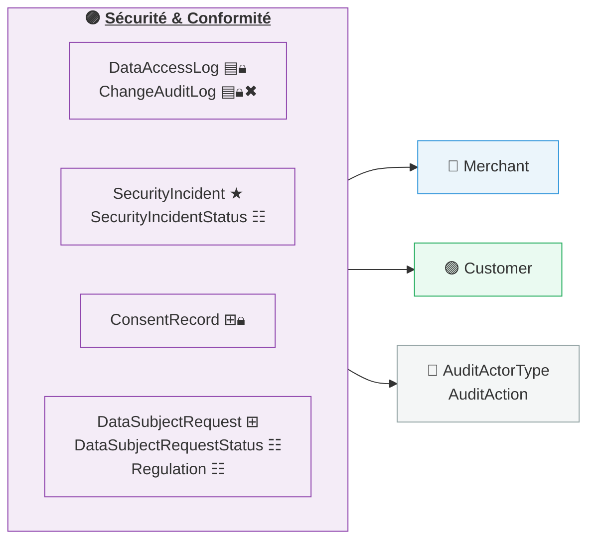

```mermaid
flowchart LR
	subgraph SECREG_DOMAIN["<b>🟣&nbsp;<u>Sécurité&nbsp;&amp;&nbsp;Conformité</u></b>"]
		direction LR
		S_LOGS_SUBDOMAIN["DataAccessLog&nbsp;▤🔒︎︎<br/>ChangeAuditLog&nbsp;▤🔒︎︎︎✖"]
    S_SECURITY_SUBDOMAIN["SecurityIncident&nbsp;★<br/>SecurityIncidentStatus&nbsp;☷"]
		S_CONSENT_SUBDOMAIN["ConsentRecord&nbsp;⊞🔒︎︎"]
		S_DATASUBJECT_SUBDOMAIN["DataSubjectRequest&nbsp;⊞<br/>DataSubjectRequestStatus&nbsp;☷<br/>Regulation&nbsp;☷"]
	end
 	
	MERCHANT_MIRROR_S["🔵&nbsp;Merchant"]
	CUSTOMER_MIRROR_S["🟢&nbsp;Customer"]
	ACTOR_MIRROR_S["🔘&nbsp;AuditActorType<br/>AuditAction"]
	
    SECREG_DOMAIN --> MERCHANT_MIRROR_S & CUSTOMER_MIRROR_S
    SECREG_DOMAIN --> ACTOR_MIRROR_S
    
    style MERCHANT_MIRROR_S fill:#EBF5FB,stroke:#3498DB,stroke-width:1px
    style CUSTOMER_MIRROR_S fill:#EAFAF1,stroke:#27AE60,stroke-width:1px
    style ACTOR_MIRROR_S fill:#F4F6F6,stroke:#95A5A6,stroke-width:1px
    
    style SECREG_DOMAIN fill:#F4ECF7,stroke:#8E44AD,stroke-width:1px
    style S_LOGS_SUBDOMAIN fill:#F4ECF7,stroke:#8E44AD,stroke-width:1px
    style S_DATASUBJECT_SUBDOMAIN fill:#F4ECF7,stroke:#8E44AD,stroke-width:1px
    style S_CONSENT_SUBDOMAIN fill:#F4ECF7,stroke:#8E44AD,stroke-width:1px
    style S_SECURITY_SUBDOMAIN fill:#F4ECF7,stroke:#8E44AD,stroke-width:1px
    
```