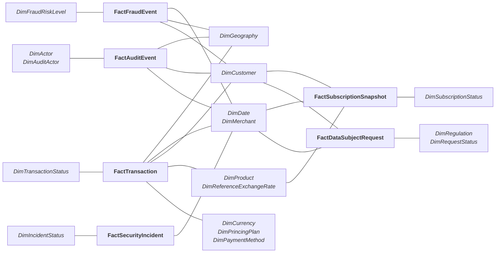

```mermaid
flowchart LR
	FACT_TRANSACTION["<b>FactTransaction</b>"]
	DIM_TRANSACTION_STATUS["<i>DimTransactionStatus</i>"]  

	FACT_SUBSCRIPTION_SNAPSHOT["<b>FactSubscriptionSnapshot</b>"]
	DIM_SUBSCRIPTION_STATUS["<i>DimSubscriptionStatus</i>"]
		
	DIM_CUSTOMER["<i>DimCustomer</i>"]
	DIM_GEOGRAPHY["<i>DimGeography</i>"]
	
	DIMS_EVENT["<i>DimDate</i><br/><i>DimMerchant</i>"]
	DIMS_PRODUCT["<i>DimProduct</i><br/><i>DimReferenceExchangeRate</i>"]
	DIMS_PAYMENT["<i>DimCurrency</i><br/><i>DimPrincingPlan</i><br/><i>DimPaymentMethod</i>"]
	
	FACT_FRAUD_EVENT["<b>FactFraudEvent</b>"]
	DIM_FRAUD_RISK_LEVEL["<i>DimFraudRiskLevel</i>"]
	
	FACT_AUDIT_EVENT["<b>FactAuditEvent</b>"]

	FACT_DATA_SUBJECT_REQUEST["<b>FactDataSubjectRequest</b>"]
	DIMS_REQUEST["<i>DimRegulation</i><br/><i>DimRequestStatus</i>"]
	
	FACT_SECURITY_INCIDENT["<b>FactSecurityIncident</b>"]
	DIM_INCIDENT_STATUS["<i>DimIncidentStatus</i>"]
	DIMS_AUDIT["<i>DimActor</i><br/><i>DimAuditActor</i>"]
	
    FACT_TRANSACTION --- DIM_GEOGRAPHY
    
    DIM_TRANSACTION_STATUS --- FACT_TRANSACTION
    
    FACT_TRANSACTION --- DIMS_EVENT
    FACT_TRANSACTION --- DIM_CUSTOMER 
    FACT_TRANSACTION --- DIMS_PRODUCT 
    FACT_TRANSACTION --- DIMS_PAYMENT
    
    DIMS_EVENT --- FACT_SUBSCRIPTION_SNAPSHOT
    
    FACT_SUBSCRIPTION_SNAPSHOT --- DIM_SUBSCRIPTION_STATUS
    
    DIM_CUSTOMER --- FACT_SUBSCRIPTION_SNAPSHOT
    DIMS_PRODUCT  --- FACT_SUBSCRIPTION_SNAPSHOT
    
    DIM_FRAUD_RISK_LEVEL --- FACT_FRAUD_EVENT
    
    FACT_FRAUD_EVENT --- DIMS_EVENT
    FACT_FRAUD_EVENT --- DIM_GEOGRAPHY
    FACT_FRAUD_EVENT --- DIM_CUSTOMER
    
    FACT_AUDIT_EVENT --- DIM_GEOGRAPHY
    
    DIMS_AUDIT --- FACT_AUDIT_EVENT
    
    FACT_DATA_SUBJECT_REQUEST --- DIMS_REQUEST
    
    FACT_AUDIT_EVENT --- DIM_CUSTOMER
    DIM_CUSTOMER --- FACT_DATA_SUBJECT_REQUEST
    
    FACT_AUDIT_EVENT --- DIMS_EVENT
    DIMS_EVENT --- FACT_DATA_SUBJECT_REQUEST
    
    FACT_SECURITY_INCIDENT --- DIMS_EVENT
    DIM_INCIDENT_STATUS --- FACT_SECURITY_INCIDENT
```
