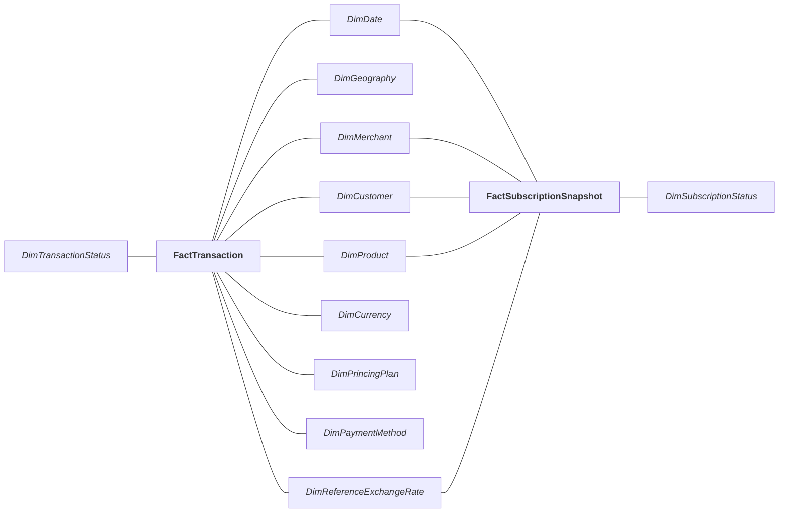

```mermaid
flowchart LR
	FACT_TRANSACTION["<b>FactTransaction</b>"]
	DIM_TRANSACTION_STATUS["<i>DimTransactionStatus</i>"]  

	FACT_SUBSCRIPTION_SNAPSHOT["<b>FactSubscriptionSnapshot</b>"]
	DIM_SUBSCRIPTION_STATUS["<i>DimSubscriptionStatus</i>"]
	
	DIM_DATE["<i>DimDate</i>"]
	DIM_GEOGRAPHY["<i>DimGeography</i>"]
	
	DIM_CUSTOMER["<i>DimCustomer</i>"]
	DIM_MERCHANT["<i>DimMerchant</i>"]
	DIM_PRODUCT["<i>DimProduct</i>"]

	DIM_CURRENCY["<i>DimCurrency</i>"]
	DIM_PRICING_PLAN["<i>DimPrincingPlan</i>"]
	DIM_PAYMENT_METHOD["<i>DimPaymentMethod</i>"]
	DIM_REFERENCE_EXCHANGE_RATE["<i>DimReferenceExchangeRate</i>"]
	
    FACT_TRANSACTION --- DIM_GEOGRAPHY
    FACT_TRANSACTION --- DIM_DATE
    
    DIM_TRANSACTION_STATUS --- FACT_TRANSACTION
    
    FACT_TRANSACTION --- DIM_MERCHANT 
    FACT_TRANSACTION --- DIM_CUSTOMER 
    FACT_TRANSACTION --- DIM_PRODUCT 
    
    FACT_TRANSACTION --- DIM_CURRENCY
    FACT_TRANSACTION --- DIM_PRICING_PLAN
    FACT_TRANSACTION --- DIM_PAYMENT_METHOD
    FACT_TRANSACTION --- DIM_REFERENCE_EXCHANGE_RATE
    
    DIM_DATE --- FACT_SUBSCRIPTION_SNAPSHOT
    
    FACT_SUBSCRIPTION_SNAPSHOT --- DIM_SUBSCRIPTION_STATUS
    
    DIM_MERCHANT --- FACT_SUBSCRIPTION_SNAPSHOT
    DIM_CUSTOMER --- FACT_SUBSCRIPTION_SNAPSHOT
    DIM_PRODUCT --- FACT_SUBSCRIPTION_SNAPSHOT
    
    DIM_REFERENCE_EXCHANGE_RATE --- FACT_SUBSCRIPTION_SNAPSHOT
```
