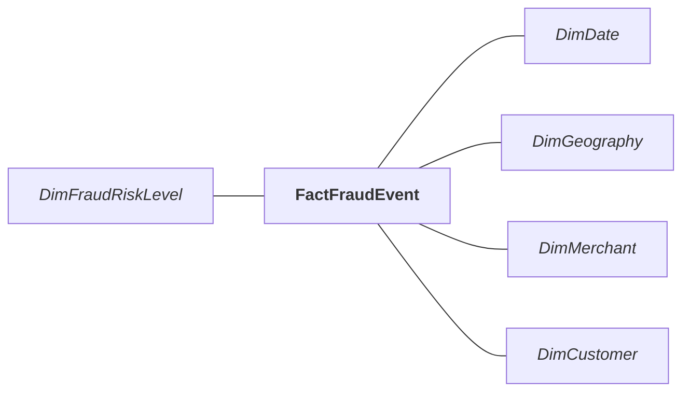

```mermaid
flowchart LR
	FACT_FRAUD_EVENT["<b>FactFraudEvent</b>"]
	DIM_FRAUD_RISK_LEVEL["<i>DimFraudRiskLevel</i>"]
	
	DIM_DATE["<i>DimDate</i>"]
	DIM_GEOGRAPHY["<i>DimGeography</i>"]
	
	DIM_CUSTOMER["<i>DimCustomer</i>"]
	DIM_MERCHANT["<i>DimMerchant</i>"]
	
    DIM_FRAUD_RISK_LEVEL --- FACT_FRAUD_EVENT
    
    FACT_FRAUD_EVENT --- DIM_DATE
    FACT_FRAUD_EVENT --- DIM_GEOGRAPHY
    FACT_FRAUD_EVENT --- DIM_MERCHANT
    FACT_FRAUD_EVENT --- DIM_CUSTOMER
```
