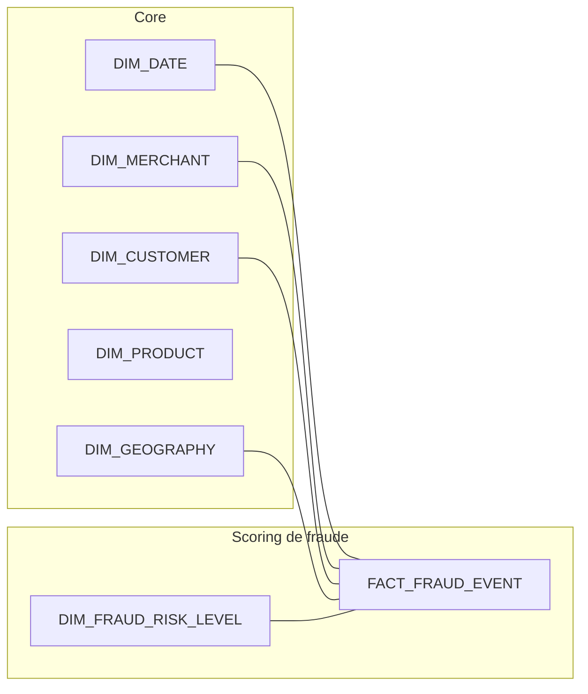

```mermaid
flowchart LR
    subgraph CORE["Core"]
        DIM_DATE
        DIM_MERCHANT
        DIM_CUSTOMER
        DIM_PRODUCT
        DIM_GEOGRAPHY
    end 

    subgraph FRAUD["Scoring de fraude"]
        FACT_FRAUD_EVENT
        DIM_FRAUD_RISK_LEVEL
    end 
    
    DIM_DATE --- FACT_FRAUD_EVENT
    DIM_MERCHANT --- FACT_FRAUD_EVENT
    DIM_CUSTOMER --- FACT_FRAUD_EVENT
    DIM_GEOGRAPHY --- FACT_FRAUD_EVENT
    DIM_FRAUD_RISK_LEVEL --- FACT_FRAUD_EVENT
```
