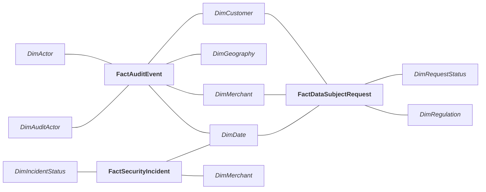

```mermaid
flowchart LR
	FACT_AUDIT_EVENT["<b>FactAuditEvent</b>"]

	FACT_DATA_SUBJECT_REQUEST["<b>FactDataSubjectRequest</b>"]
	DIM_REGULATION["<i>DimRegulation</i>"]
	DIM_REQUEST_STATUS["<i>DimRequestStatus</i>"]
	
	FACT_SECURITY_INCIDENT["<b>FactSecurityIncident</b>"]
	DIM_INCIDENT_STATUS["<i>DimIncidentStatus</i>"]
	
	DIM_ACTOR["<i>DimActor</i>"]
	DIM_AUDIT_ACTION["<i>DimAuditActor</i>"]
	
	DIM_DATE["<i>DimDate</i>"]
	DIM_GEOGRAPHY["<i>DimGeography</i>"]
	
	DIM_CUSTOMER["<i>DimCustomer</i>"]
	DIM_MERCHANT["<i>DimMerchant</i>"]
	DIM_MERCHANT2["<i>DimMerchant</i></i>"]
	
    FACT_AUDIT_EVENT --- DIM_GEOGRAPHY
    
    DIM_ACTOR --- FACT_AUDIT_EVENT
    DIM_AUDIT_ACTION --- FACT_AUDIT_EVENT
    
    FACT_DATA_SUBJECT_REQUEST --- DIM_REQUEST_STATUS
    FACT_DATA_SUBJECT_REQUEST --- DIM_REGULATION
    
    FACT_AUDIT_EVENT --- DIM_CUSTOMER
    DIM_CUSTOMER --- FACT_DATA_SUBJECT_REQUEST
    
    FACT_AUDIT_EVENT --- DIM_MERCHANT
    DIM_MERCHANT --- FACT_DATA_SUBJECT_REQUEST
    
    FACT_AUDIT_EVENT --- DIM_DATE
    DIM_DATE --- FACT_DATA_SUBJECT_REQUEST
    
    FACT_SECURITY_INCIDENT --- DIM_DATE
    FACT_SECURITY_INCIDENT --- DIM_MERCHANT2
    DIM_INCIDENT_STATUS --- FACT_SECURITY_INCIDENT
```
