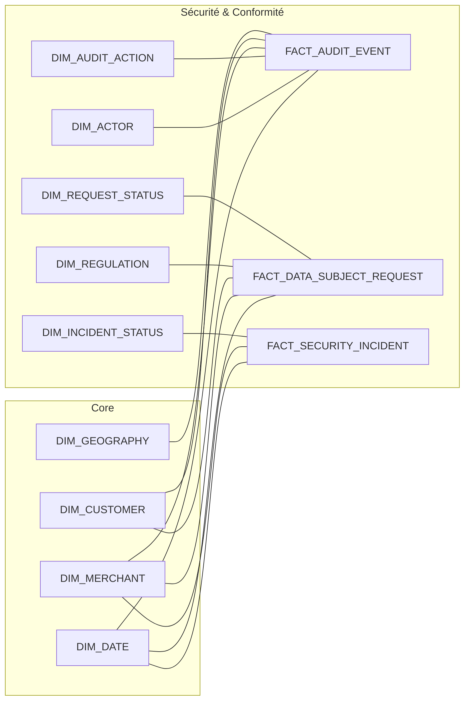

```mermaid
flowchart LR
    subgraph CORE["Core"]
        DIM_DATE
        DIM_MERCHANT
        DIM_CUSTOMER
        DIM_GEOGRAPHY
    end
    
    subgraph SECURITY["Sécurité & Conformité"]
        FACT_AUDIT_EVENT
        FACT_DATA_SUBJECT_REQUEST
        FACT_SECURITY_INCIDENT
        DIM_ACTOR
        DIM_AUDIT_ACTION
        DIM_REGULATION
        DIM_REQUEST_STATUS
        DIM_INCIDENT_STATUS
    end

    DIM_DATE --- FACT_AUDIT_EVENT
    DIM_ACTOR --- FACT_AUDIT_EVENT
    DIM_AUDIT_ACTION --- FACT_AUDIT_EVENT
    DIM_MERCHANT --- FACT_AUDIT_EVENT
    DIM_CUSTOMER --- FACT_AUDIT_EVENT
    DIM_GEOGRAPHY --- FACT_AUDIT_EVENT

    DIM_DATE --- FACT_SECURITY_INCIDENT
    DIM_MERCHANT --- FACT_SECURITY_INCIDENT
    DIM_INCIDENT_STATUS --- FACT_SECURITY_INCIDENT

    DIM_DATE --- FACT_DATA_SUBJECT_REQUEST
    DIM_MERCHANT --- FACT_DATA_SUBJECT_REQUEST
    DIM_CUSTOMER --- FACT_DATA_SUBJECT_REQUEST
    DIM_REGULATION --- FACT_DATA_SUBJECT_REQUEST
    DIM_REQUEST_STATUS --- FACT_DATA_SUBJECT_REQUEST
```
