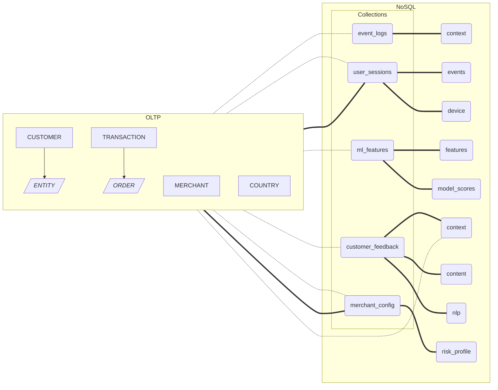

```mermaid
flowchart LR
    subgraph OLTP["OLTP"]
        TRANSACTION
        MERCHANT
        CUSTOMER
        COUNTRY
        ENTITY[/"<i>ENTITY</i>"/]
        ORDER[/"<i>ORDER</i>"/]
    end 
    subgraph NOSQL["NoSQL"]
	    subgraph COLLS["Collections"]
	        C_EVENT_LOGS("event_logs")
			C_USER_SESSIONS("user_sessions")
            C_ML_FEATURES("ml_features")
            C_CUSTOMER_FEEDBACK("customer_feedback")
            C_MERCHANT_CONFIG("merchant_config")
	    end
	    C_EL_CONTEXT("context")
		C_US_EVENTS("events")
		C_US_DEVICE("device")
        C_MLF_FEATURES("features")
        C_MLF_SCORES("model_scores")
		C_CF_CONTEXT("context")
		C_CF_CONTENT("content")
		C_CF_NLP("nlp")
	    C_MC_RISK("risk_profile")
    end

    CUSTOMER --> ENTITY  
    TRANSACTION --> ORDER  

	OLTP -.- C_EVENT_LOGS
    OLTP -.- C_USER_SESSIONS
    OLTP === C_USER_SESSIONS
    OLTP -.- C_ML_FEATURES
    OLTP -.- C_CF_CONTEXT
    OLTP -.- C_CUSTOMER_FEEDBACK
    OLTP -.- C_MERCHANT_CONFIG
    OLTP === C_MERCHANT_CONFIG
    
    C_EVENT_LOGS === C_EL_CONTEXT
    C_USER_SESSIONS === C_US_DEVICE
    C_USER_SESSIONS === C_US_EVENTS
    
    C_ML_FEATURES === C_MLF_FEATURES
    C_ML_FEATURES === C_MLF_SCORES
    
    C_CUSTOMER_FEEDBACK === C_CF_CONTEXT
    C_CUSTOMER_FEEDBACK === C_CF_CONTENT
    C_CUSTOMER_FEEDBACK === C_CF_NLP
    
    C_MERCHANT_CONFIG === C_MC_RISK
```