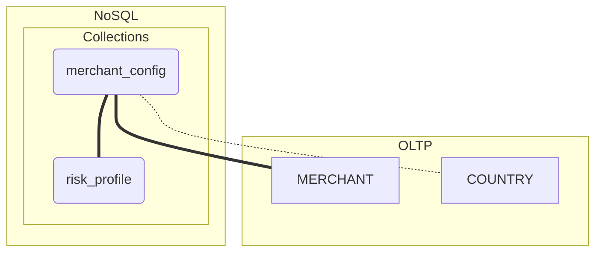

```mermaid
flowchart TB
    subgraph OLTP["OLTP"]
        MERCHANT
        COUNTRY
    end 

    subgraph NOSQL["NoSQL"]
        subgraph COLLECTIONS["Collections"]
            C_MERCHANT_CONFIG("merchant_config")
	        C_MC_RISK("risk_profile")
        end
    end

    C_MERCHANT_CONFIG === C_MC_RISK
    C_MERCHANT_CONFIG === MERCHANT
    C_MERCHANT_CONFIG -.- COUNTRY
```