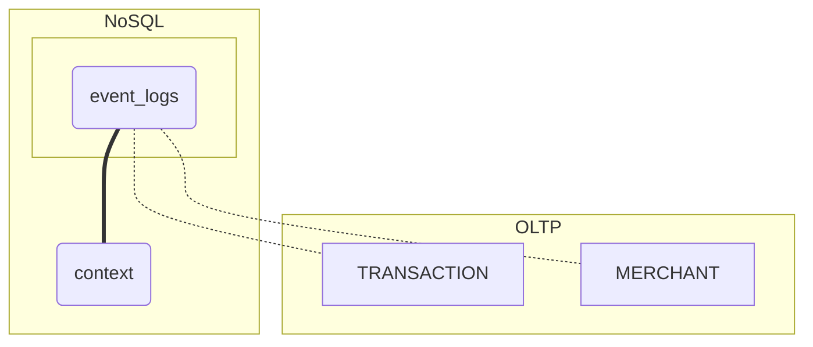

```mermaid
flowchart TB
    subgraph OLTP["OLTP"]
        TRANSACTION
        MERCHANT
    end 
    subgraph NOSQL["NoSQL"]
	    subgraph COLLS[" "]
	        C_EVENT_LOGS("event_logs")
	    end
	    C_EL_CONTEXT("context")
    end
    
    C_EVENT_LOGS === C_EL_CONTEXT
    C_EVENT_LOGS -.- TRANSACTION
    C_EVENT_LOGS -.- MERCHANT
```