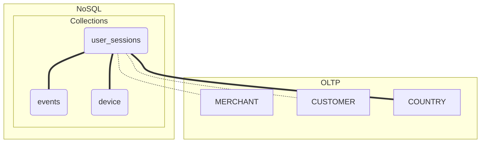

```mermaid
flowchart TB
    subgraph OLTP["OLTP"]
        MERCHANT
        CUSTOMER
        COUNTRY
    end 

    subgraph NOSQL["NoSQL"]
        subgraph COLLECTIONS["Collections"]
            C_USER_SESSIONS("user_sessions")
            C_US_EVENTS("events")
            C_US_DEVICE("device")
        end
    end

    C_USER_SESSIONS -.- CUSTOMER
    C_USER_SESSIONS -.- MERCHANT
    C_USER_SESSIONS === COUNTRY
    C_USER_SESSIONS === C_US_DEVICE
    C_USER_SESSIONS === C_US_EVENTS
```