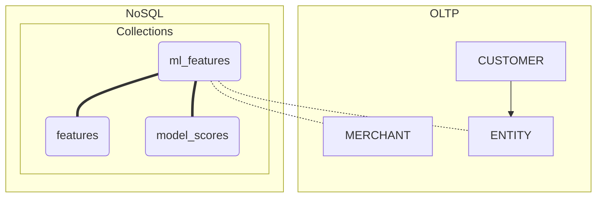

```mermaid
flowchart TB
    subgraph OLTP["OLTP"]
        MERCHANT
        CUSTOMER
        ENTITY
    end 

    subgraph NOSQL["NoSQL"]
        subgraph COLLECTIONS["Collections"]
            C_ML_FEATURES("ml_features")
            C_MLF_FEATURES("features")
            C_MLF_SCORES("model_scores")
        end

    end

    C_ML_FEATURES === C_MLF_FEATURES
    C_ML_FEATURES === C_MLF_SCORES
    
    CUSTOMER --> ENTITY  
    C_ML_FEATURES -.- ENTITY
    C_ML_FEATURES -.- MERCHANT
```