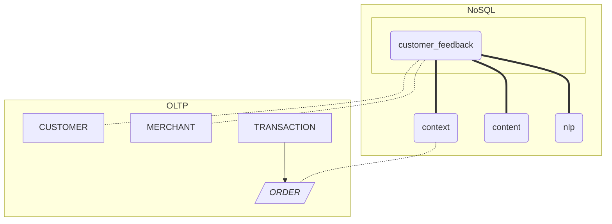

```mermaid
flowchart TB
    subgraph OLTP["OLTP"]
        CUSTOMER
        MERCHANT
        ORDER[/"<i>ORDER</i>"/]
        TRANSACTION
    end 
    subgraph NOSQL["NoSQL"]
        subgraph COLLS[" "]
            C_CUSTOMER_FEEDBACK("customer_feedback")
        end
		C_CF_CONTEXT("context")
		C_CF_CONTENT("content")
		C_CF_NLP("nlp")
    end

    TRANSACTION --> ORDER  

    C_CF_CONTEXT -.- ORDER
    C_CUSTOMER_FEEDBACK === C_CF_CONTEXT
    C_CUSTOMER_FEEDBACK === C_CF_CONTENT
    C_CUSTOMER_FEEDBACK === C_CF_NLP
    C_CUSTOMER_FEEDBACK -.- CUSTOMER
    C_CUSTOMER_FEEDBACK -.- MERCHANT
```