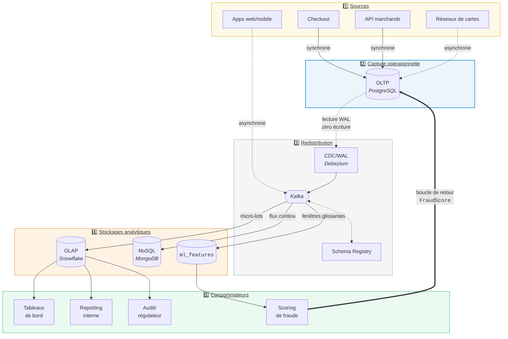

```mermaid
flowchart TB
    subgraph L1_SOURCES["1️⃣ <u>Sources</u>"]
        CHECKOUT["Checkout"]
        MERCH_API["API marchands"]
        APPS["Apps web/mobile"]
        NETWORKS["Réseaux de cartes"]
    end

    subgraph L2_OLTP["2️⃣ <u>Capture opérationnelle</u>"]
        OLTP[("OLTP<br/><i>PostgreSQL</i>")]
    end

    subgraph L3_BUS["3️⃣ <u>Redistribution</u>"]
        CDC["CDC/WAL<br/><i>Debezium</i>"]
        KAFKA{{"<i>Kafka</i>"}}
        REGISTRY["Schema Registry"]
    end

    subgraph L4_OLAP["4️⃣ <u>Stockages analytiques</u>"]
        OLAPSTORE[("OLAP<br/><i>Snowflake</i>")]
        NOSQLSTORE[("NoSQL<br/><i>MongoDB</i>")]
        FEATURESTORE[("<code>ml_features</code>")]
    end

    subgraph L5_CONSUMERS["5️⃣ <u>Consommateurs</u>"]
        DASH["Tableaux<br/>de bord"]
        REPORT["Reporting<br/>interne"]
        AUDITCONSO["Audit/<br/>régulateur"]
        FRAUDSVC["Scoring<br/>de fraude"]
    end
    
    CHECKOUT -->|synchrone| OLTP
    MERCH_API -->|synchrone| OLTP
    APPS -.->|asynchrone| KAFKA
    NETWORKS -.->|asynchrone| OLTP

    OLTP -.->|"lecture WAL<br/>zéro écriture"| CDC
    CDC --> KAFKA
    KAFKA <-.-> REGISTRY

    KAFKA -->|micro-lots| OLAPSTORE
    KAFKA -->|flux continu| NOSQLSTORE
    KAFKA -->|fenêtres glissantes| FEATURESTORE

    OLAPSTORE --> DASH
    OLAPSTORE --> REPORT
    OLAPSTORE --> AUDITCONSO
    
    FEATURESTORE --> FRAUDSVC
    FRAUDSVC ==>|"boucle de retour<br/><code>FraudScore</code>"| OLTP

    style L1_SOURCES fill:#FEF9E7,stroke:#D4AC0D,stroke-width:1px
    style L2_OLTP fill:#EBF5FB,stroke:#3498DB,stroke-width:2px
    style L3_BUS fill:#F4F6F6,stroke:#95A5A6,stroke-width:1px
    style L4_OLAP fill:#FDF2E3,stroke:#E67E22,stroke-width:1px
    style L5_CONSUMERS fill:#EAFAF1,stroke:#27AE60,stroke-width:1px
```