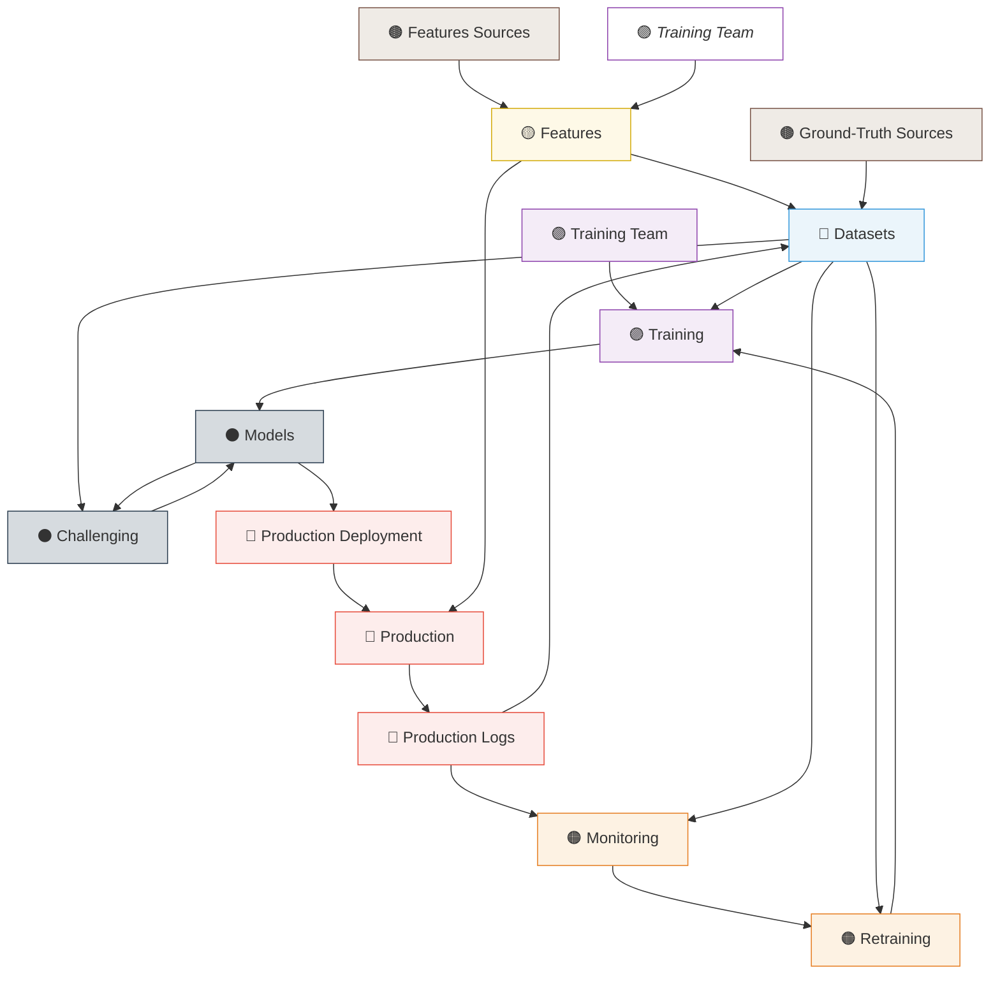

```mermaid
flowchart TB

	FEATURES_SOURCES["🟤 Features Sources"]
	LABELS_SOURCES["🟤 Ground-Truth Sources"]
	FEATURES_SYSTEM["🟡 Features"]
	DATASETS_SYSTEM["🔵 Datasets"]
	TRAINING_TEAM["🟣 Training Team"]
	TRAINING_SYSTEM["🟣 Training"]
	CHALLENGING_SYSTEM["⚫ Challenging"]
	MODELS_SYSTEM["⚫ Models"]
	PRODUCTION_DEPLOYMENT["🔴 Production Deployment"]
	PRODUCTION_SYSTEM["🔴 Production"]
	PRODUCTION_LOGS["🔴 Production Logs"]
	MONITORING_SYSTEM["🟠 Monitoring"]
	RETRAINING_SYSTEM["🟠 Retraining"]

	TRAINING_TEAM_ANCHOR["🟣 <i>Training Team</i>"]

	RETRAINING_SYSTEM --> TRAINING_SYSTEM
	TRAINING_SYSTEM --> MODELS_SYSTEM  
	MODELS_SYSTEM --> PRODUCTION_DEPLOYMENT   
	PRODUCTION_DEPLOYMENT --> PRODUCTION_SYSTEM   
	PRODUCTION_SYSTEM --> PRODUCTION_LOGS 
	PRODUCTION_LOGS --> MONITORING_SYSTEM 
	PRODUCTION_LOGS --> DATASETS_SYSTEM 
	MONITORING_SYSTEM --> RETRAINING_SYSTEM  

	FEATURES_SOURCES --> FEATURES_SYSTEM 
	FEATURES_SYSTEM --> DATASETS_SYSTEM 
	LABELS_SOURCES --> DATASETS_SYSTEM  

	TRAINING_TEAM --> TRAINING_SYSTEM  
	TRAINING_TEAM_ANCHOR --> FEATURES_SYSTEM   

	DATASETS_SYSTEM --> TRAINING_SYSTEM 
	DATASETS_SYSTEM --> RETRAINING_SYSTEM   
	DATASETS_SYSTEM --> MONITORING_SYSTEM   
	DATASETS_SYSTEM --> CHALLENGING_SYSTEM   
	 
	CHALLENGING_SYSTEM --> MODELS_SYSTEM
	MODELS_SYSTEM --> CHALLENGING_SYSTEM 
 
	FEATURES_SYSTEM --> PRODUCTION_SYSTEM 

    style FEATURES_SOURCES fill:#EFEBE6,stroke:#795548
    style LABELS_SOURCES fill:#EFEBE6,stroke:#795548
    style FEATURES_SYSTEM fill:#FEF9E7,stroke:#D4AC0D
    style DATASETS_SYSTEM fill:#EBF5FB,stroke:#3498DB
    style TRAINING_TEAM fill:#F4ECF7,stroke:#8E44AD
    style TRAINING_SYSTEM fill:#F4ECF7,stroke:#8E44AD
    style MODELS_SYSTEM fill:#D6DBDF,stroke:#2C3E50
    style CHALLENGING_SYSTEM fill:#D6DBDF,stroke:#2C3E50
    style PRODUCTION_DEPLOYMENT fill:#FDEDEC,stroke:#E74C3C  
    style PRODUCTION_SYSTEM fill:#FDEDEC,stroke:#E74C3C  
    style PRODUCTION_LOGS fill:#FDEDEC,stroke:#E74C3C  
    style MONITORING_SYSTEM fill:#FDF2E3,stroke:#E67E22
    style RETRAINING_SYSTEM fill:#FDF2E3,stroke:#E67E22

	style TRAINING_TEAM_ANCHOR fill:#FFFFFF,stroke:#8E44AD
```