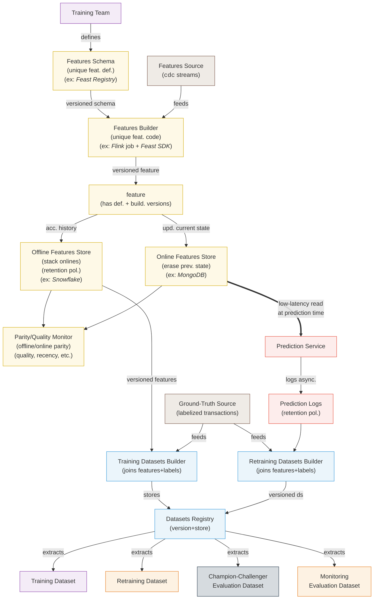

```mermaid
flowchart TB
	FEATURES_SOURCE["Features Source<br/>(<code>cdc</code> streams)"]
	LABELS_SOURCE["Ground-Truth Source<br/>(labelized transactions)"]
	
	FEATURES_SCHEMA["Features Schema<br/>(unique feat. def.)<br/>(ex: <i>Feast Registry</i>)"]
	FEATURES_BUILDER["Features Builder<br/>(unique feat. code)<br/>(ex: <i>Flink</i> job + <i>Feast SDK</i>)"]
	FEATURE_INSTANCE["feature<br/>(has def. + build. versions)"]
	FEATURES_MONITORS["Parity/Quality Monitor<br>(offline/online parity)<br>(quality, recency, etc.)"]
	FEATURES_ONLINE["Online Features Store<br/>(erase prev. state)<br/>(ex: <i>MongoDB</i>)"]
	FEATURES_STORE["Offline Features Store<br/>(stack onlines)<br/>(retention pol.)<br/>(ex: <i>Snowflake</i>)"]

	TRAINING_TEAM["Training Team"]
	TRAINING_DATASETS_BUILDER["Training Datasets Builder<br/>(joins features+labels)"]
	TRAINING_DATASET["Training Dataset"] 

	DATASETS_REGISTRY["Datasets Registry<br/>(version+store)"]

	CHALLENGING_DATASET["Champion-Challenger<br/>Evaluation Dataset"]
	
	RETRAINING_DATASETS_BUILDER["Retraining Datasets Builder<br/>(joins features+labels)"]
	RETRAINING_DATASET["Retraining Dataset"]
	
	MONITORING_DATASET["Monitoring<br/>Evaluation Dataset"] 

	PREDICTION_SERVICE["Prediction Service"]
	PREDICTION_LOGS["Prediction Logs<br/>(retention pol.)"]
	
	TRAINING_TEAM -->|"defines"| FEATURES_SCHEMA
	FEATURES_SCHEMA -->|"versioned schema"| FEATURES_BUILDER
	FEATURES_SOURCE -->|"feeds"| FEATURES_BUILDER  
	FEATURES_BUILDER -->|"versioned feature"| FEATURE_INSTANCE 
	FEATURE_INSTANCE -->|"acc. history"| FEATURES_STORE
	FEATURE_INSTANCE -->|"upd. current state"| FEATURES_ONLINE 
	FEATURES_STORE --> FEATURES_MONITORS   
	FEATURES_ONLINE --> FEATURES_MONITORS  
	
	FEATURES_STORE -->|"versioned features"| TRAINING_DATASETS_BUILDER  
	TRAINING_DATASETS_BUILDER -->|"stores"| DATASETS_REGISTRY

	LABELS_SOURCE -->|"feeds"| TRAINING_DATASETS_BUILDER
	LABELS_SOURCE -->|"feeds"| RETRAINING_DATASETS_BUILDER
	
	DATASETS_REGISTRY -->|"extracts"| TRAINING_DATASET
    DATASETS_REGISTRY -->|"extracts"| RETRAINING_DATASET
    DATASETS_REGISTRY -->|"extracts"| CHALLENGING_DATASET
	DATASETS_REGISTRY -->|"extracts"| MONITORING_DATASET 
    
	RETRAINING_DATASETS_BUILDER -->|"versioned ds"| DATASETS_REGISTRY
	
	FEATURES_ONLINE ==>|"low-latency read<br/>at prediction time"| PREDICTION_SERVICE
	
	PREDICTION_LOGS --> RETRAINING_DATASETS_BUILDER
	PREDICTION_SERVICE -->|"logs async."| PREDICTION_LOGS
	
	
    style FEATURES_SOURCE fill:#EFEBE6,stroke:#795548
    style LABELS_SOURCE fill:#EFEBE6,stroke:#795548
	
    style FEATURES_SCHEMA fill:#FEF9E7,stroke:#D4AC0D
    style FEATURES_BUILDER fill:#FEF9E7,stroke:#D4AC0D
    style FEATURES_STORE fill:#FEF9E7,stroke:#D4AC0D
    style FEATURES_ONLINE fill:#FEF9E7,stroke:#D4AC0D
    style FEATURES_MONITORS fill:#FEF9E7,stroke:#D4AC0D
    style FEATURE_INSTANCE fill:#FEF9E7,stroke:#D4AC0D
    
    style RETRAINING_DATASETS_BUILDER fill:#EBF5FB,stroke:#3498DB
    
    style TRAINING_DATASETS_BUILDER fill:#EBF5FB,stroke:#3498DB
    style DATASETS_REGISTRY fill:#EBF5FB,stroke:#3498DB

    style TRAINING_TEAM fill:#F4ECF7,stroke:#8E44AD
    
    style PREDICTION_SERVICE fill:#FDEDEC,stroke:#E74C3C
    style PREDICTION_LOGS fill:#FDEDEC,stroke:#E74C3C
    
    style TRAINING_DATASET fill:#F4ECF7,stroke:#8E44AD
    style RETRAINING_DATASET fill:#FDF2E3,stroke:#E67E22
    style MONITORING_DATASET fill:#FDF2E3,stroke:#E67E22
    style CHALLENGING_DATASET fill:#D6DBDF,stroke:#2C3E50
```