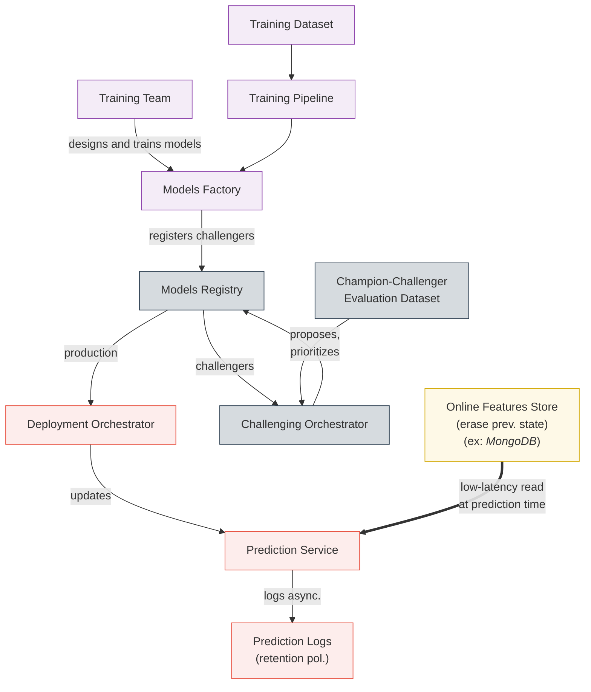

```mermaid
flowchart TB

	FEATURES_ONLINE["Online Features Store<br/>(erase prev. state)<br/>(ex: <i>MongoDB</i>)"]

	TRAINING_TEAM["Training Team"]
	TRAINING_DATASET["Training Dataset"]
	TRAINING_PIPELINE["Training Pipeline"]
	
	MODELS_FACTORY["Models Factory"]
	MODELS_REGISTRY["Models Registry"]
	
	CHALLENGING_ORCHESTRATOR["Challenging Orchestrator"]
	CHALLENGING_DATASET["Champion-Challenger<br/>Evaluation Dataset"]
	
	DEPLOYMENT_ORCHESTRATOR["Deployment Orchestrator"]
	PREDICTION_SERVICE["Prediction Service"]
	PREDICTION_LOGS["Prediction Logs<br/>(retention pol.)"]
	
	TRAINING_TEAM -->|"designs and trains models"| MODELS_FACTORY
	MODELS_FACTORY -->|"registers challengers"| MODELS_REGISTRY 
	
	TRAINING_DATASET --> TRAINING_PIPELINE
	TRAINING_PIPELINE --> MODELS_FACTORY
	
	MODELS_REGISTRY -->|"challengers"| CHALLENGING_ORCHESTRATOR
    CHALLENGING_DATASET --> CHALLENGING_ORCHESTRATOR
	CHALLENGING_ORCHESTRATOR -->|"proposes,<br/>prioritizes"| MODELS_REGISTRY
	
	MODELS_REGISTRY -->|"production"| DEPLOYMENT_ORCHESTRATOR
	DEPLOYMENT_ORCHESTRATOR -->|"updates"| PREDICTION_SERVICE
	
	FEATURES_ONLINE ==>|"low-latency read<br/>at prediction time"| PREDICTION_SERVICE
	PREDICTION_SERVICE -->|"logs async."| PREDICTION_LOGS
	
    style FEATURES_ONLINE fill:#FEF9E7,stroke:#D4AC0D
    
    style MODELS_FACTORY fill:#F4ECF7,stroke:#8E44AD
    style TRAINING_TEAM fill:#F4ECF7,stroke:#8E44AD
    style TRAINING_PIPELINE fill:#F4ECF7,stroke:#8E44AD

    style MODELS_REGISTRY fill:#D6DBDF,stroke:#2C3E50
    style CHALLENGING_ORCHESTRATOR fill:#D6DBDF,stroke:#2C3E50

    style DEPLOYMENT_ORCHESTRATOR fill:#FDEDEC,stroke:#E74C3C
    style PREDICTION_SERVICE fill:#FDEDEC,stroke:#E74C3C
    style PREDICTION_LOGS fill:#FDEDEC,stroke:#E74C3C
    
    style TRAINING_DATASET fill:#F4ECF7,stroke:#8E44AD
    style CHALLENGING_DATASET fill:#D6DBDF,stroke:#2C3E50
```