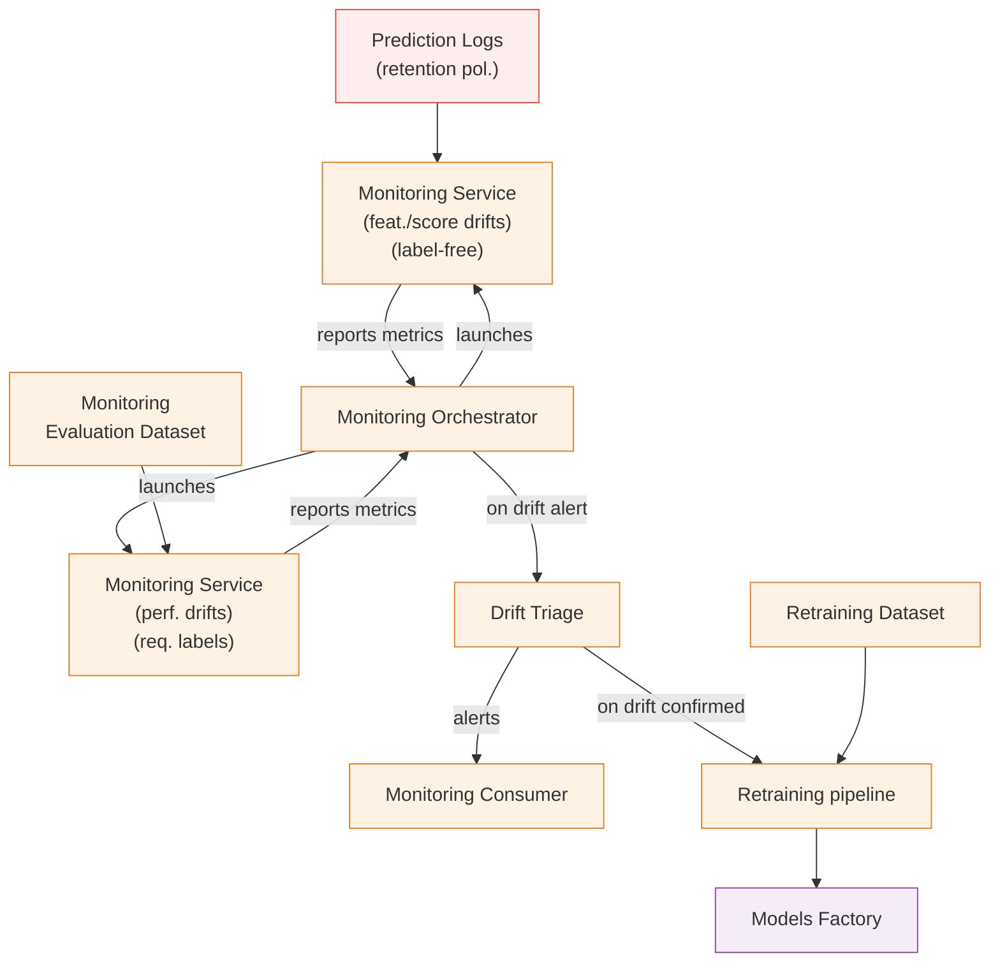

```mermaid
flowchart TB

	MODELS_FACTORY["Models Factory"]
	
	PREDICTION_LOGS["Prediction Logs<br/>(retention pol.)"]
	
	MONITORING_ORCHESTRATOR["Monitoring Orchestrator"]
	MONITORING_SERVICE_PD["Monitoring Service<br/>(perf. drifts)<br/>(req. labels)"]
	MONITORING_SERVICE_FD["Monitoring Service<br/>(feat./score drifts)<br/>(label-free)"]

	MONITORING_DRIFT_HANDLER["Drift Triage"]
	MONITORING_CONSUMER["Monitoring Consumer"]
	RETRAINING_PIPELINE["Retraining pipeline"]
	RETRAINING_DATASET["Retraining Dataset"]
	MONITORING_DATASET["Monitoring<br/>Evaluation Dataset"] 
	
	MONITORING_ORCHESTRATOR -->|"launches"| MONITORING_SERVICE_PD
	MONITORING_ORCHESTRATOR -->|"launches"| MONITORING_SERVICE_FD
	
	MONITORING_SERVICE_PD -->|"reports metrics"| MONITORING_ORCHESTRATOR
	
	PREDICTION_LOGS --> MONITORING_SERVICE_FD
	MONITORING_SERVICE_FD -->|"reports metrics"| MONITORING_ORCHESTRATOR
	
	MONITORING_ORCHESTRATOR -->|"on drift alert"| MONITORING_DRIFT_HANDLER
	MONITORING_DRIFT_HANDLER -->|"on drift confirmed"| RETRAINING_PIPELINE 
	MONITORING_DRIFT_HANDLER -->|"alerts"| MONITORING_CONSUMER
	
	RETRAINING_DATASET --> RETRAINING_PIPELINE
	RETRAINING_PIPELINE --> MODELS_FACTORY
	
	MONITORING_DATASET --> MONITORING_SERVICE_PD

    style MODELS_FACTORY fill:#F4ECF7,stroke:#8E44AD

    style PREDICTION_LOGS fill:#FDEDEC,stroke:#E74C3C
    
    style MONITORING_ORCHESTRATOR fill:#FDF2E3,stroke:#E67E22
    style MONITORING_SERVICE_PD fill:#FDF2E3,stroke:#E67E22
    style MONITORING_SERVICE_FD fill:#FDF2E3,stroke:#E67E22
    style MONITORING_DRIFT_HANDLER fill:#FDF2E3,stroke:#E67E22
    style MONITORING_CONSUMER fill:#FDF2E3,stroke:#E67E22
    style MONITORING_DATASET fill:#FDF2E3,stroke:#E67E22
    
    style RETRAINING_PIPELINE fill:#FDF2E3,stroke:#E67E22
    style RETRAINING_DATASET fill:#FDF2E3,stroke:#E67E22
```