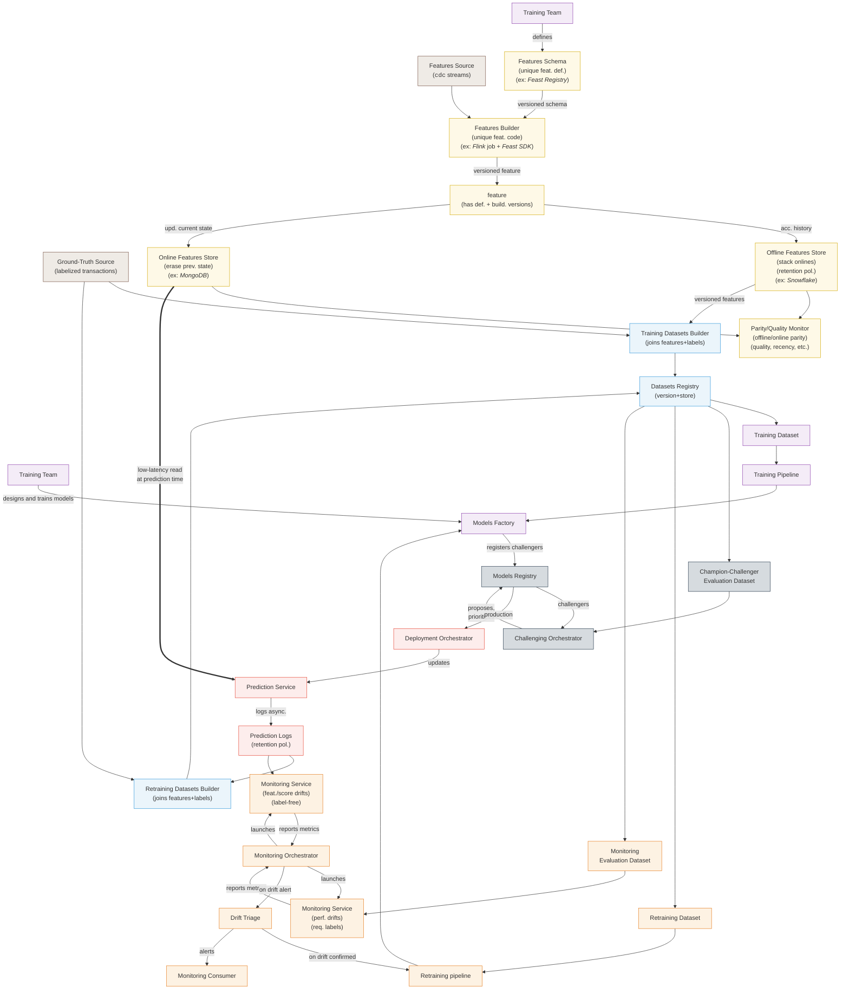

```mermaid
flowchart TB
	LABELS_SOURCE["Ground-Truth Source<br/>(labelized transactions)"]
	FEATURES_SOURCE["Features Source<br/>(<code>cdc</code> streams)"]
	
	FEATURES_SCHEMA["Features Schema<br/>(unique feat. def.)<br/>(ex: <i>Feast Registry</i>)"]
	FEATURES_BUILDER["Features Builder<br/>(unique feat. code)<br/>(ex: <i>Flink</i> job + <i>Feast SDK</i>)"]
	FEATURE_INSTANCE["feature<br/>(has def. + build. versions)"]
	FEATURES_MONITORS["Parity/Quality Monitor<br>(offline/online parity)<br>(quality, recency, etc.)"]
	FEATURES_ONLINE["Online Features Store<br/>(erase prev. state)<br/>(ex: <i>MongoDB</i>)"]
	FEATURES_STORE["Offline Features Store<br/>(stack onlines)<br/>(retention pol.)<br/>(ex: <i>Snowflake</i>)"]

	TRAINING_TEAM["Training Team"]
	
	TRAINING_DATASETS_BUILDER["Training Datasets Builder<br/>(joins features+labels)"]
	TRAINING_DATASET["Training Dataset"] 
	TRAINING_PIPELINE["Training Pipeline"]

	DATASETS_REGISTRY["Datasets Registry<br/>(version+store)"]
	
	MODELS_FACTORY["Models Factory"]
	MODELS_REGISTRY["Models Registry"]
	
	CHALLENGING_ORCHESTRATOR["Challenging Orchestrator"]
	CHALLENGING_DATASET["Champion-Challenger<br/>Evaluation Dataset"]
	
	DEPLOYMENT_ORCHESTRATOR["Deployment Orchestrator"]
	PREDICTION_SERVICE["Prediction Service"]
	PREDICTION_LOGS["Prediction Logs<br/>(retention pol.)"]

	RETRAINING_DATASETS_BUILDER["Retraining Datasets Builder<br/>(joins features+labels)"]
	
	MONITORING_ORCHESTRATOR["Monitoring Orchestrator"]
	MONITORING_SERVICE_PD["Monitoring Service<br/>(perf. drifts)<br/>(req. labels)"]
	MONITORING_SERVICE_FD["Monitoring Service<br/>(feat./score drifts)<br/>(label-free)"]
	MONITORING_DATASET["Monitoring<br/>Evaluation Dataset"] 
	MONITORING_DRIFT_HANDLER["Drift Triage"]
	MONITORING_CONSUMER["Monitoring Consumer"]
	
	RETRAINING_PIPELINE["Retraining pipeline"]
	RETRAINING_DATASET["Retraining Dataset"]
	
	TRAINING_TEAM_ANCHOR["Training Team"]
		
	TRAINING_TEAM_ANCHOR -->|"defines"| FEATURES_SCHEMA
	FEATURES_SCHEMA -->|"versioned schema"| FEATURES_BUILDER
	FEATURES_SOURCE --> FEATURES_BUILDER  
	FEATURES_BUILDER -->|"versioned feature"| FEATURE_INSTANCE 
	FEATURE_INSTANCE -->|"acc. history"| FEATURES_STORE
	FEATURE_INSTANCE -->|"upd. current state"| FEATURES_ONLINE 
	FEATURES_STORE --> FEATURES_MONITORS   
	FEATURES_ONLINE --> FEATURES_MONITORS  
	
	FEATURES_STORE -->|"versioned features"| TRAINING_DATASETS_BUILDER  
	TRAINING_DATASETS_BUILDER --> DATASETS_REGISTRY
	
	LABELS_SOURCE --> TRAINING_DATASETS_BUILDER
	LABELS_SOURCE --> RETRAINING_DATASETS_BUILDER
	
	TRAINING_TEAM -->|"designs and trains models"| MODELS_FACTORY
	MODELS_FACTORY -->|"registers challengers"| MODELS_REGISTRY 
	
	DATASETS_REGISTRY --> TRAINING_DATASET 
    DATASETS_REGISTRY --> CHALLENGING_DATASET
    
	TRAINING_DATASET --> TRAINING_PIPELINE
	TRAINING_PIPELINE --> MODELS_FACTORY
	
	MODELS_REGISTRY -->|"challengers"| CHALLENGING_ORCHESTRATOR
    CHALLENGING_DATASET --> CHALLENGING_ORCHESTRATOR
	CHALLENGING_ORCHESTRATOR -->|"proposes,<br/>prioritizes"| MODELS_REGISTRY
	
	MODELS_REGISTRY -->|"production"| DEPLOYMENT_ORCHESTRATOR
	DEPLOYMENT_ORCHESTRATOR -->|"updates"| PREDICTION_SERVICE
	
	FEATURES_ONLINE ==>|"low-latency read<br/>at prediction time"| PREDICTION_SERVICE
	PREDICTION_SERVICE -->|"logs async."| PREDICTION_LOGS
	PREDICTION_LOGS --> RETRAINING_DATASETS_BUILDER
	RETRAINING_DATASETS_BUILDER --> DATASETS_REGISTRY
    DATASETS_REGISTRY --> RETRAINING_DATASET
	
	MONITORING_ORCHESTRATOR -->|"launches"| MONITORING_SERVICE_PD
	MONITORING_ORCHESTRATOR -->|"launches"| MONITORING_SERVICE_FD
	
	MONITORING_SERVICE_PD -->|"reports metrics"| MONITORING_ORCHESTRATOR
	
	PREDICTION_LOGS --> MONITORING_SERVICE_FD
	MONITORING_SERVICE_FD -->|"reports metrics"| MONITORING_ORCHESTRATOR
	
	MONITORING_ORCHESTRATOR -->|"on drift alert"| MONITORING_DRIFT_HANDLER
	MONITORING_DRIFT_HANDLER -->|"on drift confirmed"| RETRAINING_PIPELINE 
	MONITORING_DRIFT_HANDLER -->|"alerts"| MONITORING_CONSUMER
	
	RETRAINING_DATASET --> RETRAINING_PIPELINE
	RETRAINING_PIPELINE --> MODELS_FACTORY
	
	DATASETS_REGISTRY --> MONITORING_DATASET 
	MONITORING_DATASET --> MONITORING_SERVICE_PD

    style FEATURES_SOURCE fill:#EFEBE6,stroke:#795548
    style LABELS_SOURCE fill:#EFEBE6,stroke:#795548
	
    style FEATURES_SCHEMA fill:#FEF9E7,stroke:#D4AC0D
    style FEATURES_BUILDER fill:#FEF9E7,stroke:#D4AC0D
    style FEATURES_STORE fill:#FEF9E7,stroke:#D4AC0D
    style FEATURES_ONLINE fill:#FEF9E7,stroke:#D4AC0D
    style FEATURES_MONITORS fill:#FEF9E7,stroke:#D4AC0D
    style FEATURE_INSTANCE fill:#FEF9E7,stroke:#D4AC0D
    
    style RETRAINING_DATASETS_BUILDER fill:#EBF5FB,stroke:#3498DB
    style TRAINING_DATASETS_BUILDER fill:#EBF5FB,stroke:#3498DB
    style DATASETS_REGISTRY fill:#EBF5FB,stroke:#3498DB
    
    style MODELS_FACTORY fill:#F4ECF7,stroke:#8E44AD
    style TRAINING_TEAM fill:#F4ECF7,stroke:#8E44AD
    style TRAINING_DATASET fill:#F4ECF7,stroke:#8E44AD
    style TRAINING_PIPELINE fill:#F4ECF7,stroke:#8E44AD

    style TRAINING_TEAM_ANCHOR fill:#F4ECF7,stroke:#8E44AD
    
    style MODELS_REGISTRY fill:#D6DBDF,stroke:#2C3E50
    style CHALLENGING_DATASET fill:#D6DBDF,stroke:#2C3E50
    style CHALLENGING_ORCHESTRATOR fill:#D6DBDF,stroke:#2C3E50

    style DEPLOYMENT_ORCHESTRATOR fill:#FDEDEC,stroke:#E74C3C
    style PREDICTION_SERVICE fill:#FDEDEC,stroke:#E74C3C
    style PREDICTION_LOGS fill:#FDEDEC,stroke:#E74C3C
    
    style MONITORING_DATASET fill:#FDF2E3,stroke:#E67E22
    style MONITORING_ORCHESTRATOR fill:#FDF2E3,stroke:#E67E22
    style MONITORING_SERVICE_PD fill:#FDF2E3,stroke:#E67E22
    style MONITORING_SERVICE_FD fill:#FDF2E3,stroke:#E67E22
    style MONITORING_DRIFT_HANDLER fill:#FDF2E3,stroke:#E67E22
    style MONITORING_CONSUMER fill:#FDF2E3,stroke:#E67E22
    
    style RETRAINING_DATASET fill:#FDF2E3,stroke:#E67E22
    style RETRAINING_PIPELINE fill:#FDF2E3,stroke:#E67E22
```