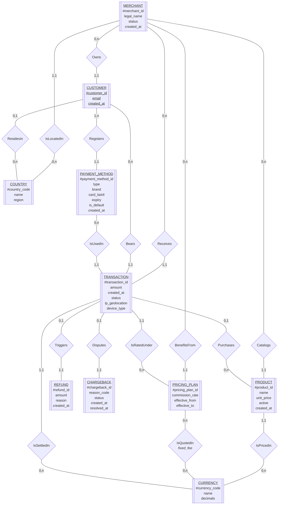

```mermaid
flowchart TB
  PAYS[["<u>COUNTRY</u><br/>#country_code<br/>name<br/>region"]]
  DEVISE[["<u>CURRENCY</u><br/>#currency_code<br/>name<br/>decimals"]]
  MARCHAND[["<u>MERCHANT</u><br/>#merchant_id<br/>legal_name<br/>status<br/>created_at"]]
  CLIENT[["<u>CUSTOMER<br/>#customer_id<br/>email<br/>created_at"]]
  MOYEN[["<u>PAYMENT_METHOD</u><br/>#payment_method_id<br/>type<br/>brand<br/>card_last4<br/>expiry<br/>is_default<br/>created_at"]]
  PRODUIT[["<u>PRODUCT</u><br/>#product_id<br/>name<br/>unit_price<br/>active<br/>created_at"]]
  TRANSACTION[["<u>TRANSACTION</u><br/>#transaction_id<br/>amount<br/>created_at<br/>status<br/>ip_geolocation<br/>device_type"]]
  REMB[["<u>REFUND</u><br/>#refund_id<br/>amount<br/>reason<br/>created_at"]]
  LITIGE[["<u>CHARGEBACK</u><br/>#chargeback_id<br/>reason_code<br/>status<br/>created_at<br/>resolved_at"]]
  PLAN[["<u>PRICING_PLAN</u><br/>#pricing_plan_id<br/>commission_rate<br/>effective_from<br/>effective_to"]]

  SITUER{IsLocatedIn}
  RESIDER{ResidesIn}
  POSSEDER{Owns}
  CATALOGUER{Catalogs}
  TARIFER{IsPricedIn}
  ENREGISTRER{Registers}
  
  BENEFICIER{BenefitsFrom}
  QUOTEDIN{"IsQuotedIn<br/><i>fixed_fee</i>"}
  RECEVOIR{Receives}
  CONCERNER{Bears}
  UTILISER{IsUsedIn}
  REGLER{IsSettledIn}
  FACTURER{IsRatedUnder}
  ACHETER{Purchases}
  REMBOURSER{Triggers}
  CONTESTER{Disputes}

  MARCHAND ---|"1,1"| SITUER
  SITUER ---|"0,n"| PAYS
  CLIENT ---|"0,1"| RESIDER
  RESIDER ---|"0,n"| PAYS

  MARCHAND ---|"0,n"| POSSEDER
  POSSEDER ---|"1,1"| CLIENT
  MARCHAND ---|"0,n"| CATALOGUER
  CATALOGUER ---|"1,1"| PRODUIT
  PRODUIT ---|"1,1"| TARIFER
  TARIFER ---|"0,n"| DEVISE
  CLIENT ---|"1,n"| ENREGISTRER
  ENREGISTRER ---|"1,1"| MOYEN

  MARCHAND ---|"0,n"| BENEFICIER
  BENEFICIER ---|"1,1"| PLAN

  PLAN ---|"0,n"| QUOTEDIN
  QUOTEDIN ---|"0,n"| DEVISE

  MARCHAND ---|"0,n"| RECEVOIR
  RECEVOIR ---|"1,1"| TRANSACTION
  
  CLIENT ---|"0,n"| CONCERNER
  CONCERNER ---|"1,1"| TRANSACTION
  
  MOYEN ---|"0,n"| UTILISER
  UTILISER ---|"1,1"| TRANSACTION
  
  TRANSACTION ---|"1,1"| REGLER
  REGLER ---|"0,n"| DEVISE
  
  TRANSACTION ---|"1,1"| FACTURER
  FACTURER ---|"0,n"| PLAN

  TRANSACTION ---|"0,1"| ACHETER
  ACHETER ---|"0,n"| PRODUIT

  TRANSACTION ---|"0,1"| REMBOURSER
  REMBOURSER ---|"1,1"| REMB
  
  TRANSACTION ---|"0,1"| CONTESTER
  CONTESTER ---|"1,1"| LITIGE
```
