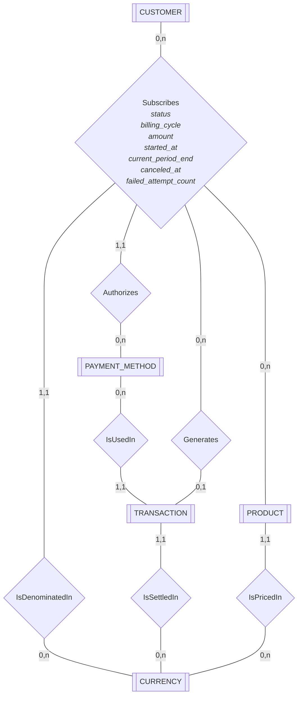

```mermaid
flowchart TB
  DEVISE[["CURRENCY"]]
  CLIENT[["CUSTOMER"]]
  MOYEN[["PAYMENT_METHOD"]]
  PRODUIT[["PRODUCT"]]
  TRANSACTION[["TRANSACTION"]]
  
  SOUSCRIRE{"Subscribes<br/><i>status</i><br/><i>billing_cycle</i><br/><i>amount</i><br/><i>started_at</i><br/><i>current_period_end</i><br/><i>canceled_at</i><br/><i>failed_attempt_count</i>"}
  
  TARIFER{IsPricedIn}
  AUTORISER{Authorizes}
  DENOMINATEDIN{IsDenominatedIn}

  UTILISER{IsUsedIn}
  REGLER{IsSettledIn}
  GENERER{Generates}

  CLIENT ---|"0,n"| SOUSCRIRE
  SOUSCRIRE ---|"0,n"| PRODUIT
  SOUSCRIRE ---|"1,1"| AUTORISER
  AUTORISER ---|"0,n"| MOYEN
  SOUSCRIRE ---|"1,1"| DENOMINATEDIN
  DENOMINATEDIN ---|"0,n"| DEVISE

  MOYEN ---|"0,n"| UTILISER
  UTILISER ---|"1,1"| TRANSACTION
  TRANSACTION ---|"1,1"| REGLER
  REGLER ---|"0,n"| DEVISE

  SOUSCRIRE ---|"0,n"| GENERER
  GENERER ---|"0,1"| TRANSACTION
  
  PRODUIT ---|"1,1"| TARIFER
  TARIFER ---|"0,n"| DEVISE
```
