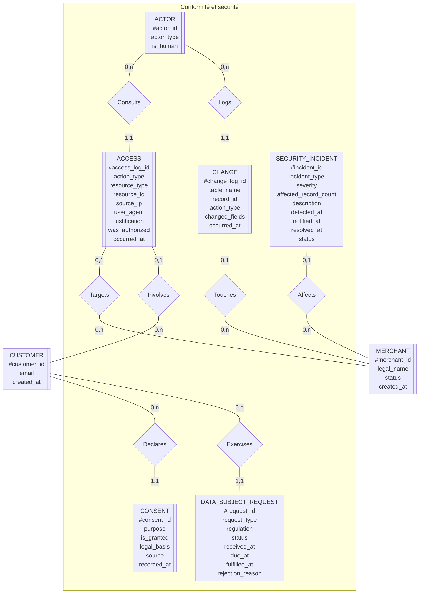

```mermaid
flowchart TB
  MARCHAND[["MERCHANT<br/>#merchant_id<br/>legal_name<br/>status<br/>created_at"]]
  CLIENT[["CUSTOMER<br/>#customer_id<br/>email<br/>created_at"]]

  subgraph SEC["Conformité et sécurité"]
    ACTEUR[["ACTOR<br/>#actor_id<br/>actor_type<br/>is_human"]]
    ACCES[["ACCESS<br/>#access_log_id<br/>action_type<br/>resource_type<br/>resource_id<br/>source_ip<br/>user_agent<br/>justification<br/>was_authorized<br/>occurred_at"]]
    CHANGEMENT[["CHANGE<br/>#change_log_id<br/>table_name<br/>record_id<br/>action_type<br/>changed_fields<br/>occurred_at"]]
    CONSENTEMENT[["CONSENT<br/>#consent_id<br/>purpose<br/>is_granted<br/>legal_basis<br/>source<br/>recorded_at"]]
    DEMANDE[["DATA_SUBJECT_REQUEST<br/>#request_id<br/>request_type<br/>regulation<br/>status<br/>received_at<br/>due_at<br/>fulfilled_at<br/>rejection_reason"]]
    INCIDENT[["SECURITY_INCIDENT<br/>#incident_id<br/>incident_type<br/>severity<br/>affected_record_count<br/>description<br/>detected_at<br/>notified_at<br/>resolved_at<br/>status"]]

    CONSULTER{Consults}
    CONSIGNER{Logs}
    CIBLER{Targets}
    VISER{Involves}
    TOUCHER{Touches}
    CONSENTIR{Declares}
    EXERCER{Exercises}
    AFFECTER{Affects}
  end

  ACTEUR ---|"0,n"| CONSULTER
  CONSULTER ---|"1,1"| ACCES
  ACTEUR ---|"0,n"| CONSIGNER
  CONSIGNER ---|"1,1"| CHANGEMENT

  ACCES ---|"0,1"| CIBLER
  CIBLER ---|"0,n"| MARCHAND
  ACCES ---|"0,1"| VISER
  VISER ---|"0,n"| CLIENT
  CHANGEMENT ---|"0,1"| TOUCHER
  TOUCHER ---|"0,n"| MARCHAND

  CLIENT ---|"0,n"| CONSENTIR
  CONSENTIR ---|"1,1"| CONSENTEMENT
  CLIENT ---|"0,n"| EXERCER
  EXERCER ---|"1,1"| DEMANDE

  INCIDENT ---|"0,1"| AFFECTER
  AFFECTER ---|"0,n"| MARCHAND
```
