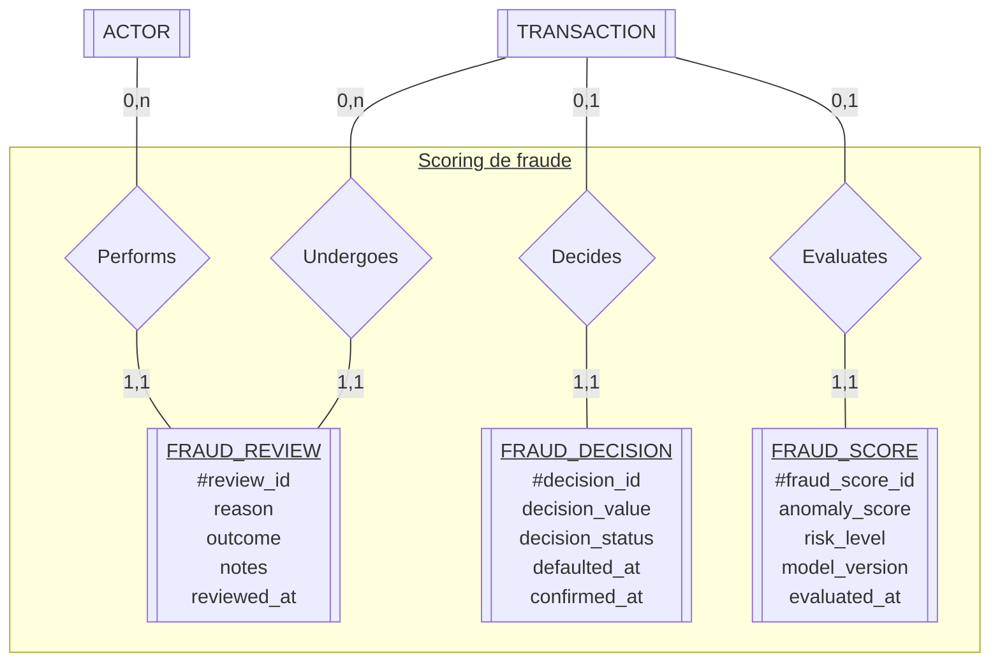

```mermaid
flowchart TB
  ACTEUR[["ACTOR"]]
  TRANSACTION[["TRANSACTION"]]

  subgraph FRAUD["<u>Scoring de fraude</u>"]
    FRAUDE_SCORE[["<u>FRAUD_SCORE</u><br/>#fraud_score_id<br/>anomaly_score<br/>risk_level<br/>model_version<br/>evaluated_at"]]
    FRAUDE_REVUE[["<u>FRAUD_REVIEW</u><br/>#review_id<br/>reason<br/>outcome<br/>notes<br/>reviewed_at"]]
    FRAUDE_DECISION[["<u>FRAUD_DECISION</u><br/>#decision_id<br/>decision_value<br/>decision_status<br/>defaulted_at<br/>confirmed_at"]]
    REALISER{Performs}
    SUBIR{Undergoes}
    DECIDER{Decides}
    EVALUER{Evaluates}
  end

  ACTEUR ---|"0,n"| REALISER 
  REALISER ---|"1,1"| FRAUDE_REVUE
  
  TRANSACTION ---|"0,n"| SUBIR
  SUBIR ---|"1,1"| FRAUDE_REVUE
  TRANSACTION ---|"0,1"| DECIDER 
  DECIDER ---|"1,1"| FRAUDE_DECISION
  
  TRANSACTION ---|"0,1"| EVALUER
  EVALUER ---|"1,1"| FRAUDE_SCORE
```
