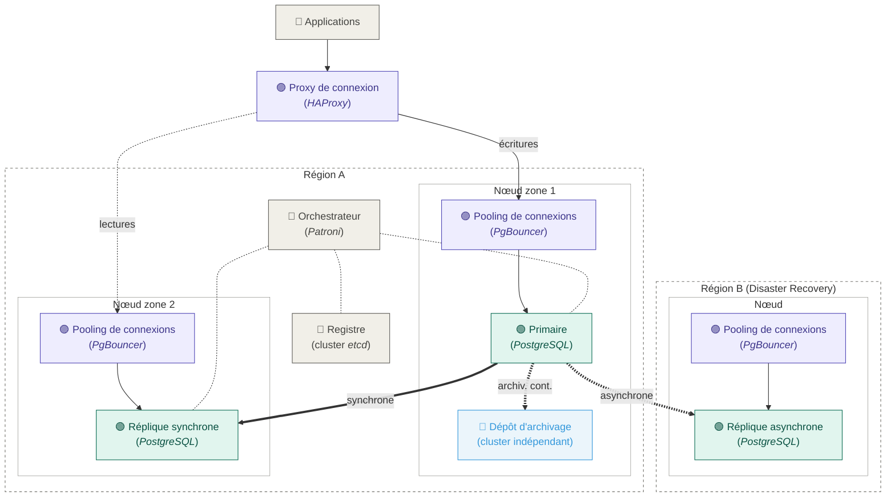

```mermaid
flowchart TB
  APP["🔘 Applications"]
  HAP["🟣 Proxy de connexion<br/>(<i>HAProxy</i>)"]

  subgraph RA["Région A"]
    subgraph N1["Nœud zone 1"]
      PGB1["🟣 Pooling de connexions<br/>(<i>PgBouncer</i>)"]
      PRIM["🟢 Primaire<br/>(<i>PostgreSQL</i>)"]
      BACK["🔵 Dépôt d'archivage<br/>(cluster indépendant)"]
    end
    subgraph N2["Nœud zone 2"]
      PGB2["🟣 Pooling de connexions<br/>(<i>PgBouncer</i>)"]
      SYNC["🟢 Réplique synchrone<br/>(<i>PostgreSQL</i>)"]
    end
    PAT["🔘 Orchestrateur <br/>(<i>Patroni</i>)"]
    ETCD["🔘 Registre<br/>(cluster <i>etcd</i>)"]
  end
  subgraph RB["Région B (Disaster Recovery)"]
    subgraph N3["Nœud"]
      PGB3["🟣 Pooling de connexions<br/>(<i>PgBouncer</i>)"]
      ASYNC["🟢 Réplique asynchrone<br/>(<i>PostgreSQL</i>)"]
    end
  end
  
  APP --> HAP
  
  PGB1 --> PRIM
  PGB2 --> SYNC
  PGB3 --> ASYNC
  
  HAP -->|écritures| PGB1
  HAP -.->|lectures| PGB2
  PAT -.- PRIM
  PAT -.- SYNC
  PAT -.- ETCD
  
  PRIM ==>|synchrone| SYNC
  PRIM -.->|asynchrone| ASYNC
  PRIM -.->|archiv. cont.| BACK
  
  classDef pg fill:#E1F5EE,stroke:#0F6E56,color:#085041
  classDef ctl fill:#F1EFE8,stroke:#5F5E5A,color:#444441
  classDef proxy fill:#EEEDFE,stroke:#534AB7,color:#3C3489
  classDef bk fill:#EBF5FB,stroke:#3498DB,color:#3498DB
  class PRIM,SYNC,ASYNC pg
  class APP,PAT,ETCD ctl
  class HAP,PGB1,PGB2,PGB3 proxy
  class BACK bk
  
  linkStyle 10 stroke-width:4px,stroke-dasharray:6\,4
  linkStyle 11 stroke-width:4px,stroke-dasharray:6\,4
  style RA fill:transparent,stroke:#73726c,stroke-dasharray:4 4
  style RB fill:transparent,stroke:#73726c,stroke-dasharray:4 4
  style N1 fill:transparent,stroke:#73726c,stroke-width:0.5px
  style N2 fill:transparent,stroke:#73726c,stroke-width:0.5px
  style N3 fill:transparent,stroke:#73726c,stroke-width:0.5px
```
