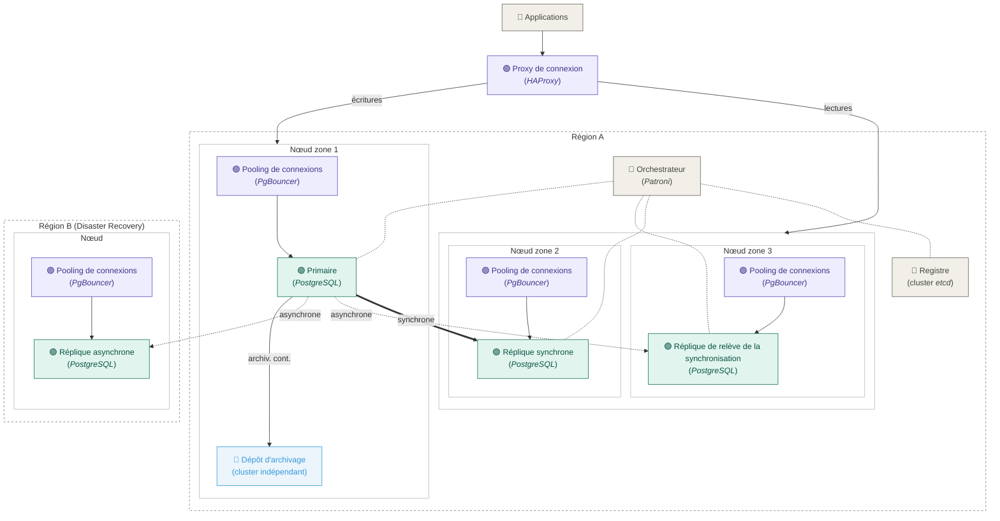

```mermaid
flowchart TB
  APP["🔘 Applications"]
  HAP["🟣 Proxy de connexion<br/>(<i>HAProxy</i>)"]

  subgraph RA["Région A"]
    subgraph N1["Nœud zone 1"]
      PGB1["🟣 Pooling de connexions<br/>(<i>PgBouncer</i>)"]
      PRIM["🟢 Primaire<br/>(<i>PostgreSQL</i>)"]
      BACK["🔵 Dépôt d'archivage<br/>(cluster indépendant)"]
    end
    subgraph RP[" "]
		direction TB
	    subgraph N2["Nœud zone 2"]
	      PGB2["🟣 Pooling de connexions<br/>(<i>PgBouncer</i>)"]
	      SYNC2["🟢 Réplique synchrone<br/>(<i>PostgreSQL</i>)"]
	    end
	    subgraph N3["Nœud zone 3"]
	      PGB3["🟣 Pooling de connexions<br/>(<i>PgBouncer</i>)"]
	      ASYNC3["🟢 Réplique de relève de la synchronisation<br/>(<i>PostgreSQL</i>)"]
	    end
    end
    PAT["🔘 Orchestrateur <br/>(<i>Patroni</i>)"]
    ETCD["🔘 Registre<br/>(cluster <i>etcd</i>)"]
  end
  subgraph RB["Région B (Disaster Recovery)"]
    subgraph N4["Nœud"]
      PGB4["🟣 Pooling de connexions<br/>(<i>PgBouncer</i>)"]
      ASYNC4["🟢 Réplique asynchrone<br/>(<i>PostgreSQL</i>)"]
    end
  end
  
  APP --> HAP
  PAT -.- ETCD
  HAP --->|lectures| RP
  
  PAT -.- PRIM
  PAT -.- SYNC2
  PAT -.- ASYNC3
  
  PGB1 --> PRIM
  PGB4 --> ASYNC4
  PGB2 --> SYNC2
  PGB3 --> ASYNC3
  
  HAP -->|écritures| N1
  PRIM ==>|synchrone| SYNC2
  PRIM -.->|asynchrone| ASYNC3
  PRIM -.->|asynchrone| ASYNC4
  PRIM --->|archiv. cont.| BACK
  
  classDef pg fill:#E1F5EE,stroke:#0F6E56,color:#085041
  classDef ctl fill:#F1EFE8,stroke:#5F5E5A,color:#444441
  classDef proxy fill:#EEEDFE,stroke:#534AB7,color:#3C3489
  classDef bk fill:#EBF5FB,stroke:#3498DB,color:#3498DB
  class PRIM,SYNC2,ASYNC3,ASYNC4 pg
  class APP,PAT,ETCD ctl
  class HAP,PGB1,PGB2,PGB3,PGB4 proxy
  class BACK bk
  
  %% linkStyle 13 stroke-width:4px,stroke-dasharray:6\,4
  %% linkStyle 14 stroke-width:4px,stroke-dasharray:6\,4
  style RA fill:transparent,stroke:#73726c,stroke-dasharray:4 4
  style RB fill:transparent,stroke:#73726c,stroke-dasharray:4 4
  style N1 fill:transparent,stroke:#73726c,stroke-width:0.5px
  style N2 fill:transparent,stroke:#73726c,stroke-width:0.5px
  style N3 fill:transparent,stroke:#73726c,stroke-width:0.5px
  style N4 fill:transparent,stroke:#73726c,stroke-width:0.5px
  style RP fill:transparent,stroke:#73726c,stroke-width:0.5px
```
