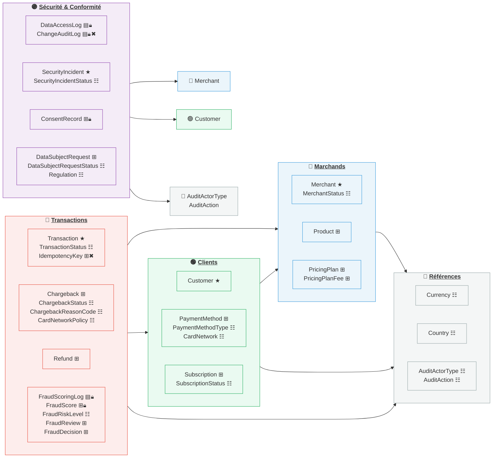

```mermaid
flowchart LR
	subgraph MERCHANT_DOMAIN["<b>🔵&nbsp;<u>Marchands</u></b>"]
		direction LR
		M_MERCHANT_SUBDOMAIN["Merchant&nbsp;★<br/>MerchantStatus&nbsp;☷"]
		M_PRODUCT_SUBDOMAIN["Product&nbsp;⊞"]
		M_PLAN_SUBDOMAIN["PricingPlan&nbsp;⊞<br/>PricingPlanFee&nbsp;⊞"]
	end
	
	subgraph CUSTOMER_DOMAIN["<b>🟢&nbsp;<u>Clients</u></b>"]
		direction LR
		C_CUSTOMER_SUBDOMAIN["Customer&nbsp;★"]
		C_PAYMENT_SUBDOMAIN["PaymentMethod&nbsp;⊞<br/>PaymentMethodType&nbsp;☷<br/>CardNetwork&nbsp;☷"]
		C_SUBSCRIPTION_SUBDOMAIN["Subscription&nbsp;⊞<br/>SubscriptionStatus&nbsp;☷"]
	end
	
	subgraph TRANSACTION_DOMAIN["<b>🔴&nbsp;<u>Transactions</u></b>"]
		direction LR
		T_TRANSACTION_SUBDOMAIN["Transaction&nbsp;★<br/>TransactionStatus&nbsp;☷<br/>IdempotencyKey&nbsp;⊞✖"]
    T_CHARGEBACK_SUBDOMAIN["Chargeback&nbsp;⊞<br/>ChargebackStatus&nbsp;☷<br/>ChargebackReasonCode&nbsp;☷<br/>CardNetworkPolicy&nbsp;☷"]
		T_REFUND_SUBDOMAIN["Refund&nbsp;⊞"]
		T_FRAUD_SUBDOMAIN["FraudScoringLog&nbsp;▤🔒︎︎<br/>FraudScore&nbsp;⊞🔒︎︎<br/>FraudRiskLevel&nbsp;☷<br/>FraudReview&nbsp;⊞<br/>FraudDecision&nbsp;⊞"]
	end
	
	subgraph SECREG_DOMAIN["<b>🟣&nbsp;<u>Sécurité&nbsp;&amp;&nbsp;Conformité</u></b>"]
		direction LR
		S_LOGS_SUBDOMAIN["DataAccessLog&nbsp;▤🔒︎︎<br/>ChangeAuditLog&nbsp;▤🔒︎︎︎✖"]
    S_SECURITY_SUBDOMAIN["SecurityIncident&nbsp;★<br/>SecurityIncidentStatus&nbsp;☷"]
		S_CONSENT_SUBDOMAIN["ConsentRecord&nbsp;⊞🔒︎︎"]
		S_DATASUBJECT_SUBDOMAIN["DataSubjectRequest&nbsp;⊞<br/>DataSubjectRequestStatus&nbsp;☷<br/>Regulation&nbsp;☷"]
	end
	
	subgraph REF_DOMAIN["<b>🔘&nbsp;<u>Références</u></b>"]
		direction LR
		R_CURRENCY_SUBDOMAIN["Currency&nbsp;☷"]
		R_COUNTRY_SUBDOMAIN["Country&nbsp;☷"]
		R_AUDIT_SUBDOMAIN["AuditActorType&nbsp;☷<br/>AuditAction&nbsp;☷"]
 	end
	  
	MERCHANT_MIRROR_S["🔵&nbsp;Merchant"]
	CUSTOMER_MIRROR_S["🟢&nbsp;Customer"]
	ACTOR_MIRROR_S["🔘&nbsp;AuditActorType<br/>AuditAction"]
	
    MERCHANT_DOMAIN --> REF_DOMAIN
    
    CUSTOMER_DOMAIN --> MERCHANT_DOMAIN
    CUSTOMER_DOMAIN --> REF_DOMAIN
    
    TRANSACTION_DOMAIN --> MERCHANT_DOMAIN & CUSTOMER_DOMAIN
    TRANSACTION_DOMAIN --> REF_DOMAIN
    
    SECREG_DOMAIN --> MERCHANT_MIRROR_S & CUSTOMER_MIRROR_S
    SECREG_DOMAIN --> ACTOR_MIRROR_S
    
    style REF_DOMAIN fill:#F4F6F6,stroke:#95A5A6,stroke-width:1px
    style ACTOR_MIRROR_S fill:#F4F6F6,stroke:#95A5A6,stroke-width:1px
    style R_CURRENCY_SUBDOMAIN fill:#F4F6F6,stroke:#95A5A6,stroke-width:1px
    style R_COUNTRY_SUBDOMAIN fill:#F4F6F6,stroke:#95A5A6,stroke-width:1px
    style R_AUDIT_SUBDOMAIN fill:#F4F6F6,stroke:#95A5A6,stroke-width:1px
    
    style MERCHANT_DOMAIN fill:#EBF5FB,stroke:#3498DB,stroke-width:1px
    style MERCHANT_MIRROR_S fill:#EBF5FB,stroke:#3498DB,stroke-width:1px
    style M_MERCHANT_SUBDOMAIN fill:#EBF5FB,stroke:#3498DB,stroke-width:1px
    style M_PRODUCT_SUBDOMAIN fill:#EBF5FB,stroke:#3498DB,stroke-width:1px
    style M_PLAN_SUBDOMAIN fill:#EBF5FB,stroke:#3498DB,stroke-width:1px
    
    style CUSTOMER_DOMAIN fill:#EAFAF1,stroke:#27AE60,stroke-width:1px
    style CUSTOMER_MIRROR_S fill:#EAFAF1,stroke:#27AE60,stroke-width:1px
    style C_CUSTOMER_SUBDOMAIN fill:#EAFAF1,stroke:#27AE60,stroke-width:1px
    style C_PAYMENT_SUBDOMAIN fill:#EAFAF1,stroke:#27AE60,stroke-width:1px
    style C_SUBSCRIPTION_SUBDOMAIN fill:#EAFAF1,stroke:#27AE60,stroke-width:1px
    
    style TRANSACTION_DOMAIN fill:#FDEDEC,stroke:#E74C3C,stroke-width:1px
    style T_TRANSACTION_SUBDOMAIN fill:#FDEDEC,stroke:#E74C3C,stroke-width:1px
    style T_CHARGEBACK_SUBDOMAIN fill:#FDEDEC,stroke:#E74C3C,stroke-width:1px
    style T_REFUND_SUBDOMAIN fill:#FDEDEC,stroke:#E74C3C,stroke-width:1px
    style T_FRAUD_SUBDOMAIN fill:#FDEDEC,stroke:#E74C3C,stroke-width:1px
    
    style SECREG_DOMAIN fill:#F4ECF7,stroke:#8E44AD,stroke-width:1px
    style S_LOGS_SUBDOMAIN fill:#F4ECF7,stroke:#8E44AD,stroke-width:1px
    style S_DATASUBJECT_SUBDOMAIN fill:#F4ECF7,stroke:#8E44AD,stroke-width:1px
    style S_CONSENT_SUBDOMAIN fill:#F4ECF7,stroke:#8E44AD,stroke-width:1px
    style S_SECURITY_SUBDOMAIN fill:#F4ECF7,stroke:#8E44AD,stroke-width:1px
```