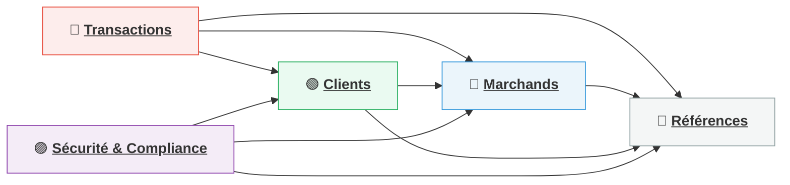

```mermaid
flowchart LR
 	REF_DOMAIN["🔘&nbsp;<b><u>Références</u></b>"]
	MERCHANT_DOMAIN["🔵&nbsp;<b><u>Marchands</u></b>"]
	CUSTOMER_DOMAIN["🟢&nbsp;<b><u>Clients</u></b>"]
 	TRANSACTION_DOMAIN["🔴&nbsp;<b><u>Transactions</u></b>"]
	SECREG_DOMAIN["🟣&nbsp;<b><u>Sécurité&nbsp;&amp;&nbsp;Compliance</u></b>"]

    TRANSACTION_DOMAIN --> MERCHANT_DOMAIN
    TRANSACTION_DOMAIN --> CUSTOMER_DOMAIN
    TRANSACTION_DOMAIN --> REF_DOMAIN
    
    MERCHANT_DOMAIN --> REF_DOMAIN
    
    CUSTOMER_DOMAIN --> MERCHANT_DOMAIN
    CUSTOMER_DOMAIN --> REF_DOMAIN
    
    
    SECREG_DOMAIN --> MERCHANT_DOMAIN & CUSTOMER_DOMAIN 
    SECREG_DOMAIN --> REF_DOMAIN
    
    style REF_DOMAIN fill:#F4F6F6,stroke:#95A5A6,stroke-width:1px
    style MERCHANT_DOMAIN fill:#EBF5FB,stroke:#3498DB,stroke-width:1px
    style CUSTOMER_DOMAIN fill:#EAFAF1,stroke:#27AE60,stroke-width:1px
    style TRANSACTION_DOMAIN fill:#FDEDEC,stroke:#E74C3C,stroke-width:1px
    style SECREG_DOMAIN fill:#F4ECF7,stroke:#8E44AD,stroke-width:1px
```