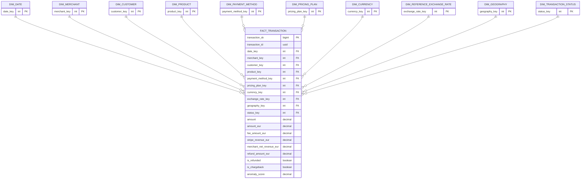

```mermaid
erDiagram
    FACT_TRANSACTION {
        transaction_sk bigint PK
        transaction_id uuid
        date_key int FK
        merchant_key int FK
        customer_key int FK
        product_key int FK
        payment_method_key int FK
        pricing_plan_key int FK
        currency_key int FK
        exchange_rate_key int FK
        geography_key int FK
        status_key int FK
        amount decimal
        amount_eur decimal
        fee_amount_eur decimal
        stripe_revenue_eur decimal
        merchant_net_revenue_eur decimal
        refund_amount_eur decimal
        is_refunded boolean
        is_chargeback boolean
        anomaly_score decimal
    }
    DIM_DATE { date_key int PK }
    DIM_MERCHANT { merchant_key int PK }
    DIM_CUSTOMER { customer_key int PK }
    DIM_PRODUCT { product_key int PK }
    DIM_PAYMENT_METHOD { payment_method_key int PK }
    DIM_PRICING_PLAN { pricing_plan_key int PK }
    DIM_CURRENCY { currency_key int PK }
    DIM_REFERENCE_EXCHANGE_RATE { exchange_rate_key int PK }
    DIM_GEOGRAPHY { geography_key int PK }
    DIM_TRANSACTION_STATUS { status_key int PK }

    DIM_DATE ||--o{ FACT_TRANSACTION : ""
    DIM_MERCHANT ||--o{ FACT_TRANSACTION : ""
    DIM_CUSTOMER ||--o{ FACT_TRANSACTION : ""
    DIM_PRODUCT ||--o{ FACT_TRANSACTION : ""
    DIM_PAYMENT_METHOD ||--o{ FACT_TRANSACTION : ""
    DIM_PRICING_PLAN ||--o{ FACT_TRANSACTION : ""
    DIM_CURRENCY ||--o{ FACT_TRANSACTION : ""
    DIM_REFERENCE_EXCHANGE_RATE ||--o{ FACT_TRANSACTION : ""
    DIM_GEOGRAPHY ||--o{ FACT_TRANSACTION : ""
    DIM_TRANSACTION_STATUS ||--o{ FACT_TRANSACTION : ""
```
