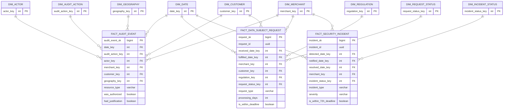

```mermaid
erDiagram
    FACT_AUDIT_EVENT {
        audit_event_sk bigint PK
        date_key int FK
        audit_action_key int FK
        actor_key int FK
        merchant_key int FK
        customer_key int FK
        geography_key int FK
        resource_type varchar
        was_authorized boolean
        had_justification boolean
    }
    FACT_DATA_SUBJECT_REQUEST {
        request_sk bigint PK
        request_id uuid
        received_date_key int FK
        fulfilled_date_key int FK
        merchant_key int FK
        customer_key int FK
        regulation_key int FK
        request_status_key int FK
        request_type varchar
        processing_days int
        is_within_deadline boolean
    }
    FACT_SECURITY_INCIDENT {
        incident_sk bigint PK
        incident_id uuid
        detected_date_key int FK
        notified_date_key int FK
        resolved_date_key int FK
        merchant_key int FK
        incident_status_key int FK
        incident_type varchar
        severity varchar
        is_within_72h_deadline boolean
    }
    DIM_DATE { date_key int PK }
    DIM_MERCHANT { merchant_key int PK }
    DIM_CUSTOMER { customer_key int PK }
    DIM_GEOGRAPHY { geography_key int PK }
    DIM_ACTOR { actor_key int PK }
    DIM_AUDIT_ACTION { audit_action_key int PK }
    DIM_REGULATION { regulation_key int PK }
    DIM_REQUEST_STATUS { request_status_key int PK }
    DIM_INCIDENT_STATUS { incident_status_key int PK }

    DIM_DATE ||--o{ FACT_AUDIT_EVENT : ""
    DIM_ACTOR ||--o{ FACT_AUDIT_EVENT : ""
    DIM_AUDIT_ACTION ||--o{ FACT_AUDIT_EVENT : ""
    DIM_MERCHANT ||--o{ FACT_AUDIT_EVENT : ""
    DIM_CUSTOMER ||--o{ FACT_AUDIT_EVENT : ""
    DIM_GEOGRAPHY ||--o{ FACT_AUDIT_EVENT : ""

    DIM_DATE ||--o{ FACT_DATA_SUBJECT_REQUEST : ""
    DIM_MERCHANT ||--o{ FACT_DATA_SUBJECT_REQUEST : ""
    DIM_CUSTOMER ||--o{ FACT_DATA_SUBJECT_REQUEST : ""
    DIM_REGULATION ||--o{ FACT_DATA_SUBJECT_REQUEST : ""
    DIM_REQUEST_STATUS ||--o{ FACT_DATA_SUBJECT_REQUEST : ""

    DIM_DATE ||--o{ FACT_SECURITY_INCIDENT : ""
    DIM_MERCHANT ||--o{ FACT_SECURITY_INCIDENT : ""
    DIM_INCIDENT_STATUS ||--o{ FACT_SECURITY_INCIDENT : ""
```
