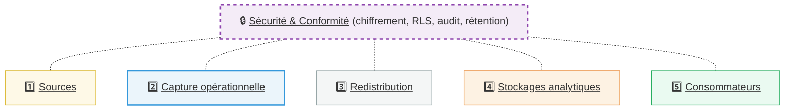

```mermaid
flowchart TB
    L1["1️⃣ <u>Sources</u>"]
    L2["2️⃣ <u>Capture opérationnelle</u>"]
    L3["3️⃣ <u>Redistribution</u>"]
    L4["4️⃣ <u>Stockages analytiques</u>"]
    L5["5️⃣ <u>Consommateurs</u>"]
    COMPLIANCE["🔒&nbsp;<u>Sécurité&nbsp;&amp;&nbsp;Conformité</u>&nbsp;(chiffrement,&nbsp;RLS,&nbsp;audit,&nbsp;rétention)"]

    COMPLIANCE -.- L1
    COMPLIANCE -.- L2
    COMPLIANCE -.- L3
    COMPLIANCE -.- L4
    COMPLIANCE -.- L5

    style L1 fill:#FEF9E7,stroke:#D4AC0D,stroke-width:1px
    style L2 fill:#EBF5FB,stroke:#3498DB,stroke-width:2px
    style L3 fill:#F4F6F6,stroke:#95A5A6,stroke-width:1px
    style L4 fill:#FDF2E3,stroke:#E67E22,stroke-width:1px
    style L5 fill:#EAFAF1,stroke:#27AE60,stroke-width:1px
    style COMPLIANCE fill:#F4ECF7,stroke:#8E44AD,stroke-width:2px,stroke-dasharray: 5 5
```