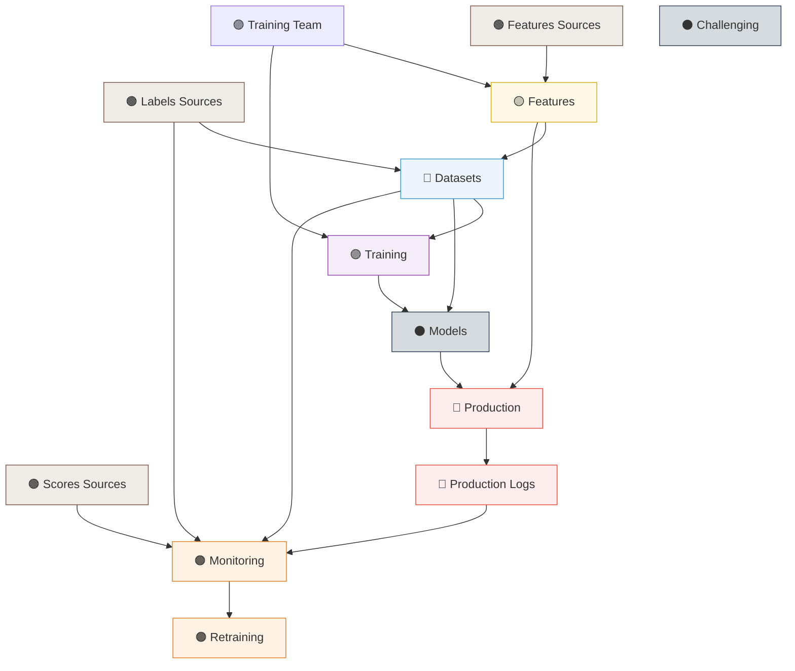

> v09 (2026/09/20)

```mermaid
flowchart TB

	FEATURES_SOURCES["🟤 Features Sources"]
	SCORES_SOURCES["🟤 Scores Sources"]
	LABELS_SOURCES["🟤 Labels Sources"]
	FEATURES_SYSTEM["🟡 Features"]
	DATASETS_SYSTEM["🔵 Datasets"]
	TRAINING_TEAM["🟣 Training Team"]
	TRAINING_SYSTEM["🟣 Training"]
	MODELS_SYSTEM["⚫ Models"]
	CHALLENGING_SYSTEM["⚫ Challenging"]
	PRODUCTION_SYSTEM["🔴 Production"]
	PRODUCTION_LOGS["🔴 Production Logs"]
	MONITORING_SYSTEM["🟠 Monitoring"]
	RETRAINING_SYSTEM["🟠 Retraining"]

	FEATURES_SOURCES --> FEATURES_SYSTEM  
	LABELS_SOURCES --> DATASETS_SYSTEM  
	
	FEATURES_SYSTEM --> DATASETS_SYSTEM  
	FEATURES_SYSTEM --> PRODUCTION_SYSTEM 

	TRAINING_TEAM --> FEATURES_SYSTEM   
	TRAINING_TEAM --> TRAINING_SYSTEM  
	TRAINING_SYSTEM --> MODELS_SYSTEM  
	
	DATASETS_SYSTEM --> TRAINING_SYSTEM  
	DATASETS_SYSTEM --> MODELS_SYSTEM  
	DATASETS_SYSTEM --> MONITORING_SYSTEM 
	 
	MODELS_SYSTEM --> PRODUCTION_SYSTEM    
	
	PRODUCTION_SYSTEM --> PRODUCTION_LOGS 
	PRODUCTION_LOGS --> MONITORING_SYSTEM 
	SCORES_SOURCES --> MONITORING_SYSTEM
	LABELS_SOURCES --> MONITORING_SYSTEM  
	MONITORING_SYSTEM --> RETRAINING_SYSTEM  
	
    style FEATURES_SOURCES fill:#EFEBE6,stroke:#795548
    style SCORES_SOURCES fill:#EFEBE6,stroke:#795548
    style LABELS_SOURCES fill:#EFEBE6,stroke:#795548
    style FEATURES_SYSTEM fill:#FEF9E7,stroke:#D4AC0D
    style DATASETS_SYSTEM fill:#EBF5FB,stroke:#3498DB
    style TRAINING_SYSTEM fill:#F4ECF7,stroke:#8E44AD
    style MODELS_SYSTEM fill:#D6DBDF,stroke:#2C3E50
    style CHALLENGING_SYSTEM fill:#D6DBDF,stroke:#2C3E50
    style PRODUCTION_SYSTEM fill:#FDEDEC,stroke:#E74C3C  
    style PRODUCTION_LOGS fill:#FDEDEC,stroke:#E74C3C  
    style MONITORING_SYSTEM fill:#FDF2E3,stroke:#E67E22
    style RETRAINING_SYSTEM fill:#FDF2E3,stroke:#E67E22
```