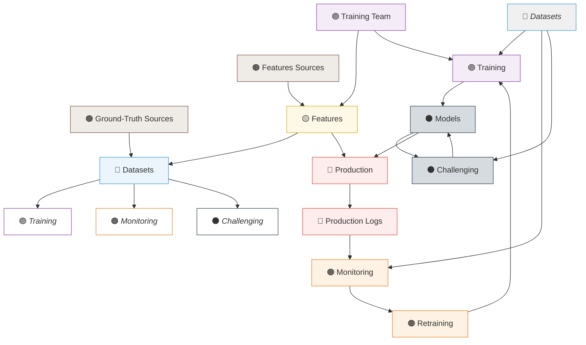

```mermaid
flowchart TB

	DATASETS_SYSTEM_ANCHOR["🔵 <i>Datasets</i>"]
	TRAINING_SYSTEM_ANCHOR["🟣 <i>Training</i>"]
	MONITORING_SYSTEM_ANCHOR["🟠 <i>Monitoring</i>"]
	CHALLENGING_SYSTEM_ANCHOR["⚫ <i>Challenging</i>"]

	FEATURES_SOURCES["🟤 Features Sources"]
	LABELS_SOURCES["🟤 Ground-Truth Sources"]
	FEATURES_SYSTEM["🟡 Features"]
	DATASETS_SYSTEM["🔵 Datasets"]
	TRAINING_TEAM["🟣 Training Team"]
	TRAINING_SYSTEM["🟣 Training"]
	CHALLENGING_SYSTEM["⚫ Challenging"]
	MODELS_SYSTEM["⚫ Models"]
	PRODUCTION_SYSTEM["🔴 Production"]
	PRODUCTION_LOGS["🔴 Production Logs"]
	MONITORING_SYSTEM["🟠 Monitoring"]
	RETRAINING_SYSTEM["🟠 Retraining"]

	TRAINING_TEAM --> FEATURES_SYSTEM   
	TRAINING_TEAM --> TRAINING_SYSTEM  

	LABELS_SOURCES --> DATASETS_SYSTEM  

	FEATURES_SOURCES --> FEATURES_SYSTEM  
	FEATURES_SYSTEM --> DATASETS_SYSTEM 

	FEATURES_SYSTEM --> PRODUCTION_SYSTEM 

	DATASETS_SYSTEM --> TRAINING_SYSTEM_ANCHOR   
	DATASETS_SYSTEM --> MONITORING_SYSTEM_ANCHOR    
	DATASETS_SYSTEM --> CHALLENGING_SYSTEM_ANCHOR    
	 
	CHALLENGING_SYSTEM --> MODELS_SYSTEM
	MODELS_SYSTEM --> CHALLENGING_SYSTEM 

	TRAINING_SYSTEM --> MODELS_SYSTEM  
	MODELS_SYSTEM --> PRODUCTION_SYSTEM   
	
	PRODUCTION_SYSTEM --> PRODUCTION_LOGS 
	PRODUCTION_LOGS --> MONITORING_SYSTEM 
	MONITORING_SYSTEM --> RETRAINING_SYSTEM  
	
	RETRAINING_SYSTEM --> TRAINING_SYSTEM

	DATASETS_SYSTEM_ANCHOR --> TRAINING_SYSTEM  
	DATASETS_SYSTEM_ANCHOR --> MONITORING_SYSTEM 
	DATASETS_SYSTEM_ANCHOR --> CHALLENGING_SYSTEM

    style FEATURES_SOURCES fill:#EFEBE6,stroke:#795548
    style LABELS_SOURCES fill:#EFEBE6,stroke:#795548
    style FEATURES_SYSTEM fill:#FEF9E7,stroke:#D4AC0D
    style DATASETS_SYSTEM fill:#EBF5FB,stroke:#3498DB
    style TRAINING_TEAM fill:#F4ECF7,stroke:#8E44AD
    style TRAINING_SYSTEM fill:#F4ECF7,stroke:#8E44AD
    style MODELS_SYSTEM fill:#D6DBDF,stroke:#2C3E50
    style CHALLENGING_SYSTEM fill:#D6DBDF,stroke:#2C3E50
    style PRODUCTION_SYSTEM fill:#FDEDEC,stroke:#E74C3C  
    style PRODUCTION_LOGS fill:#FDEDEC,stroke:#E74C3C  
    style MONITORING_SYSTEM fill:#FDF2E3,stroke:#E67E22
    style RETRAINING_SYSTEM fill:#FDF2E3,stroke:#E67E22

	style DATASETS_SYSTEM_ANCHOR fill:#F0F0F0,stroke:#3498DB
	style TRAINING_SYSTEM_ANCHOR fill:#FFFFFF,stroke:#8E44AD
	style MONITORING_SYSTEM_ANCHOR fill:#FFFFFF,stroke:#E67E22
	style CHALLENGING_SYSTEM_ANCHOR fill:#FFFFFF,stroke:#2C3E50

```