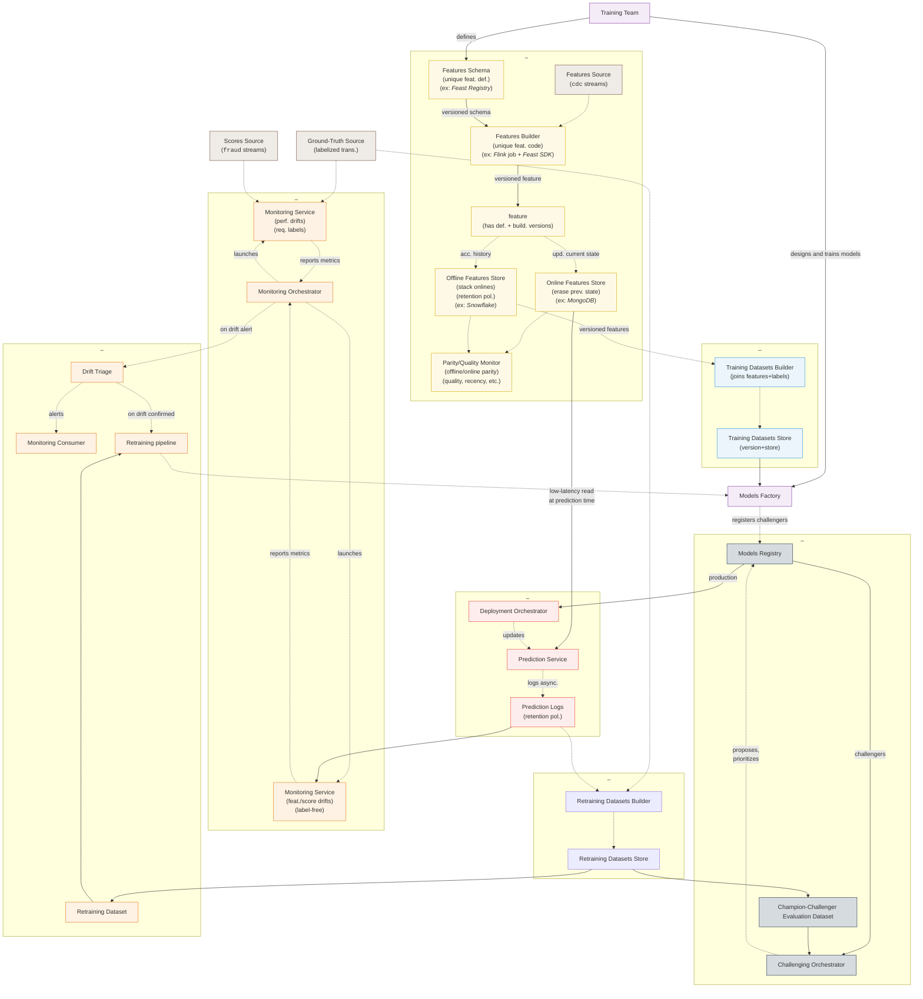

> v09

```mermaid
flowchart TB
	SCORES_SOURCE["Scores Source<br/>(<code>fraud</code> streams)"]
	LABELS_SOURCE["Ground-Truth Source<br/>(labelized trans.)"]
	
	subgraph FEATURES_SYSTEM["_"]
		FEATURES_SOURCE["Features Source<br/>(<code>cdc</code> streams)"]
		FEATURES_SCHEMA["Features Schema<br/>(unique feat. def.)<br/>(ex: <i>Feast Registry</i>)"]
		FEATURES_BUILDER["Features Builder<br/>(unique feat. code)<br/>(ex: <i>Flink</i> job + <i>Feast SDK</i>)"]
		FEATURE_INSTANCE["feature<br/>(has def. + build. versions)"]
		FEATURES_ONLINE["Online Features Store<br/>(erase prev. state)<br/>(ex: <i>MongoDB</i>)"]
		FEATURES_MONITORS["Parity/Quality Monitor<br>(offline/online parity)<br>(quality, recency, etc.)"]
		FEATURES_STORE["Offline Features Store<br/>(stack onlines)<br/>(retention pol.)<br/>(ex: <i>Snowflake</i>)"]
	end	
	
	TRAINING_TEAM["Training Team"]
	
	subgraph TRAINING_SYSTEM["_"]
		TRAINING_DATASETS_BUILDER["Training Datasets Builder<br/>(joins features+labels)"]
		TRAINING_DATASETS_STORE["Training Datasets Store<br/>(version+store)"]
	end
		
	TRAINING_FACTORY["Models Factory"]
	
	subgraph MODELS_SYSTEM["_"]
		MODELS_REGISTRY["Models Registry"]
		CHALLENGING["Challenging Orchestrator"]
		CHALLENGING_DATASET["Champion-Challenger Evaluation Dataset"]
	end	
	
	subgraph PRODUCTION_SYSTEM["_"]
		DEPLOYMENT["Deployment Orchestrator"]
		SERVICE["Prediction Service"]
		PREDICTION_LOGS["Prediction Logs<br/>(retention pol.)"]
	end
	
	subgraph RETRAINING_SYSTEM["_"]
		RETRAINING_DATASETS_BUILDER["Retraining Datasets Builder"]
		RETRAINING_DATASETS_STORE["Retraining Datasets Store"]
	end
	
	subgraph MONITORING_SYSTEM["_"]
		MONITORING["Monitoring Orchestrator"]
		MONITORING_SERVICE_PD["Monitoring Service<br/>(perf. drifts)<br/>(req. labels)"]
		MONITORING_SERVICE_FD["Monitoring Service<br/>(feat./score drifts)<br/>(label-free)"]
	end
	subgraph MONITORING_DRIFT_SYSTEM["_"]
		MONITORING_DRIFT_HANDLER["Drift Triage"]
		MONITORING_CONSUMER["Monitoring Consumer"]
		RETRAINING_PIPELINE["Retraining pipeline"]
		RETRAINING_DATASET["Retraining Dataset"]
	end
		
		
	FEATURES_SOURCE -.-> FEATURES_BUILDER  
	LABELS_SOURCE -.-> RETRAINING_DATASETS_BUILDER
	
	TRAINING_TEAM -->|"defines"| FEATURES_SCHEMA
	TRAINING_TEAM -->|"designs and trains models"| TRAINING_FACTORY
	TRAINING_FACTORY -.->|"registers challengers"| MODELS_REGISTRY
	
	FEATURES_SCHEMA -->|"versioned schema"| FEATURES_BUILDER
	FEATURES_BUILDER -->|"versioned feature"| FEATURE_INSTANCE 
	FEATURE_INSTANCE -.->|"upd. current state"| FEATURES_ONLINE     
	FEATURES_ONLINE -.-> FEATURES_MONITORS  
	FEATURES_ONLINE -->|"low-latency read<br/>at prediction time"| SERVICE
	
	FEATURE_INSTANCE -.->|"acc. history"| FEATURES_STORE
	FEATURES_STORE -.-> FEATURES_MONITORS     
	
	FEATURES_STORE -.->|"versioned features"| TRAINING_DATASETS_BUILDER
	TRAINING_DATASETS_BUILDER -.-> TRAINING_DATASETS_STORE

    TRAINING_DATASETS_STORE --> TRAINING_FACTORY
	
	MODELS_REGISTRY -->|"challengers"| CHALLENGING
    RETRAINING_DATASETS_STORE --> CHALLENGING_DATASET
    CHALLENGING_DATASET --> CHALLENGING
	CHALLENGING -.->|"proposes,<br/>prioritizes"| MODELS_REGISTRY
	
	MODELS_REGISTRY -->|"production"| DEPLOYMENT
	DEPLOYMENT -.->|"updates"| SERVICE
	
	SERVICE -.->|"logs async."| PREDICTION_LOGS
	PREDICTION_LOGS -.-> RETRAINING_DATASETS_BUILDER
	RETRAINING_DATASETS_BUILDER -.-> RETRAINING_DATASETS_STORE
    RETRAINING_DATASETS_STORE --> RETRAINING_DATASET
	
	MONITORING -.->|"launches"| MONITORING_SERVICE_PD
	MONITORING -.->|"launches"| MONITORING_SERVICE_FD
	
	LABELS_SOURCE -.-> MONITORING_SERVICE_PD
	SCORES_SOURCE -.-> MONITORING_SERVICE_PD
	MONITORING_SERVICE_PD -.->|"reports metrics"| MONITORING
	
	PREDICTION_LOGS --> MONITORING_SERVICE_FD
	MONITORING_SERVICE_FD -.->|"reports metrics"| MONITORING
	
	MONITORING -.->|"on drift alert"| MONITORING_DRIFT_HANDLER
	MONITORING_DRIFT_HANDLER -.->|"on drift confirmed"| RETRAINING_PIPELINE 
	MONITORING_DRIFT_HANDLER -.->|"alerts"| MONITORING_CONSUMER
	
	RETRAINING_DATASET --> RETRAINING_PIPELINE
	RETRAINING_PIPELINE -.-> TRAINING_FACTORY
	
    style FEATURES_SOURCE fill:#EFEBE6,stroke:#795548
    style SCORES_SOURCE fill:#EFEBE6,stroke:#795548
    style LABELS_SOURCE fill:#EFEBE6,stroke:#795548
	
    style FEATURES_SCHEMA fill:#FEF9E7,stroke:#D4AC0D
    style FEATURES_BUILDER fill:#FEF9E7,stroke:#D4AC0D
    style FEATURES_STORE fill:#FEF9E7,stroke:#D4AC0D
    style FEATURES_ONLINE fill:#FEF9E7,stroke:#D4AC0D
    style FEATURES_MONITORS fill:#FEF9E7,stroke:#D4AC0D
    style FEATURE_INSTANCE fill:#FEF9E7,stroke:#D4AC0D
    
    style TRAINING_DATASETS_BUILDER fill:#EBF5FB,stroke:#3498DB
    style TRAINING_DATASETS_STORE fill:#EBF5FB,stroke:#3498DB

    style TRAINING_TEAM fill:#F4ECF7,stroke:#8E44AD
    style TRAINING_FACTORY fill:#F4ECF7,stroke:#8E44AD

    style MODELS_REGISTRY fill:#D6DBDF,stroke:#2C3E50
    style CHALLENGING fill:#D6DBDF,stroke:#2C3E50
    style CHALLENGING_DATASET fill:#D6DBDF,stroke:#2C3E50

    style DEPLOYMENT fill:#FDEDEC,stroke:#E74C3C
    style SERVICE fill:#FDEDEC,stroke:#E74C3C
    style PREDICTION_LOGS fill:#FDEDEC,stroke:#E74C3C
    
    style MONITORING fill:#FDF2E3,stroke:#E67E22
    style MONITORING_SERVICE_PD fill:#FDF2E3,stroke:#E67E22
    style MONITORING_SERVICE_FD fill:#FDF2E3,stroke:#E67E22
    style MONITORING_DRIFT_HANDLER fill:#FDF2E3,stroke:#E67E22
    style MONITORING_CONSUMER fill:#FDF2E3,stroke:#E67E22
    
    style RETRAINING_DATASET fill:#FDF2E3,stroke:#E67E22
    style RETRAINING_PIPELINE fill:#FDF2E3,stroke:#E67E22
```