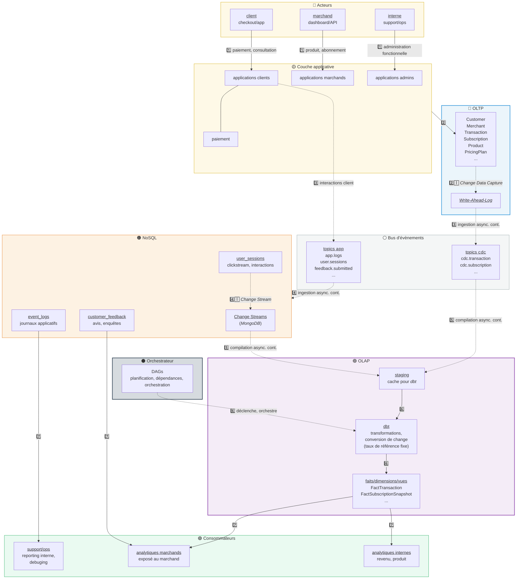

---
tags:
  - _RNCP38777
  - _2026
  - aia
  - aia/bc02
  - stripe-project
  - stripe-project/step-8
---
> GDA : v32
---

```mermaid
flowchart TB
    subgraph ACTORS["👤 Acteurs"]
        S_CUSTOMER["<u>client</u><br/>checkout/app"]
        S_MERCHANT["<u>marchand</u><br/>dashboard/API"]
        S_ADMIN["<u>interne</u><br/>support/ops"]
    end

    subgraph APPS["🟡 Couche applicative"]
        APP_CUSTOMERS["applications clients"]
        APP_EPAYMENTS["paiement"]
        APP_MERCHANTS["applications marchands"]
        APP_ADMINS["applications admins"]
    end

    subgraph OLTP["🔵 OLTP"]
        OLTP_CORE["Customer<br/>Merchant<br/>Transaction<br/>Subscription<br/>Product<br/>PricingPlan<br/>..."]
        OLTP_CDC["<u><i>Write-Ahead-Log</i></u>"]
    end

    subgraph EBUS["⚪ Bus d'évènements"]
        TOPIC_CDC["<u>topics <code>cdc</code></u><br/>cdc.transaction<br/>cdc.subscription<br/>..."]
        TOPIC_APP["<u>topics <code>app</code></u><br/>app.logs<br/>user.sessions<br/>feedback.submitted<br/>..."]
    end
    
    subgraph NOSQL["🟠 NoSQL"]
	    NOSQL_LOGS["<u>event_logs</u><br/>journaux applicatifs"]
        NOSQL_FEEDBACK["<u>customer_feedback</u><br/>avis, enquêtes"]
        NOSQL_SESSIONS["<u>user_sessions</u><br/>clickstream, interactions"]
	    NOSQL_CS["<u>Change Streams</u><br/>(<i>MongoDB</i>)"]
    end

    subgraph ORCHESTRATOR["⚫ Orchestrateur"]
	    O_DAGS["DAGs<br/>planification, dépendances, orchestration"]
    end

    subgraph OLAP["🟣 OLAP"]
        direction TB
        OLAP_STAGING["<u>staging</u><br/>cache pour <i>dbt</i>"]
        OLAP_DBT["<u>dbt</u><br/>transformations,<br/>conversion de change<br/>(taux de référence fixe)"]
        OLAP_CORE_FACTS["<u>faits/dimensions/vues</u><br/>FactTransaction<br/>FactSubscriptionSnapshot<br/>..."]
    end

    subgraph CONSUMERS["🟢 Consommateurs"]
        direction LR
        C_ADMIN["<u>support/ops</u><br/>reporting interne,<br/>debuging"]
        C_MERCHANTS["<u>analytiques marchands</u><br/>exposé au marchand"]
        C_BUSINESS_TEAM["<u>analytiques internes</u><br/>revenu, produit"]
    end

    S_CUSTOMER -->|"1️⃣ paiement, consultation"| APP_CUSTOMERS
    S_MERCHANT -->|"1️⃣ produit, abonnement"| APP_MERCHANTS
    S_ADMIN -->|"1️⃣ administration fonctionnelle"| APP_ADMINS
    
    APP_CUSTOMERS -.->|"3️⃣ interactions client"| TOPIC_APP
    APP_CUSTOMERS --- APP_EPAYMENTS
    
    APPS -->|"2️⃣"| OLTP_CORE
    
    NOSQL_SESSIONS -.->|"4️⃣🄸 <i>Change Stream</i>"| NOSQL_CS
	NOSQL_CS -.->|"5️⃣ compilation async. cont."| OLAP_STAGING
     
    O_DAGS -.->|"6️⃣ déclenche, orchestre"| OLAP_DBT  
    
    OLTP_CORE -.->|"2️⃣🄸 <i>Change Data Capture</i>"| OLTP_CDC
    OLTP_CDC -.->|"3️⃣ ingestion async. cont."| TOPIC_CDC
    
    TOPIC_APP -.->|"4️⃣ ingestion async. cont."| NOSQL
    TOPIC_CDC -.->|"5️⃣ compilation async. cont."| OLAP_STAGING
	        
    OLAP_STAGING -->|"6️⃣ "| OLAP_DBT
    OLAP_DBT -->|"6️⃣ "| OLAP_CORE_FACTS

    NOSQL_LOGS -->|"7️⃣ "| C_ADMIN
    NOSQL_FEEDBACK -->|"7️⃣ "| C_MERCHANTS

    OLAP_CORE_FACTS -->|"7️⃣ "| C_MERCHANTS
    OLAP_CORE_FACTS -->|"7️⃣ "| C_BUSINESS_TEAM
    
    style ACTORS fill:#FEF9E7,stroke:#D4AC0D,stroke-width:1px
    style APPS fill:#FEF9E7,stroke:#D4AC0D,stroke-width:1px
    style OLTP fill:#EBF5FB,stroke:#3498DB,stroke-width:2px
    style EBUS fill:#F4F6F6,stroke:#95A5A6,stroke-width:1px
    style NOSQL fill:#FDF2E3,stroke:#E67E22,stroke-width:1px
    style ORCHESTRATOR fill:#D6DBDF,stroke:#2C3E50,stroke-width:2px
    style OLAP fill:#F4ECF7,stroke:#8E44AD,stroke-width:2px
    style CONSUMERS fill:#EAFAF1,stroke:#27AE60,stroke-width:1px
```