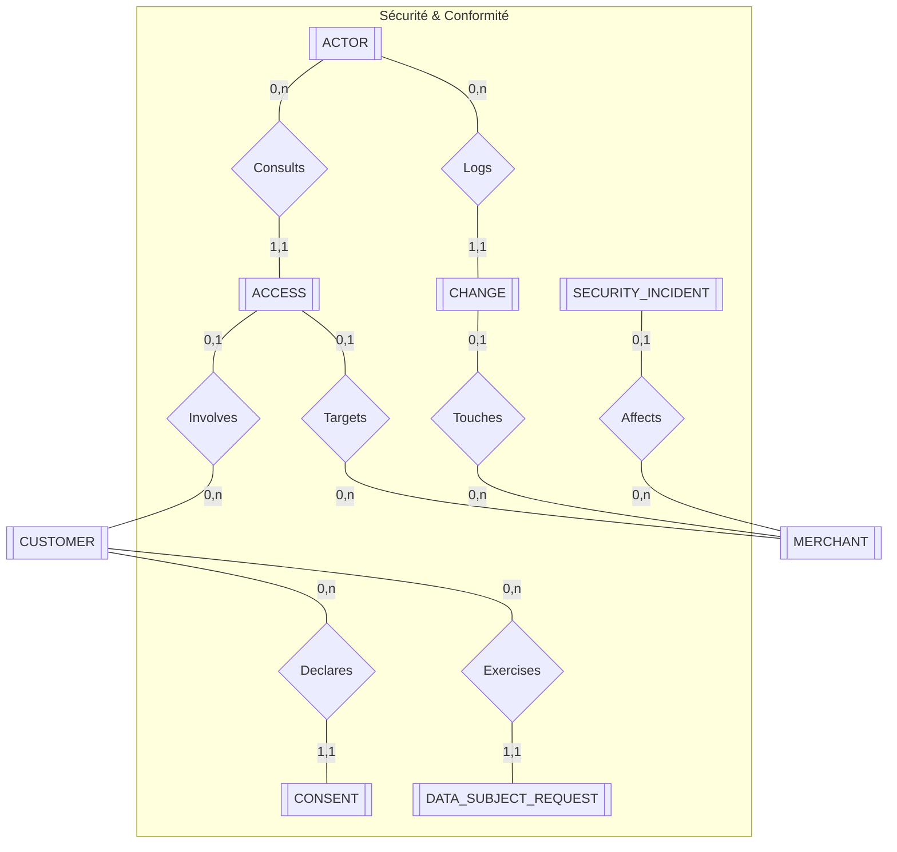

---
tags:
  - _RNCP38777
  - _2026
  - aia
  - aia/bc02
  - stripe-project
  - stripe-project/step-8
---
> OLTP : v30 (2026/09/21).
---

```mermaid
flowchart TB
  MARCHAND[["MERCHANT"]]
  CLIENT[["CUSTOMER"]]

  subgraph SEC["Sécurité & Conformité"]
    ACTEUR[["ACTOR"]]
    ACCES[["ACCESS"]]
    CHANGEMENT[["CHANGE"]]
    CONSENTEMENT[["CONSENT"]]
    DEMANDE[["DATA_SUBJECT_REQUEST"]]
    INCIDENT[["SECURITY_INCIDENT"]]

    CONSULTER{Consults}
    CONSIGNER{Logs}
    CIBLER{Targets}
    VISER{Involves}
    TOUCHER{Touches}
    CONSENTIR{Declares}
    EXERCER{Exercises}
    AFFECTER{Affects}
  end

  ACTEUR ---|"0,n"| CONSULTER
  CONSULTER ---|"1,1"| ACCES
  ACTEUR ---|"0,n"| CONSIGNER
  CONSIGNER ---|"1,1"| CHANGEMENT

  ACCES ---|"0,1"| VISER
  VISER ---|"0,n"| CLIENT
  
  ACCES ---|"0,1"| CIBLER
  CIBLER ---|"0,n"| MARCHAND
  
  CHANGEMENT ---|"0,1"| TOUCHER
  TOUCHER ---|"0,n"| MARCHAND

  CLIENT ---|"0,n"| CONSENTIR
  CONSENTIR ---|"1,1"| CONSENTEMENT
  CLIENT ---|"0,n"| EXERCER
  EXERCER ---|"1,1"| DEMANDE

  INCIDENT ---|"0,1"| AFFECTER
  AFFECTER ---|"0,n"| MARCHAND
```
