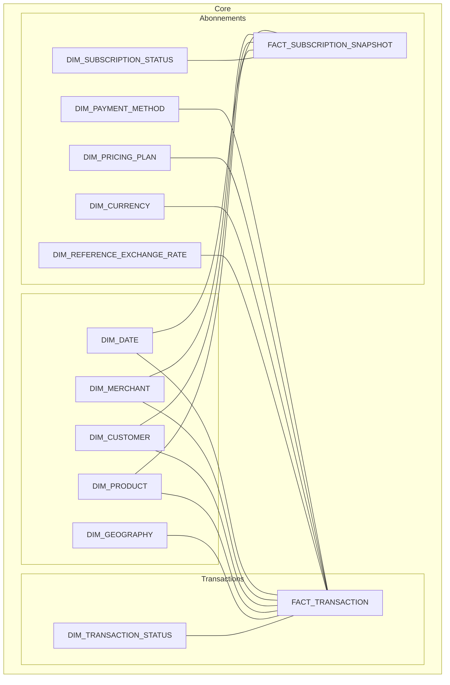

---
tags:
  - _RNCP38777
  - _2026
  - aia
  - aia/bc02
  - stripe-project
  - stripe-project/step-8
---
> OLAP : v08 (2026/x/x).
---

```mermaid
flowchart TB
    subgraph CORE["Core"]
        subgraph COMMON[" "]
            DIM_DATE
            DIM_MERCHANT
            DIM_CUSTOMER
            DIM_PRODUCT
            DIM_GEOGRAPHY
        end

        subgraph FT["Transactions"]
            FACT_TRANSACTION
            DIM_TRANSACTION_STATUS
        end
        
        subgraph FS["Abonnements"]
            FACT_SUBSCRIPTION_SNAPSHOT
            DIM_SUBSCRIPTION_STATUS
            DIM_PAYMENT_METHOD
            DIM_PRICING_PLAN
            DIM_CURRENCY
            DIM_REFERENCE_EXCHANGE_RATE
        end
    end
    
    DIM_DATE --- FACT_TRANSACTION
    DIM_MERCHANT --- FACT_TRANSACTION
    DIM_CUSTOMER --- FACT_TRANSACTION
    DIM_PRODUCT --- FACT_TRANSACTION
    DIM_PAYMENT_METHOD --- FACT_TRANSACTION
    DIM_PRICING_PLAN --- FACT_TRANSACTION
    DIM_CURRENCY --- FACT_TRANSACTION
    DIM_REFERENCE_EXCHANGE_RATE --- FACT_TRANSACTION
    DIM_GEOGRAPHY --- FACT_TRANSACTION
    DIM_TRANSACTION_STATUS --- FACT_TRANSACTION
    
    DIM_DATE --- FACT_SUBSCRIPTION_SNAPSHOT
    DIM_MERCHANT --- FACT_SUBSCRIPTION_SNAPSHOT
    DIM_CUSTOMER --- FACT_SUBSCRIPTION_SNAPSHOT
    DIM_PRODUCT --- FACT_SUBSCRIPTION_SNAPSHOT
    DIM_SUBSCRIPTION_STATUS --- FACT_SUBSCRIPTION_SNAPSHOT

```
