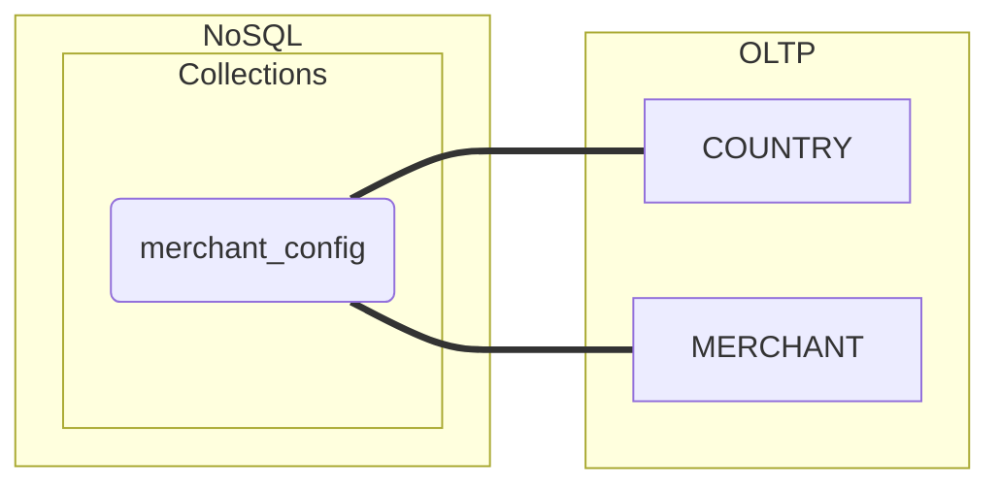

---
tags:
  - _RNCP38777
  - _2026
  - aia
  - aia/bc02
  - stripe-project
  - stripe-project/step-8
---
> NoSQL : v08 (2026/x/x).
---

```mermaid
flowchart LR
    subgraph OLTP["OLTP"]
        COUNTRY
        MERCHANT
    end 

    subgraph NOSQL["NoSQL"]
        subgraph EMBEDDED["Collections"]
            C_MERCHANT_CONFIG("merchant_config")
        end
    end

    C_MERCHANT_CONFIG === MERCHANT
    C_MERCHANT_CONFIG === COUNTRY
```