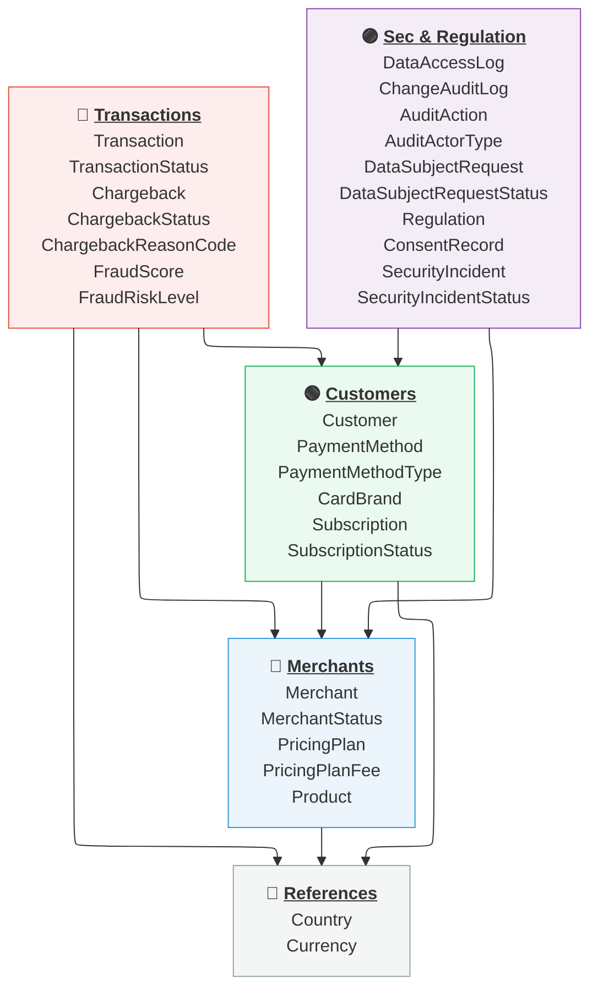

*STRIPE* PROJECT
===

# 1. Modèle de Données OLTP
## D2. Diagramme Entité-Relation (ERD)

> *Nicolas Pichon - AIA RNCP 38777 / BC02 / D2 : OLTP - ERD / v25 - 2026/10/13.*   

---

### D2.1. Contexte

Diagrammes représentant le modèle physique des données OLTP.

Le modèle est scindé en différentes groupes fonctionnels pour permettre une meilleure lisibilité : 
- une vue globale des entités regroupées par fonctions,
- une vue du modèle centré sur les entités *Clients*,
- une vue du modèle centré sur les entités *Marchands*,
- une vue du modèle centré sur les entités *Transactions*,
- une vue du modèle centré sur les référentiels géographique et monétaire,
- une vue du modèle centré sur les entités dédiées à la sécurité et à la conformité réglementaire.

---

### D2.2. Vue fonctionnelle des entités

---

### D2.3. Modèle *Clients*

![[stripe-step-1--oltp-views--customers.svg]]

---

###  D2.4. Modèle *Marchands*

![[stripe-step-1--oltp-views--merchants.svg]]

---

###  D2.5. Modèle *Transactions*

![[stripe-step-1--oltp-views--transactions.svg]]

---

### D2.6. Référentiels *Géographique* & *Monétaire*

![[stripe-step-1--oltp-views--references.svg]]

---

### D2.7. Modèle *Sécurité & Conformité*

![[stripe-step-1--oltp-views--security-and-regulation.svg]]

---
