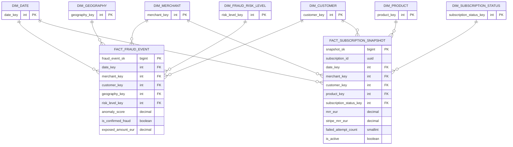

```mermaid
erDiagram
    FACT_FRAUD_EVENT {
        fraud_event_sk bigint PK
        date_key int FK
        merchant_key int FK
        customer_key int FK
        geography_key int FK
        risk_level_key int FK
        anomaly_score decimal
        is_confirmed_fraud boolean
        exposed_amount_eur decimal
    }
    FACT_SUBSCRIPTION_SNAPSHOT {
        snapshot_sk bigint PK
        subscription_id uuid
        date_key int FK
        merchant_key int FK
        customer_key int FK
        product_key int FK
        subscription_status_key int FK
        mrr_eur decimal
        stripe_mrr_eur decimal
        failed_attempt_count smallint
        is_active boolean
    }
    DIM_DATE { date_key int PK }
    DIM_MERCHANT { merchant_key int PK }
    DIM_CUSTOMER { customer_key int PK }
    DIM_PRODUCT { product_key int PK }
    DIM_GEOGRAPHY { geography_key int PK }
    DIM_FRAUD_RISK_LEVEL { risk_level_key int PK }
    DIM_SUBSCRIPTION_STATUS { subscription_status_key int PK }

    DIM_DATE ||--o{ FACT_FRAUD_EVENT : ""
    DIM_MERCHANT ||--o{ FACT_FRAUD_EVENT : ""
    DIM_CUSTOMER ||--o{ FACT_FRAUD_EVENT : ""
    DIM_GEOGRAPHY ||--o{ FACT_FRAUD_EVENT : ""
    DIM_FRAUD_RISK_LEVEL ||--o{ FACT_FRAUD_EVENT : ""

    DIM_DATE ||--o{ FACT_SUBSCRIPTION_SNAPSHOT : ""
    DIM_MERCHANT ||--o{ FACT_SUBSCRIPTION_SNAPSHOT : ""
    DIM_CUSTOMER ||--o{ FACT_SUBSCRIPTION_SNAPSHOT : ""
    DIM_PRODUCT ||--o{ FACT_SUBSCRIPTION_SNAPSHOT : ""
    DIM_SUBSCRIPTION_STATUS ||--o{ FACT_SUBSCRIPTION_SNAPSHOT : ""
```
