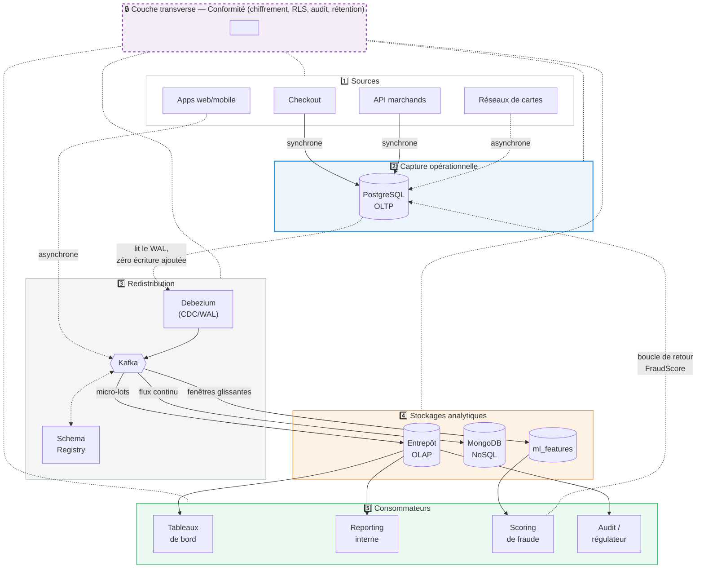

```mermaid
flowchart TB
    subgraph L1["1️⃣ Sources"]
        direction LR
        CHECKOUT["Checkout"]
        MERCH_API["API marchands"]
        APPS["Apps web/mobile"]
        NETWORKS["Réseaux de cartes"]
    end

    subgraph L2["2️⃣ Capture opérationnelle"]
        OLTP[("PostgreSQL<br/>OLTP")]
    end

    subgraph L3["3️⃣ Redistribution"]
        direction LR
        CDC["Debezium<br/>(CDC/WAL)"]
        KAFKA{{"Kafka"}}
        REGISTRY["Schema<br/>Registry"]
    end

    subgraph L4["4️⃣ Stockages analytiques"]
        direction LR
        OLAPSTORE[("Entrepôt<br/>OLAP")]
        NOSQLSTORE[("MongoDB<br/>NoSQL")]
        FEATURESTORE[("ml_features")]
    end

    subgraph L5["5️⃣ Consommateurs"]
        direction LR
        DASH["Tableaux<br/>de bord"]
        REPORT["Reporting<br/>interne"]
        FRAUDSVC["Scoring<br/>de fraude"]
        AUDITCONSO["Audit /<br/>régulateur"]
    end

    subgraph COMPLIANCE["🔒 Couche transverse — Conformité (chiffrement, RLS, audit, rétention)"]
        direction LR
        CMP1[" "]
    end

    CHECKOUT -->|synchrone| OLTP
    MERCH_API -->|synchrone| OLTP
    APPS -.->|asynchrone| KAFKA
    NETWORKS -.->|asynchrone| OLTP

    OLTP -.->|"lit le WAL,<br/>zéro écriture ajoutée"| CDC
    CDC --> KAFKA
    KAFKA <-.-> REGISTRY

    KAFKA -->|micro-lots| OLAPSTORE
    KAFKA -->|flux continu| NOSQLSTORE
    KAFKA -->|fenêtres glissantes| FEATURESTORE

    OLAPSTORE --> DASH
    OLAPSTORE --> REPORT
    OLAPSTORE --> AUDITCONSO
    FEATURESTORE --> FRAUDSVC
    FRAUDSVC -.->|"boucle de retour<br/>FraudScore"| OLTP

    COMPLIANCE -.- L1
    COMPLIANCE -.- L2
    COMPLIANCE -.- L3
    COMPLIANCE -.- L4
    COMPLIANCE -.- L5

    style L1 fill:#FFFFFF,stroke:#BFC9CA,stroke-width:1px
    style L2 fill:#EBF5FB,stroke:#3498DB,stroke-width:2px
    style L3 fill:#F4F6F6,stroke:#95A5A6,stroke-width:1px
    style L4 fill:#FDF2E3,stroke:#E67E22,stroke-width:1px
    style L5 fill:#EAFAF1,stroke:#27AE60,stroke-width:1px
    style COMPLIANCE fill:#F4ECF7,stroke:#8E44AD,stroke-width:2px,stroke-dasharray: 5 5
```