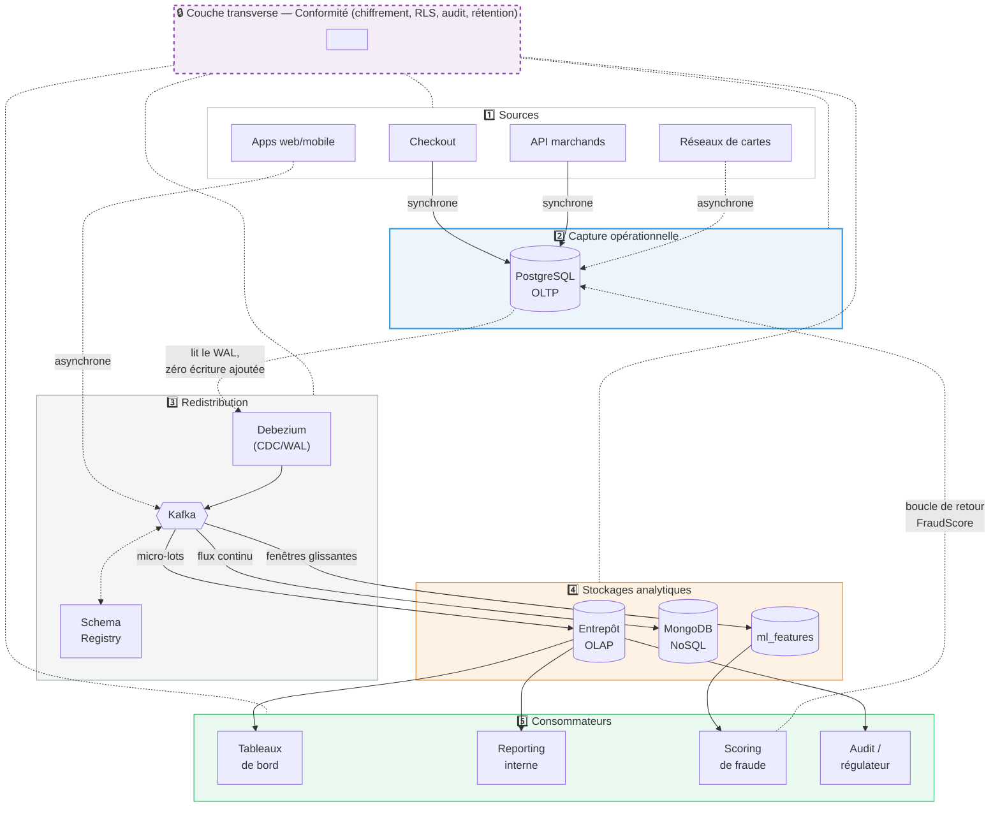

*STRIPE* PROJECT
===

# 4. Data Pipeline
## D5. Data Pipeline Architecture

> *Nicolas Pichon - AIA RNCP 38777 / BC02 / D5 : Data Pipeline Architecture / v03 - 2026/10/13.*   

---
### D5.1. Contexte

Document technique décrivant l'architecture du pipeline de données : outils, technologies et processus d'intégration et de synchronisation entre les systèmes *OLTP*, *OLAP* et *NoSQL*.

### D5.2. Vue d'ensemble

L'architecture du pipeline de données s'organise en cinq couches stratifiées, complétées d'une couche transverse de conformité.

| #  | Couche                 | Rôle                      | Technologies                                                |
| -- | ---------------------- | ------------------------- | ----------------------------------------------------------- |
| 1  | Sources                | Production des événements | Checkout, API marchands, apps web/mobile, réseaux de cartes |
| 2  | Capture opérationnelle | Vérité transactionnelle   | PostgreSQL (OLTP)                                           |
| 3  | Redistribution         | Diffusion des événements  | Apache Kafka, Debezium, Schema Registry                     |
| 4  | Stockages analytiques  | Persistance spécialisée   | Entrepôt colonne, MongoDB, magasin de features              |
| 5  | Consommateurs          | Restitution et décision   | Tableaux de bord, reporting interne, scoring de fraude      |
| -  | Transverse             | Conformité et gouvernance | Chiffrement, RLS, audit, rétention                          |

**Principe directeur.** *La base OLPT est la source de vérité*.

Les autres systèmes en dérivent. Aucun consommateur n'écrit directement dans OLTP - à une
exception près : la décision de fraude, seule boucle de retour du système.

**Distinction fondamentale.** Le pipeline produit deux types de sorties :
- une sortie **opérationnelle** : la décision d'autoriser ou bloquer un  paiement, en quelques ms ;
- des sorties **analytiques** : revenus, segmentation, performance produit, fraude *a posteriori*, conformité.

La première conditionne le fonctionnement du service ; les secondes alimentent la décision humaine. Leurs exigences de latence, de disponibilité et de cohérence n'ont rien de commun, et le pipeline les traite séparément.

**Lecture du diagramme.**  
- Flèches pleines = écritures *synchrones* ;  
- Flèches pointillées = flux *asynchrones*. 
- La seule flèche qui remonte vers OLTP est la *boucle de retour du scoring de fraude* (§D5.5.4) ;
- Tout le reste du pipeline est à sens unique. 
- La couche de *conformité* (pointillé violet) s'applique aux cinq couches  (§D5.8).

### D5.3. Couche 1 : Sources

| Source | Nature | Destination initiale |
| ------ | ------ | -------------------- |
| Checkout | Paiements clients | OLTP |
| API marchands | Intégrations serveur à serveur | OLTP |
| Applications web / mobile | Clickstream, sessions, journaux | Kafka puis NoSQL |
| Réseaux de cartes | Litiges, retours d'autorisation | OLTP (asynchrone) |

Les deux premières sources écrivent dans OLTP de façon *synchrone* : le client attend la réponse. Les journaux et sessions n'ont pas cette contrainte et entrent directement dans Kafka, sans passer par la base transactionnelle.

Les retours des réseaux de cartes (rétro-facturations, notamment) arrivent parfois plusieurs semaines après la transaction d'origine, ce qui justifie leur traitement *asynchrone*.

### D5.4. Couche 2 : Capture opérationnelle

**Technologie** : *PostgreSQL*, 
	- moteurs distribués alternatifs compatibles : *CockroachDB*, *Aurora* (fonction du volume).

**Rôle** : garantir l'intégrité transactionnelle. 
Propriétés ACID, réplication synchrone, basculement automatique.

**Optimisations retenues** (cf. modèle OLTP) :

- partitionnement de `Transaction` par `created_at`, mensuel ;
- clés primaires en UUID pour la génération distribuée ;
- index ciblés sur les accès fréquents, parcimonieux sur les tables fortement sollicitées en écriture ;
- découplage de `Refund`, `Chargeback` et `FraudScore` pour ne pas verrouiller la table transactionnelle.

**Contrainte structurante.** Rien ne doit ralentir le chemin critique du paiement. C'est ce qui dicte le choix du CDC pour l'alimentation aval, et l'écriture asynchrone des journaux d'audit.

### D5.5. Couche 3 : Redistribution

Cœur de l'intégration. Kafka découple les producteurs des consommateurs : OLTP publie sans savoir qui lit, chaque consommateur lit à son rythme.

#### D5.4.1. Capture par CDC

**Technologie** : *Debezium* + connecteur *PostgreSQL*.

*Debezium* lit *le journal des transactions* (*WAL*) de *PostgreSQL*. La redistribution n'ajoute donc pas d'écriture au chemin critique. Une transaction s'exécute exactement comme si le pipeline
n'existait pas.

Avec ça, les déclencheurs d'audit (*triggers*) sont inutiles (ils doubleraient le coût de chaque insertion sur la table la plus sollicitée du système).

#### D5.4.2. Topics

| Topic | Clé de partition | Rétention | Consommateurs |
|---|---|---|---|
| `txn.events` | `merchant_id` | 7 jours | OLAP, ML, NoSQL |
| `fraud.scores` | `transaction_id` | 7 jours | OLAP, OLTP (retour) |
| `user.sessions` | `session_id` | 3 jours | NoSQL, ML |
| `audit.events` | `merchant_id` | 30 jours | OLAP (conformité) |
| `consent.events` | `customer_id` | **Compacté** | OLTP, OLAP, NoSQL |
| `merchant.changes` | `merchant_id` | **Compacté** | Tous |

**Le choix de la clé de partition n'est pas anodin.** Kafka ne garantit
l'ordre qu'à l'intérieur d'une partition, jamais globalement. Partitionner
`txn.events` par `merchant_id` assure que toutes les transactions d'un
marchand arrivent dans l'ordre — ce qui est nécessaire pour un cumul de
chiffre d'affaires correct — sans imposer un ordre global qui interdirait
tout parallélisme.

**Les topics compactés** conservent uniquement la dernière valeur par clé.
C'est adapté aux données d'état (consentement courant, configuration d'un
marchand) et, on le verra en §8, indispensable à l'effacement RGPD.

#### D5.4.3. Schema Registry

**Technologie** : Confluent Schema Registry, format Avro ou Protobuf.

Chaque topic est associé à un schéma versionné. Un producteur ne peut pas publier un message non conforme ; un consommateur sait toujours interpréter ce qu'il lit. La compatibilité ascendante est imposée : ajouter un champ est permis, en supprimer un ne l'est pas sans procédure de migration.

Sans ce contrat, un changement de schéma OLTP casserait silencieusement tous les consommateurs en aval.

#### D5.4.4. Garanties

- **Ordre** garanti par clé de partition.
- **Rejeu** possible depuis n'importe quel offset — un consommateur défaillant
  reprend là où il s'était arrêté, sans perte.
- **Livraison au moins une fois** (*at-least-once*) : un message peut être
  reçu deux fois, jamais zéro. Les consommateurs doivent donc être
  **idempotents** — voir §6.

### D5.6. Couche 4 : Stockages analytiques

Trois destinations, trois modes de consommation, dictés par des exigences différentes.

#### D5.5.1. Vers l'OLAP : micro-lots

**Technologies** : Kafka Connect ou Spark Structured Streaming pour
l'ingestion ; Apache Airflow pour l'orchestration ; dbt pour les
transformations.

**Mode** : micro-lots de 5 minutes vers les tables de faits, traitement
nocturne pour les agrégats lourds.

**Justification** : l'entrepôt colonne est optimisé pour des écritures
groupées. Insérer ligne par ligne dégraderait fortement les performances.
Une latence de quelques minutes est sans conséquence pour un tableau de bord.

**Séquence d'alimentation** (l'ordre importe) :

1. Charger les **dimensions** — un fait ne peut référencer une dimension
   inexistante.
2. Résoudre les **clés de substitution** — traduire `merchant_id` (UUID) en
   `merchant_key` (entier), en sélectionnant la version SCD Type 2 valide à
   la date de la transaction.
3. Appliquer la **conversion monétaire** — `amount × reference_rate` avec le
   taux de référence figé, non le taux du jour.
4. Charger les **faits**.
5. Rafraîchir les **agrégats** (`AggRevenueDailyMerchant`, etc.).

**Gestion du SCD Type 2** : lorsqu'un attribut de dimension change, l'ETL
clôt la ligne courante (`valid_to`, `is_current = false`) et en insère une
nouvelle. Les faits déjà chargés conservent leur `merchant_key` d'origine —
c'est précisément ce qui préserve l'exactitude historique.

#### D5.5.2. Vers le NoSQL : flux continu

**Technologie** : consommateur Kafka dédié, écriture MongoDB.

**Mode** : continu, cohérence à terme acceptée.

**Justification** : les journaux et sessions n'ont pas d'exigence de
cohérence forte. Un délai de quelques secondes est sans impact.

#### D5.5.3. Vers le magasin de features ML : traitement de flux

**Technologie** : magasin de features MongoDB (`ml_features`, déjà spécifié en détail par
\[D4\] §D4.5.4 — schéma, index, sharding) ; Apache Flink (ou Kafka Streams) pour le calcul
des agrégations en amont.

**Mode** : agrégations sur fenêtres glissantes, latence sous la seconde.

**Justification** : c'est la seule branche du pipeline dont dépend une
décision temps réel. Flink calcule en continu les features du modèle de
fraude — nombre de transactions sur 24 h, nombre de pays distincts sur 7
jours, taux d'échec — et les écrit dans le document `ml_features`.

Le scoring lit ensuite **un seul document par clé**, sans agrégation à la
volée. C'est ce qui rend la décision possible en quelques millisecondes.

#### D5.5.4. La boucle de retour

`fraud.scores` est le seul flux qui revient vers l'OLTP. Le service de
scoring publie son résultat, un consommateur l'écrit dans `FraudScore`, et
la transaction est autorisée ou bloquée.

C'est la seule exception au principe « l'OLTP ne reçoit rien de l'aval ».

### D5.7. Cohérence et synchronisation
#### D5.6.1. Idempotence

Kafka garantit une livraison *au moins une fois*. Tout consommateur doit
donc pouvoir traiter deux fois le même message sans effet de bord.

**Mécanisme retenu** : `FactTransaction` porte un index **unique** sur
`transaction_id`. Un doublon est rejeté par la base plutôt que dédoublonné
par l'application. La clé métier OLTP joue ici son rôle : elle est la
garantie d'unicité que la clé de substitution ne peut pas fournir.

Même principe côté NoSQL : les documents utilisent des identifiants
déterministes plutôt que des `ObjectId` générés.

#### D5.6.2. Modèles de cohérence

| Flux | Modèle | Latence cible | Justification |
|---|---|---|---|
| Paiement (OLTP) | **Forte, ACID** | Synchrone | Un débit ne peut être ni perdu ni dupliqué |
| Scoring de fraude | Forte en lecture | < 100 ms | Une feature périmée a un coût réel |
| OLTP → OLAP | À terme | < 5 min | Un tableau de bord tolère le délai |
| OLTP → NoSQL | À terme | < 30 s | Journaux et sessions sans criticité |

La cohérence forte n'est appliquée que là où elle est nécessaire. L'imposer
partout coûterait en performance sans bénéfice.

#### D5.6.3. Résolution de conflits

Le pipeline est **unidirectionnel** : l'OLTP écrit, l'aval lit. Cette
contrainte de conception élimine par construction la plupart des conflits.

En cas de divergence détectée (voir §7), la règle est simple : **l'OLTP fait
foi**, et le segment concerné est rejoué depuis Kafka.

#### D5.6.4. Reprise et rattrapage

- **Panne d'un consommateur** : reprise depuis le dernier offset validé.
- **Corruption d'une table OLAP** : rejeu du topic sur la fenêtre concernée,
  après troncature des partitions touchées.
- **Perte de données au-delà de la rétention Kafka** : rechargement complet
  depuis l'OLTP (*snapshot* Debezium).

---

### D5.8. Supervision

**Technologies** : *Prometheus* et *Grafana* pour les métriques, *Great Expectations* ou *dbt tests* pour la qualité des données.

**Indicateurs de pipeline** :

- décalage des consommateurs (*consumer lag*) par topic ;
- fraîcheur des données par table cible ;
- taux d'échec et volume des files d'attente d'erreurs (*dead letter queue*).

**Contrôles de qualité** :

- **réconciliation quotidienne** : le nombre de transactions et la somme des
  montants doivent concorder entre OLTP et OLAP sur la journée écoulée ;
- contrôles de complétude : aucun fait sans dimension correspondante ;
- contrôles de cohérence : aucune transaction dont le montant converti serait
  nul alors que le montant local ne l'est pas.

La *réconciliation* est le contrôle le plus important : c'est lui qui détecte une perte silencieuse de messages.

### D5.9. Couche Transverse : Conformité

La couche de conformité traite les trois réglementations citées dans le cahier des charges : RGPD, PCI-DSS et CCPA. Elle traverse toutes les couches stratifiées (1 --> 5).

#### D5.8.1. Protection à l'entrée

- **Tokenisation** (PCI-DSS) :
	- le numéro de carte complet n'est jamais stocké. Seuls les quatre derniers chiffres et un jeton subsistent.
- **Chiffrement** : 
	- au repos (stockage) et en transit (TLS). Chiffrement au niveau du champ pour les données les plus sensibles.
- **Recueil du consentement** (RGPD, CCPA) :
	- par finalité et par marchand, historisé dans `ConsentRecord`.

#### D5.8.2. Gouvernance en continu

- **Contrôle d'accès** : 
	- rôles, moindre privilège, et sécurité au niveau des lignes (RLS) imposée par le moteur : un marchand accédant au reporting ne voit que ses propres lignes. Le filtrage ne doit pas dépendre de la requête applicative.
- **Journalisation** : 
	- `DataAccessLog` et `ChangeAuditLog` en écriture seule.  Aucun droit `UPDATE` ni `DELETE`, même administrateur : un journal modifiable ne prouve rien.
- **Rétention** : 
	- index TTL sur les journaux NoSQL (90 jours), archivage à froid au-delà, purge automatique.

#### D5.8.3. Droit à l'effacement

Le droit à l'effacement suppose de supprimer une donnée de l'utilisateur *partout*. 
A l'inverse, l'architecture repose sur des couches conçues pour être immuables :
Kafka rejoue depuis un offset, les journaux d'audit sont en écriture seule, l'entrepôt conserve l'historique.

###### Principe de résolution : conserver le fait, effacer l'identité.

| Couche | Traitement |
| ---    | ---        |
| OLTP   | Anonymisation de `Customer` ; les transactions sont conservées (valeur comptable et légale) |
| OLAP   | Anonymisation de `DimCustomer` ; `FactTransaction` reste intacte ; les revenus agrégés demeurent exacts |
| NoSQL  | Suppression effective, rendue possible par l'index `customer_id` présent dans chaque collection |
| Kafka  | Message de suppression (*tombstone*) sur les topics **compactés** — d'où ce choix pour `consent.events` |

C'est ici que la **clé de substitution** montre un avantage inattendu : elle découple la mesure de l'identité. On peut neutraliser l'identité derrière `customer_key` sans toucher aux faits qui la référencent.

###### Traçabilité
Chaque demande est enregistrée dans `DataSubjectRequest`, avec `due_at` et `fulfilled_at`. L'écart entre les deux est l'indicateur audité, le rapport de conformité doit prouver le respect des délais, pas seulement l'existence de la procédure.

#### D5.8.4. Restitution

Les rapports de conformité sont produits automatiquement depuis
`FactAuditEvent`, `FactDataSubjectRequest` et `AggComplianceDailyMerchant`.

Ils apportent les preuves opposables : qui a accédé à quoi, dans quels
délais les demandes ont été traitées, quels incidents sont survenus et quand
ils ont été notifiés (72 heures pour le RGPD).

### D5.10. Couche 5 : Consommateurs

| Consommateur | Source | Mesure de référence | Contrainte |
| ---|---|---|---|
| Tableau de bord marchand | OLAP (agrégats) | `merchant_net_revenue_eur` | RLS obligatoire, fraîcheur < 5 min |
| Reporting interne Stripe | OLAP | `stripe_revenue_eur` | Traitement nocturne acceptable |
| Décision de fraude | Magasin ML | `anomaly_score` | Latence < 100 ms, haute disponibilité |
| Audit et régulateur | OLAP (conformité) | Indicateurs de délai | Preuves inaltérables |

**Double destination.** Le *business case* \[R0\] précise que *Stripe* fournit des analyses à ses clients *et* à ses parties prenantes internes. L'entrepôt sert donc deux publics dont les besoins diffèrent : 
- le marchand analyse son chiffre d'affaires, 
- *Stripe* analyse ses commissions. 
Les deux mesures cohabitent sur la même ligne de faits, seule la colonne agrégée distingue
les deux lectures.

### D5.11. Récapitulatif des technologies

| Fonction            | Technologies                    | Alternatives                   |
| ------------------- | ------------------------------- | ------------------------------ |
| OLTP                | PostgreSQL                      | CockroachDB, Aurora            |
| CDC                 | Debezium                        | AWS DMS                        |
| Bus d'événements    | Apache Kafka                    | Pulsar, Kinesis                |
| Contrats de données | Confluent Schema Registry       | Apicurio                       |
| Traitement de flux  | Apache Flink                    | Kafka Streams, Spark Streaming |
| Orchestration       | Apache Airflow                  | Dagster, Prefect               |
| Transformation      | dbt                             | Spark SQL                      |
| Entrepôt            | Snowflake / BigQuery / Redshift | ClickHouse                     |
| NoSQL               | MongoDB                         | DocumentDB, DynamoDB           |
| Magasin de features | MongoDB (`ml_features`\[D4\])   | Feast                          |
| Supervision         | Prometheus, Grafana             | Datadog                        |
| Qualité des données | Great Expectations, dbt tests   | Soda                           |

###### Note sur les sources

Le *business case* \[R0\] mentionne explicitement les outils suivants :
- **Apache Kafka** pour le streaming temps réel 
- **Apache Airflow** pour l'orchestration des processus ETL, ainsi que les exigences de traitement par lots et en flux, de CDC, de cohérence à terme et de conformité RGPD / PCI-DSS / CCPA.

Les autres technologies citées (*Debezium*, *Flink*, *dbt*, *Schema Registry*, *Feast*, *Great Expectations*), les choix de partitionnement, les modes de consommation, les seuils de latence et la stratégie d'effacement constituent des propositions techniques inférées, cohérentes avec les exigences
exprimées mais non prescrites par \[R0\].

---

### Références

#### Ressources
- \[R0\] [Stripe Business Case](stripe-project--business-case.pdf)
#### Livrables
- \[D4\] [NoSQL Data Model](stripe-step-3--nosql-data-model--v08.pdf)

