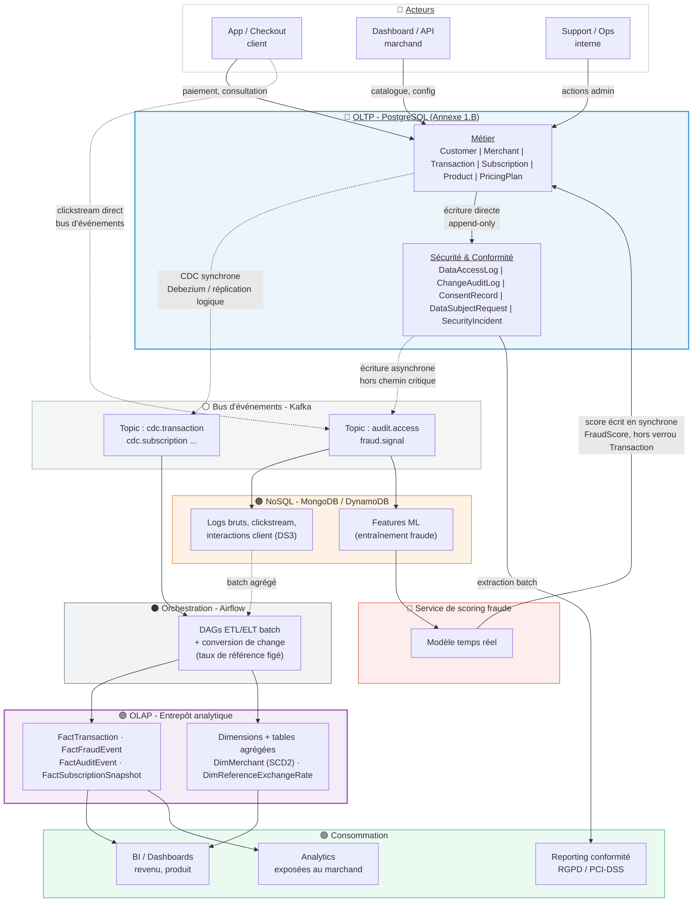

*STRIPE* PROJECT
===

# 8. Architecture Globale
## D1. Diagramme détaillé d'architecture globale

> *Nicolas Pichon - AIA RNCP 38777 / BC02 / D1 : Diagramme d'Architecture / v25 - 2026/10/13.*

---

### D1.1. Contexte

Le cahier des charges (D1) demande un diagramme montrant l'intégration des systèmes OLTP,
OLAP et NoSQL - flux de données, pipelines, et modèles de données. Contrairement à D2 (ERD
détaillée du seul OLTP), ce diagramme se place au niveau **architecture** : quels systèmes,
quels mécanismes de transport entre eux, quel usage en sortie.

Trois principes structurants, hérités des choix déjà justifiés côté OLTP (Annexe 1.C) :
- **Le chemin transactionnel ne doit jamais être ralenti** par la conformité, l'analytique ou
  la détection de fraude - tout ce qui part de l'OLTP vers les autres systèmes est asynchrone.
- **CDC plutôt que triggers synchrones** pour répliquer les changements (déjà retenu pour
  `ChangeAuditLog`, généralisé ici à l'alimentation de l'OLAP).
- **Taux de change figé côté OLAP**, jamais recalculé côté OLTP (déjà acté dès la conception
  de `Transaction` - voir note v06).

### D1.2. Diagramme

### D1.3. Lecture des flux

| Flux | Mécanisme | Justification |
|---|---|---|
| Client/Marchand → OLTP | Écriture synchrone directe | Chemin transactionnel, ACID requis (T1, BR1) |
| OLTP cœur → topic CDC | CDC (Debezium / réplication logique WAL) | Même principe que `ChangeAuditLog` (Annexe 1.C) : jamais de trigger synchrone sur `Transaction` |
| OLTP conformité → topic applicatif | Écriture asynchrone (bus d'événements) | `DataAccessLog` ne peut pas utiliser le CDC - rien à lire dans le WAL pour un `SELECT` (voir Annexe 1.C) |
| Topic applicatif → NoSQL | Ingestion continue | Absorbe logs, clickstream, interactions (DS3) - schéma flexible, volumétrie non bornée |
| NoSQL features → service de scoring | Lecture temps réel | Alimente le modèle de fraude en continu |
| Service de scoring → OLTP | Écriture synchrone ciblée sur `FraudScore` | Table découplée de `Transaction` (Annexe 1.C) : n'ajoute aucun verrou sur le chemin critique |
| Topic CDC + NoSQL → Airflow → OLAP | Batch ETL/ELT planifié | Conversion de change appliquée ici, avec taux de référence figé - jamais recalculée côté OLTP |
| OLAP → BI / marchand | Requêtes analytiques | Découplé du chemin transactionnel, aucun impact sur la latence de paiement |
| Conformité OLTP → reporting | Extraction batch | Alimente les rapports RGPD/PCI-DSS sans exposer l'OLTP directement aux outils de reporting |

### D1.4. Couverture du diagramme

Le choix précis de l'outillage managé (quel service Kafka, quel entrepôt OLAP, quelle base NoSQL) sont hors périmètre (décision d'infrastructure, pas d'architecture de données). 
La stratégie de réplication/failover propre à l'OLTP est détaillée séparément (annexe 1.C).

---
