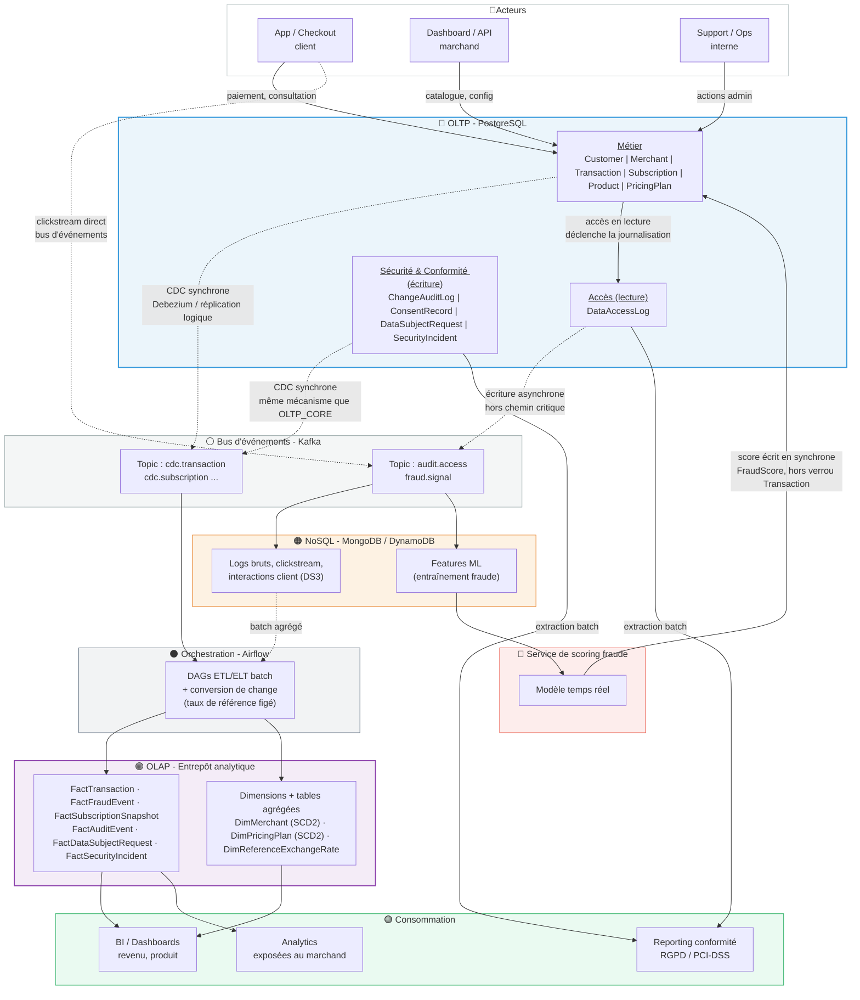

```mermaid
flowchart TB
    subgraph ACTEURS["👤Acteurs<br/>"]
        direction LR
        CUST_APP["App / Checkout<br/>client"]
        MERCH_API["Dashboard / API<br/>marchand"]
        ADMIN["Support / Ops<br/>interne"]
    end

    subgraph OLTP_SYS["🔵 OLTP - PostgreSQL"]
        direction TB
        OLTP_CORE["<u>Métier</u><br/>Customer | Merchant | Transaction | Subscription | Product | PricingPlan"]
        OLTP_ACCESS["<u>Accès (lecture)</u><br/>DataAccessLog"]
        OLTP_COMP["<u>Sécurité & Conformité (écriture)</u><br/>ChangeAuditLog | ConsentRecord | DataSubjectRequest | SecurityIncident"]
    end

    subgraph STREAM["⚪ Bus d'événements - Kafka"]
        direction LR
        TOPIC_CDC["Topic : cdc.transaction<br/>cdc.subscription ..."]
        TOPIC_APP["Topic : audit.access<br/>fraud.signal"]
    end

    subgraph NOSQL_SYS["🟠 NoSQL - MongoDB / DynamoDB"]
        direction TB
        NOSQL_LOGS["Logs bruts, clickstream,<br/>interactions client (DS3)"]
        NOSQL_FEATURES["Features ML<br/>(entraînement fraude)"]
    end

    subgraph ORCH["⚫ Orchestration - Airflow"]
        ETL["DAGs ETL/ELT batch<br/>+ conversion de change<br/>(taux de référence figé)"]
    end

    subgraph OLAP_SYS["🟣 OLAP - Entrepôt analytique"]
        direction TB
        OLAP_FACTS["FactTransaction · FactFraudEvent · FactSubscriptionSnapshot<br/>FactAuditEvent · FactDataSubjectRequest · FactSecurityIncident"]
        OLAP_DIM["Dimensions + tables agrégées<br/>DimMerchant (SCD2) · DimPricingPlan (SCD2) · DimReferenceExchangeRate"]
    end

    subgraph MLSYS["🔴 Service de scoring fraude"]
        FRAUD_SVC["Modèle temps réel"]
    end

    subgraph CONSO["🟢 Consommation"]
        direction LR
        BI["BI / Dashboards<br/>revenu, produit"]
        COMPLIANCE["Reporting conformité<br/>RGPD / PCI-DSS"]
        MERCH_ANALYTICS["Analytics<br/>exposées au marchand"]
    end

    CUST_APP -->|paiement, consultation| OLTP_CORE
    MERCH_API -->|catalogue, config| OLTP_CORE
    ADMIN -->|actions admin| OLTP_CORE

    OLTP_CORE -.->|CDC synchrone<br/>Debezium / réplication logique| TOPIC_CDC
    OLTP_CORE -->|accès en lecture<br/>déclenche la journalisation| OLTP_ACCESS
    OLTP_ACCESS -.->|écriture asynchrone<br/>hors chemin critique| TOPIC_APP
    OLTP_COMP -.->|CDC synchrone<br/>même mécanisme que OLTP_CORE| TOPIC_CDC
    CUST_APP -.->|clickstream direct<br/>bus d'événements| TOPIC_APP

    TOPIC_APP --> NOSQL_LOGS
    TOPIC_APP --> NOSQL_FEATURES
    NOSQL_FEATURES --> FRAUD_SVC
    FRAUD_SVC -->|score écrit en synchrone<br/>FraudScore, hors verrou Transaction| OLTP_CORE

    TOPIC_CDC --> ETL
    NOSQL_LOGS -.->|batch agrégé| ETL
    ETL --> OLAP_FACTS
    ETL --> OLAP_DIM

    OLAP_FACTS --> BI
    OLAP_DIM --> BI
    OLTP_COMP -->|extraction batch| COMPLIANCE
    OLTP_ACCESS -->|extraction batch| COMPLIANCE
    OLAP_FACTS --> MERCH_ANALYTICS

    style OLTP_SYS fill:#EBF5FB,stroke:#3498DB,stroke-width:2px
    style STREAM fill:#F4F6F6,stroke:#95A5A6,stroke-width:1px
    style NOSQL_SYS fill:#FDF2E3,stroke:#E67E22,stroke-width:1px
    style ORCH fill:#F2F3F4,stroke:#5D6D7E,stroke-width:1px
    style OLAP_SYS fill:#F4ECF7,stroke:#8E44AD,stroke-width:2px
    style MLSYS fill:#FDEDEC,stroke:#E74C3C,stroke-width:1px
    style CONSO fill:#EAFAF1,stroke:#27AE60,stroke-width:1px
    style ACTEURS fill:#FFFFFF,stroke:#BFC9CA,stroke-width:1px
```
