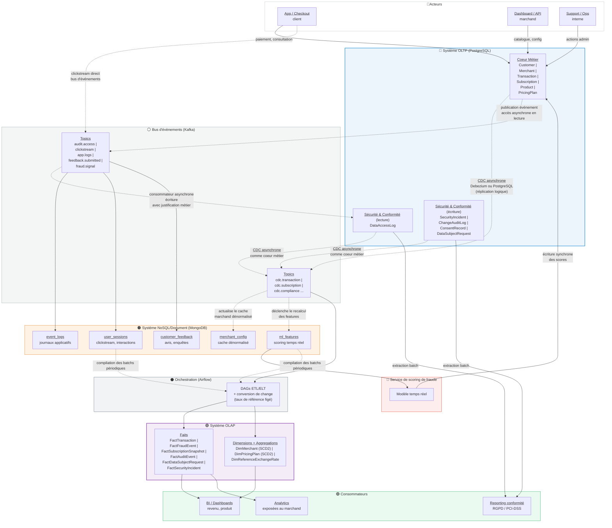

```mermaid
flowchart TB
    subgraph ACTEURS["👤Acteurs"]
        direction LR
        CUST_APP["<u>App / Checkout</u><br/>client"]
        MERCH_API["<u>Dashboard / API</u><br/>marchand"]
        ADMIN["<u>Support / Ops</u><br/>interne"]
    end

    subgraph OLTP_SYS["🔵 Système OLTP (PostgreSQL)"]
        direction TB
        OLTP_CORE["<u>Coeur Métier</u><br/>Customer |<br/>Merchant |<br/>Transaction |<br/>Subscription |<br/>Product |<br/>PricingPlan"]
        OLTP_ACCESS["<u>Sécurité & Conformité</u> (lecture)<br/>DataAccessLog"]
        OLTP_COMP["<u>Sécurité & Conformité</u> (écriture)<br/>SecurityIncident |<br/>ChangeAuditLog | <br/>ConsentRecord |<br/>DataSubjectRequest"]
    end

    subgraph STREAM["⚪ Bus d'évènements (Kafka)"]
        direction LR
        TOPIC_CDC["<u>Topics</u><br/>cdc.transaction |<br/>cdc.subscription | <br/>cdc.compliance ..."]
        TOPIC_APP["<u>Topics</u><br/>audit.access |<br/>clickstream |<br/>app.logs |<br/>feedback.submitted |<br/>fraud.signal"]
    end

    subgraph NOSQL_SYS["🟠 Système NoSQL/Document (MongoDB)"]
        direction TB
        NOSQL_LOGS["<u>event_logs</u><br/>journaux applicatifs"]
        NOSQL_SESSIONS["<u>user_sessions</u><br/>clickstream, interactions"]
        NOSQL_FEATURES["<u>ml_features</u><br/>scoring temps réel"]
        NOSQL_FEEDBACK["<u>customer_feedback</u><br/>avis, enquêtes"]
        NOSQL_CONFIG["<u>merchant_config</u><br/>cache dénormalisé"]
    end

    subgraph ORCH["⚫ Orchestration (Airflow)"]
        ETL["DAGs ETL/ELT<br/> + conversion de change<br/>(taux de référence figé)"]
    end

    subgraph OLAP_SYS["🟣 Système OLAP"]
        direction TB
        OLAP_FACTS["<u>Faits</u><br/>FactTransaction |<br/>FactFraudEvent | <br/>FactSubscriptionSnapshot |<br/>FactAuditEvent |<br/>FactDataSubjectRequest | <br/>FactSecurityIncident"]
        OLAP_DIM["<u>Dimensions + Aggregations</u><br/>DimMerchant (SCD2) |  DimPricingPlan (SCD2) | DimReferenceExchangeRate"]
    end

    subgraph MLSYS["🔴 Service de scoring de fraude"]
        FRAUD_SVC["Modèle temps réel"]
    end

    subgraph CONSO["🟢 Consommateurs"]
        direction LR
        BI["<u>BI / Dashboards</u><br/>revenu, produit"]
        COMPLIANCE["<u>Reporting conformité</u><br/>RGPD / PCI-DSS"]
        MERCH_ANALYTICS["<u>Analytics</u><br/>exposées au marchand"]
    end

    CUST_APP -->|paiement, consultation| OLTP_CORE
    MERCH_API -->|catalogue, config| OLTP_CORE
    ADMIN -->|actions admin| OLTP_CORE

    OLTP_CORE -.->|"<u>CDC asynchrone</u><br/>Debezium ou PostgreSQL<br/>(réplication logique)"| TOPIC_CDC
    OLTP_CORE -.->|publication événement<br/>accès asynchrone en lecture| TOPIC_APP
    TOPIC_APP -.->|consommateur asynchrone<br/>écriture<br/>avec justification métier| OLTP_ACCESS
    OLTP_ACCESS -.->|"<u>CDC asynchrone</u><br/>comme coeur métier"| TOPIC_CDC
    OLTP_COMP -.->|"<u>CDC asynchrone</u><br/>comme coeur métier"| TOPIC_CDC
    CUST_APP -.->|clickstream direct<br/>bus d'événements| TOPIC_APP

    TOPIC_APP --> NOSQL_LOGS
    TOPIC_APP --> NOSQL_SESSIONS
    TOPIC_APP --> NOSQL_FEEDBACK
    TOPIC_CDC -.->|actualise le cache<br/>marchand dénormalisé| NOSQL_CONFIG
    TOPIC_CDC -.->|déclenche le recalcul<br/>des features| NOSQL_FEATURES
    NOSQL_FEATURES --> FRAUD_SVC
    FRAUD_SVC -->|écriture synchrone<br/>des scores| OLTP_CORE

    TOPIC_CDC --> ETL
    NOSQL_SESSIONS -.->|compilation des batchs périodiques| ETL
    NOSQL_FEATURES -.->|compilation des batchs périodiques| ETL
    ETL --> OLAP_FACTS
    ETL --> OLAP_DIM

    OLAP_FACTS --> BI
    OLAP_DIM --> BI
    OLTP_COMP -->|extraction batch| COMPLIANCE
    OLTP_ACCESS -->|extraction batch| COMPLIANCE
    OLAP_FACTS --> MERCH_ANALYTICS

    style OLTP_SYS fill:#EBF5FB,stroke:#3498DB,stroke-width:2px
    style STREAM fill:#F4F6F6,stroke:#95A5A6,stroke-width:1px
    style NOSQL_SYS fill:#FDF2E3,stroke:#E67E22,stroke-width:1px
    style ORCH fill:#F2F3F4,stroke:#5D6D7E,stroke-width:1px
    style OLAP_SYS fill:#F4ECF7,stroke:#8E44AD,stroke-width:2px
    style MLSYS fill:#FDEDEC,stroke:#E74C3C,stroke-width:1px
    style CONSO fill:#EAFAF1,stroke:#27AE60,stroke-width:1px
    style ACTEURS fill:#FFFFFF,stroke:#BFC9CA,stroke-width:1px
```