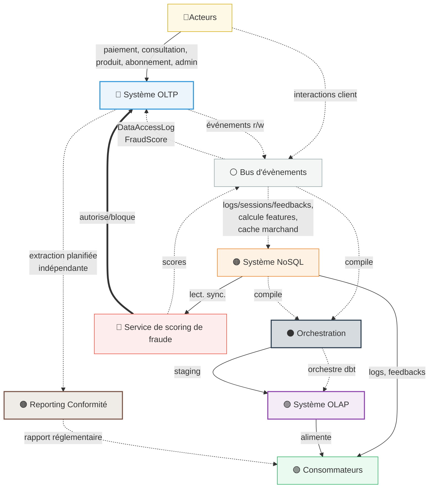

```mermaid
flowchart TB
    ACTORS["👤Acteurs"]
    OLTP_SYS["🔵 Système OLTP"]
    BUS["⚪ Bus d'évènements"]
    ORCHESTRATOR["⚫ Orchestration"]
    NOSQL_SYS["🟠 Système NoSQL"]
    OLAP_SYS["🟣 Système OLAP"]
    MLSYS["🔴 Service de scoring de fraude"]
    CONSUMERS["🟢 Consommateurs"]
    COMPLIANCE_REPORTING_PIPE["🟤 Reporting Conformité"]
    
    ACTORS -->|"paiement, consultation, produit, abonnement, admin"| OLTP_SYS
    ACTORS -.->|"interactions client"|BUS
    OLTP_SYS -.->|"événements r/w"| BUS
    
    BUS -.->|compile| ORCHESTRATOR
    BUS -.->|"logs/sessions/feedbacks,<br/>calcule features,<br>cache marchand"| NOSQL_SYS
    
        
    ORCHESTRATOR -.->|"orchestre dbt"| OLAP_SYS
    ORCHESTRATOR -->|"staging"| OLAP_SYS

    NOSQL_SYS -->|"lect. sync."| MLSYS
    NOSQL_SYS -->|"logs, feedbacks"| CONSUMERS
    NOSQL_SYS -.->|compile| ORCHESTRATOR
    MLSYS -.->|"scores"| BUS
    MLSYS ==>|"autorise/bloque"| OLTP_SYS
    
    OLAP_SYS -->|"alimente"| CONSUMERS

    BUS -.->|"DataAccessLog<br/>FraudScore"| OLTP_SYS
    
    OLTP_SYS -.->|extraction planifiée<br/>indépendante| COMPLIANCE_REPORTING_PIPE
    COMPLIANCE_REPORTING_PIPE -.->|"rapport réglementaire"| CONSUMERS
    
    style ACTORS fill:#FEF9E7,stroke:#D4AC0D,stroke-width:1px
    style OLTP_SYS fill:#EBF5FB,stroke:#3498DB,stroke-width:2px
    style BUS fill:#F4F6F6,stroke:#95A5A6,stroke-width:1px
    style NOSQL_SYS fill:#FDF2E3,stroke:#E67E22,stroke-width:1px
    style ORCHESTRATOR fill:#D6DBDF,stroke:#2C3E50,stroke-width:2px
    style OLAP_SYS fill:#F4ECF7,stroke:#8E44AD,stroke-width:2px
    style CONSUMERS fill:#EAFAF1,stroke:#27AE60,stroke-width:1px
    style MLSYS fill:#FDEDEC,stroke:#E74C3C,stroke-width:1px
    style COMPLIANCE_REPORTING_PIPE fill:#EFEBE6,stroke:#795548,stroke-width:2px
```