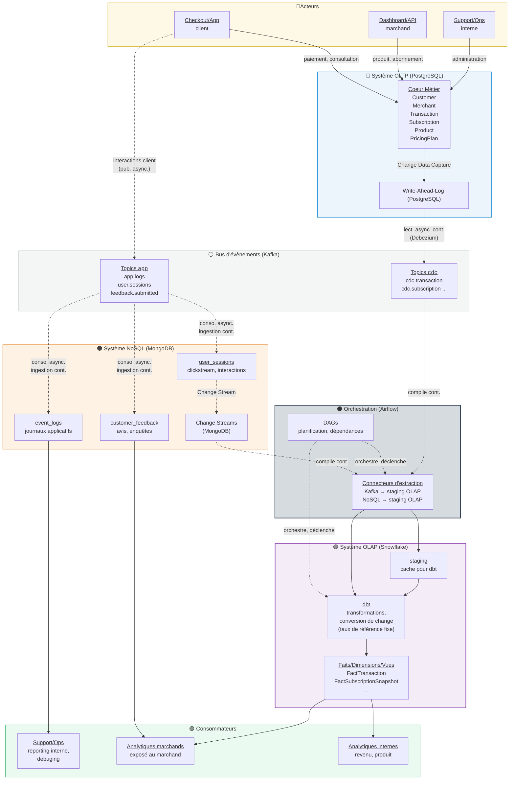

```mermaid
flowchart TB
    subgraph ACTORS["👤Acteurs"]
        S_CUSTOMER["<u>Checkout/App</u><br/>client"]
        S_MERCHANT["<u>Dashboard/API</u><br/>marchand"]
        S_ADMIN["<u>Support/Ops</u><br/>interne"]
    end
    
    subgraph OLTP_SYS["🔵 Système OLTP (PostgreSQL)"]
        OLTP_CORE["<u>Coeur Métier</u><br/>Customer<br/>Merchant<br/>Transaction<br/>Subscription<br/>Product<br/>PricingPlan"]
        OLTP_CDC["Write-Ahead-Log (PostgreSQL)"]
    end

    subgraph BUS["⚪ Bus d'évènements (Kafka)"]
        TOPIC_CDC["<u>Topics <code>cdc</code></u><br/>cdc.transaction<br/>cdc.subscription ..."]
        TOPIC_APP["<u>Topics <code>app</code></u><br/>app.logs<br/>user.sessions<br/>feedback.submitted"]
    end
    
    subgraph NOSQL_SYS["🟠 Système NoSQL (MongoDB)"]
	    NOSQL_LOGS["<u>event_logs</u><br/>journaux applicatifs"]
        NOSQL_FEEDBACK["<u>customer_feedback</u><br/>avis, enquêtes"]
        NOSQL_SESSIONS["<u>user_sessions</u><br/>clickstream, interactions"]
	    NOSQL_CS["<u>Change Streams</u><br/>(MongoDB)"]
    end

    subgraph ORCHESTRATOR["⚫ Orchestration (Airflow)"]
	    O_AIRFLOW["DAGs<br/>planification, dépendances"]
	    O_STAGING["<u>Connecteurs d'extraction</u><br/>Kafka → staging OLAP<br/>NoSQL → staging OLAP"]
    end

    subgraph OLAP_SYS["🟣 Système OLAP (Snowflake)"]
        OLAP_STAGING["<u>staging</u><br/>cache pour dbt"]
        OLAP_DBT["<u>dbt</u><br/>transformations,<br/>conversion de change<br/>(taux de référence fixe)"]
        OLAP_CORE_FACTS["<u>Faits/Dimensions/Vues</u><br/>FactTransaction<br/>FactSubscriptionSnapshot<br/>..."]
    end

    subgraph CONSUMERS["🟢 Consommateurs"]
        C_ADMIN["<u>Support/Ops</u><br/>reporting interne,<br/>debuging"]
        C_MERCHANTS["<u>Analytiques marchands</u><br/>exposé au marchand"]
        C_BUSINESS_TEAM["<u>Analytiques internes</u><br/>revenu, produit"]
    end

    S_CUSTOMER -->|paiement, consultation| OLTP_CORE
    S_MERCHANT -->|produit, abonnement| OLTP_CORE
    S_ADMIN -->|administration| OLTP_CORE
    
    S_CUSTOMER -.->|"interactions client<br/>(pub. async.)"| TOPIC_APP
    
    NOSQL_SESSIONS -.->|Change Stream| NOSQL_CS
    NOSQL_CS -.->|compile cont.| O_STAGING
    
    O_AIRFLOW -.->|"orchestre, déclenche"| O_STAGING   
    O_AIRFLOW -.->|"orchestre, déclenche"| OLAP_DBT  
    O_STAGING --> OLAP_DBT
    
    OLTP_CORE -.->|Change Data Capture| OLTP_CDC
    OLTP_CDC -.->|"lect. async. cont.<br/>(Debezium)"| TOPIC_CDC
    
    TOPIC_APP -.->|conso. async.<br/>ingestion cont.| NOSQL_FEEDBACK
    TOPIC_APP -.->|conso. async.<br/>ingestion cont.| NOSQL_LOGS
    TOPIC_APP -.->|conso. async.<br/>ingestion cont.| NOSQL_SESSIONS
    TOPIC_CDC -.->|compile cont.| O_STAGING
	        
    O_STAGING --> OLAP_STAGING
    OLAP_STAGING --> OLAP_DBT
    
    OLAP_DBT --> OLAP_CORE_FACTS

    NOSQL_LOGS --> C_ADMIN
    NOSQL_FEEDBACK --> C_MERCHANTS
    OLAP_CORE_FACTS --> C_MERCHANTS
    OLAP_CORE_FACTS --> C_BUSINESS_TEAM
    
    
    style ACTORS fill:#FEF9E7,stroke:#D4AC0D,stroke-width:1px
    style OLTP_SYS fill:#EBF5FB,stroke:#3498DB,stroke-width:2px
    style BUS fill:#F4F6F6,stroke:#95A5A6,stroke-width:1px
    style NOSQL_SYS fill:#FDF2E3,stroke:#E67E22,stroke-width:1px
    style ORCHESTRATOR fill:#D6DBDF,stroke:#2C3E50,stroke-width:2px
    style OLAP_SYS fill:#F4ECF7,stroke:#8E44AD,stroke-width:2px
    style CONSUMERS fill:#EAFAF1,stroke:#27AE60,stroke-width:1px
```