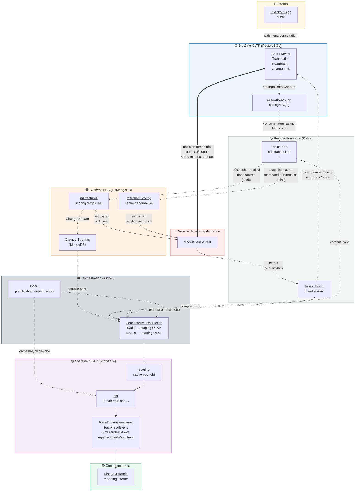

```mermaid
flowchart TB
    subgraph ACTORS["👤Acteurs"]
        S_CUSTOMER["<u>Checkout/App</u><br/>client"]
    end
    
    subgraph OLTP_SYS["🔵 Système OLTP (PostgreSQL)"]
        OLTP_CORE["<u>Coeur Métier</u><br/>Transaction<br/>FraudScore<br/>Chargeback<br/>..."]
        OLTP_CDC["Write-Ahead-Log (PostgreSQL)"]
    end
    
    subgraph BUS["⚪ Bus d'évènements (Kafka)"]
        TOPIC_CDC["<u>Topics <code>cdc</code></u><br/>cdc.transaction<br/>..."]
        TOPIC_FRAUD["<u>Topics <code>fraud</code></u><br/>fraud.scores"]
    end
    
    subgraph NOSQL_SYS["🟠 Système NoSQL (MongoDB)"]
        NOSQL_CS["<u>Change Streams</u><br/>(MongoDB)"]
        NOSQL_FEATURES["<u>ml_features</u><br/>scoring temps réel"]
        NOSQL_CONFIG["<u>merchant_config</u><br/>cache dénormalisé"]
    end
    
    subgraph ORCHESTRATOR["⚫ Orchestration (Airflow)"]
	    O_AIRFLOW["DAGs<br/>planification, dépendances"]
	    O_STAGING["<u>Connecteurs d'extraction</u><br/>Kafka → staging OLAP<br/>NoSQL → staging OLAP"]
    end
    
    subgraph OLAP_SYS["🟣 Système OLAP (Snowflake)"]
        OLAP_STAGING["<u>staging</u><br/>cache pour dbt"]
        OLAP_DBT["<u>dbt</u><br/>transformations ..."]    
        OLAP_FRAUD_FACTS["<u>Faits/Dimensions/vues</u><br/>FactFraudEvent<br/>DimFraudRiskLevel<br/>AggFraudDailyMerchant<br/>..."]
    end

    subgraph MLSYS["🔴 Service de scoring de fraude"]
        FRAUD_SVC["Modèle temps réel"]
    end
    
    subgraph CONSUMERS["🟢 Consommateurs"]
	    C_RISK_TEAM["<u>Risque & fraude</u><br/>reporting interne"]
    end
        
    S_CUSTOMER -->|paiement, consultation| OLTP_CORE
    
    OLTP_CORE -.->|Change Data Capture| OLTP_CDC
    
    OLTP_CDC -.->|"<u>consommateur async.</u><br/>lect. cont."| TOPIC_CDC

    NOSQL_FEATURES -.->|Change Stream| NOSQL_CS
	
	NOSQL_CS -.->|compile cont.| O_STAGING
	

    TOPIC_CDC -.->|"déclenche recalcul<br/>des features<br/>(Flink)"| NOSQL_FEATURES
    TOPIC_CDC -.->|"actualise cache<br/>marchand dénormalisé<br/>(Flink)"| NOSQL_CONFIG
    
    TOPIC_FRAUD -.->|compile cont.| O_STAGING
    TOPIC_CDC -.->|compile cont.| O_STAGING
	    
    O_AIRFLOW -.->|"orchestre, déclenche"| OLAP_DBT
    O_AIRFLOW -.->|"orchestre, déclenche"| O_STAGING       
    O_STAGING --> OLAP_STAGING
    OLAP_STAGING --> OLAP_DBT
    
    OLAP_DBT --> OLAP_FRAUD_FACTS
    
	NOSQL_FEATURES -->|lect. sync.<br/>< 10 ms| FRAUD_SVC
	NOSQL_CONFIG -->|lect. sync.<br/>seuils marchands| FRAUD_SVC

	FRAUD_SVC ==>|"<u>décision temps réel</u><br/>autorise/bloque<br/>< 100 ms bout en bout"| OLTP_CORE
	FRAUD_SVC -.->|"scores<br/>(pub. async.)"| TOPIC_FRAUD

    OLAP_FRAUD_FACTS --> C_RISK_TEAM

    TOPIC_FRAUD -.->|"<u>consommateur async.</u><br/>écr. FraudScore"| OLTP_CORE
    style ACTORS fill:#FEF9E7,stroke:#D4AC0D,stroke-width:1px
    style OLTP_SYS fill:#EBF5FB,stroke:#3498DB,stroke-width:2px
    style BUS fill:#F4F6F6,stroke:#95A5A6,stroke-width:1px
    style NOSQL_SYS fill:#FDF2E3,stroke:#E67E22,stroke-width:1px
    style ORCHESTRATOR fill:#D6DBDF,stroke:#2C3E50,stroke-width:2px
    style OLAP_SYS fill:#F4ECF7,stroke:#8E44AD,stroke-width:2px
    style CONSUMERS fill:#EAFAF1,stroke:#27AE60,stroke-width:1px
    style MLSYS fill:#FDEDEC,stroke:#E74C3C,stroke-width:1px
```