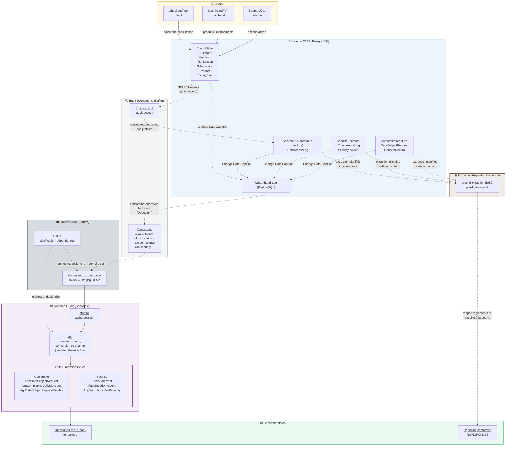

```mermaid
flowchart TB
    subgraph ACTORS["👤Acteurs"]
        S_CUSTOMER["<u>Checkout/App</u><br/>client"]
        S_MERCHANT["<u>Dashboard/API</u><br/>marchand"]
        S_ADMIN["<u>Support/Ops</u><br/>interne"]
    end
    
    subgraph OLTP_SYS["🔵 Système OLTP (PostgreSQL)"]
        OLTP_CORE["<u>Coeur Métier</u><br/>Customer<br/>Merchant<br/>Transaction<br/>Subscription<br/>Product<br/>PricingPlan"]
        OLTP_CDC["Write-Ahead-Log (PostgreSQL)"]
		OLTP_ACCESS["<u>Sécurité & Conformité</u> (lecture)<br/>DataAccessLog"]
		OLTP_SECURE["<u>Sécurité</u> (écriture)<br/>ChangeAuditLog<br/>SecurityIncident"]
		OLTP_COMPLY["<u>Conformité</u> (écriture)<br/>DataSubjectRequest<br/>ConsentRecord"]
    end
    
    subgraph BUS["⚪ Bus d'évènements (Kafka)"]
		TOPIC_CDC["<u>Topics <code>cdc</code></u><br/>cdc.transaction<br/>cdc.subscription<br/>cdc.compliance<br/>cdc.security ..."]
        TOPIC_AUDIT["<u>Topics <code>audit</code></u><br/>audit.access"]
    end
    
    subgraph ORCHESTRATOR["⚫ Orchestration (Airflow)"]
	    O_AIRFLOW["DAGs<br/>planification, dépendances"]
	    O_STAGING["<u>Connecteurs d'extraction</u><br/>Kafka → staging OLAP"]
    end
    
    subgraph OLAP_SYS["🟣 Système OLAP (Snowflake)"]
        subgraph OLAP_FACTS_SUBSYS["Faits/Dimensions/Vues"]
	        direction TB
	        OLAP_COMPLY_FACTS["<u>Conformité</u><br/>FactDataSubjectRequest<br/>AggComplianceDailyMerchant<br/>AggDataSubjectRequestMonthly<br/>..."]
	        OLAP_SECURE_FACTS["<u>Sécurité</u><br/>FactAuditEvent<br/>FactSecurityIncident<br/>AggSecurityIncidentMonthly<br/>..."]
	    end
        OLAP_STAGING["<u>staging</u><br/>cache pour dbt"]
        OLAP_DBT["<u>dbt</u><br/>transformations,<br/>conversion de change<br/>(taux de référence fixe)"]
        OLAP_FACTS_SUBSYS
    end
    
    subgraph CONSUMERS["🟢 Consommateurs"]
	    C_SECURITY_TEAM["<u>Analytiques séc. & conf.</u><br/>tendances"]
        C_COMPLIANCE_TEAM["<u>Reporting conformité</u><br/>RGPD/PCI-DSS"]
    end
      
    subgraph COMPLIANCE_REPORTING_PIPE["🟤 Extraction Reporting Conformité"]
	    CRP_EXTRACT["proc. d'extraction dédié,<br/>planification indé."]
    end
    
    S_CUSTOMER -->|paiement, consultation| OLTP_CORE
    S_MERCHANT -->|produits, abonnements| OLTP_CORE
    S_ADMIN -->|actions admin| OLTP_CORE
    
    OLTP_CORE -.->|"SELECT events<br/>(pub. async.)"| TOPIC_AUDIT
    
    OLTP_CORE -.->|Change Data Capture| OLTP_CDC
    OLTP_ACCESS -.->|Change Data Capture| OLTP_CDC
	OLTP_SECURE -.->|Change Data Capture| OLTP_CDC
	OLTP_COMPLY -.->|Change Data Capture| OLTP_CDC
    
    OLTP_CDC -.->|"<u>consommateur async.</u></br>lect. cont.<br/>(Debezium)"| TOPIC_CDC
	
	    
    O_AIRFLOW -.->|"orchestre, déclenche"| OLAP_DBT
    O_AIRFLOW -.->|"orchestre, déclenche"| O_STAGING   
    TOPIC_CDC -.->|compile cont.| O_STAGING    
    O_STAGING --> OLAP_STAGING
    OLAP_STAGING --> OLAP_DBT
    
    OLAP_DBT --> OLAP_FACTS_SUBSYS
    
    OLAP_FACTS_SUBSYS --> C_SECURITY_TEAM

    OLTP_ACCESS -.->|extraction planifiée<br/>indépendante| CRP_EXTRACT
    OLTP_SECURE -.->|extraction planifiée<br/>indépendante| CRP_EXTRACT
    OLTP_COMPLY -.->|extraction planifiée<br/>indépendante| CRP_EXTRACT
    CRP_EXTRACT -.->|rapport réglementaire,<br/>traçable à la source| C_COMPLIANCE_TEAM
    
    TOPIC_AUDIT -.->|"<u>consommateur async.</u><br/>écr. justifiée"| OLTP_ACCESS
    
    style ACTORS fill:#FEF9E7,stroke:#D4AC0D,stroke-width:1px
    style OLTP_SYS fill:#EBF5FB,stroke:#3498DB,stroke-width:2px
    style BUS fill:#F4F6F6,stroke:#95A5A6,stroke-width:1px
    style ORCHESTRATOR fill:#D6DBDF,stroke:#2C3E50,stroke-width:2px
    style OLAP_SYS fill:#F4ECF7,stroke:#8E44AD,stroke-width:2px
    style OLAP_FACTS_SUBSYS fill:#F4ECF7,stroke:#8E44AD,stroke-width:2px
    style CONSUMERS fill:#EAFAF1,stroke:#27AE60,stroke-width:1px  
    style COMPLIANCE_REPORTING_PIPE fill:#EFEBE6,stroke:#795548,stroke-width:2px
```