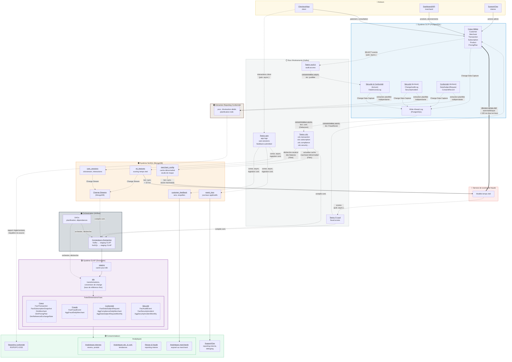

```mermaid
flowchart TB
    subgraph ACTORS["👤Acteurs"]
        S_CUSTOMER["<u>Checkout/App</u><br/>client"]
        S_MERCHANT["<u>Dashboard/API</u><br/>marchand"]
        S_ADMIN["<u>Support/Ops</u><br/>interne"]
    end
    
    subgraph OLTP_SYS["🔵 Système OLTP (PostgreSQL)"]
	    OLTP_CORE["<u>Coeur Métier</u><br/>Customer<br/>Merchant<br/>Transaction<br/>Subscription<br/>Product<br/>PricingPlan"]
        OLTP_CDC["Write-Ahead-Log (PostgreSQL)"]
		OLTP_ACCESS["<u>Sécurité & Conformité</u> (lecture)<br/>DataAccessLog"]
		OLTP_SECURE["<u>Sécurité</u> (écriture)<br/>ChangeAuditLog<br/>SecurityIncident"]
		OLTP_COMPLY["<u>Conformité</u> (écriture)<br/>DataSubjectRequest<br/>ConsentRecord"]
    end
    
    subgraph BUS["⚪ Bus d'évènements (Kafka)"]
        TOPIC_APP["<u>Topics <code>app</code></u><br/>app.logs<br/>user.sessions<br/>feedback.submitted"]
	    TOPIC_CDC["<u>Topics <code>cdc</code></u><br/>cdc.transaction<br/>cdc.subscription<br/>cdc.compliance<br/>cdc.security ..."]
		TOPIC_FRAUD["<u>Topics <code>fraud</code></u><br/>fraud.scores"]
        TOPIC_AUDIT["<u>Topics <code>audit</code></u><br/>audit.access"]
    end
    
    subgraph NOSQL_SYS["🟠 Système NoSQL (MongoDB)"]
	    NOSQL_CS["<u>Change Streams</u><br/>(MongoDB)"]
	    NOSQL_LOGS["<u>event_logs</u><br/>journaux applicatifs"]
		NOSQL_SESSIONS["<u>user_sessions</u><br/>clickstream, interactions"]
		NOSQL_FEATURES["<u>ml_features</u><br/>scoring temps réel"]
	    NOSQL_FEEDBACK["<u>customer_feedback</u><br/>avis, enquêtes"]
        NOSQL_CONFIG["<u>merchant_config</u><br/>cache dénormalisé<br/>seuils de risque"]
    end
    
    subgraph ORCHESTRATOR["⚫ Orchestration (Airflow)"]
	    O_AIRFLOW["DAGs<br/>planification, dépendances"]
	    O_STAGING["<u>Connecteurs d'extraction</u><br/>Kafka → staging OLAP<br/>NoSQL → staging OLAP"]
    end
    
    subgraph OLAP_SYS["🟣 Système OLAP (Snowflake)"]
        subgraph OLAP_FACTS_SUBSYS["Faits/Dimensions/Vues"]
	        direction TB
	        OLAP_CORE_FACTS["<u>Coeur</u><br/>FactTransaction<br/>FactSubscriptionSnapshot<br/>DimMerchant<br/>DimPricingPlan<br/>DimReferenceExchangeRate<br/>..."]
	        OLAP_FRAUD_FACTS["<u>Fraude</u><br/>FactFraudEvent<br/>AggFraudDailyMerchant<br/>..."]
	        OLAP_COMPLY_FACTS["<u>Conformité</u><br/>FactDataSubjectRequest<br/>AggComplianceDailyMerchant<br/>AggDataSubjectRequestMonthly<br/>..."]
	        OLAP_SECURE_FACTS["<u>Sécurité</u><br/>FactAuditEvent<br/>FactSecurityIncident<br/>AggSecurityIncidentMonthly<br/>..."]
	    end
        OLAP_STAGING["<u>staging</u><br/>cache pour dbt"]
        OLAP_DBT["<u>dbt</u><br/>transformations,<br/>conversion de change<br/>(taux de référence fixe)"]
        OLAP_FACTS_SUBSYS
    end

    subgraph MLSYS["🔴 Service de scoring de fraude"]
        FRAUD_SVC["Modèle temps réel"]
    end
    
    subgraph CONSUMERS["🟢 Consommateurs"]
	    subgraph ANALYTICS_CONSUMERS["Analytiques"]
	        C_BUSINESS_TEAM["<u>Analytiques internes</u><br/>revenu, produit"]
	        C_SECURITY_TEAM["<u>Analytiques séc. & conf.</u><br/>tendances"]
	        C_RISK_TEAM["<u>Risque & fraude</u><br/>reporting interne"]
	        C_MERCHANTS["<u>Analytiques marchands</u><br/>exposé au marchand"]
	    end
    
        C_ADMIN["<u>Support/Ops</u><br/>reporting interne,<br/>debuging"]
        ANALYTICS_CONSUMERS
        C_COMPLIANCE_TEAM["<u>Reporting conformité</u><br/>RGPD/PCI-DSS"]
    end
      
    subgraph COMPLIANCE_REPORTING_PIPE["🟤 Extraction Reporting Conformité"]
	    CRP_EXTRACT["proc. d'extraction dédié,<br/>planification indé."]
    end
    
    S_CUSTOMER -.->|"interactions client<br/>(pub. async.)"| TOPIC_APP
    
    S_CUSTOMER -->|paiement, consultation| OLTP_CORE
    S_MERCHANT -->|produits, abonnements| OLTP_CORE
    S_ADMIN -->|actions admin| OLTP_CORE
    
    OLTP_CORE -.->|"SELECT events<br/>(pub. async.)"| TOPIC_AUDIT
    
    OLTP_CORE -.->|Change Data Capture| OLTP_CDC
    OLTP_ACCESS -.->|Change Data Capture| OLTP_CDC
    OLTP_SECURE -.->|Change Data Capture| OLTP_CDC
    OLTP_COMPLY -.->|Change Data Capture| OLTP_CDC
    
    OLTP_CDC -.->|"<u>consommateur async.</u></br>lect. cont.<br/>(Debezium)"| TOPIC_CDC
    
    NOSQL_FEATURES -.->|Change Stream| NOSQL_CS
    NOSQL_SESSIONS -.->|Change Stream| NOSQL_CS
	
	NOSQL_CS -.->|compile cont.| O_STAGING
	
    TOPIC_APP -.->|conso. async.<br/>ingestion cont.| NOSQL_FEEDBACK
    TOPIC_APP -.->|conso. async.<br/>ingestion cont.| NOSQL_LOGS
    TOPIC_APP -.->|conso. async.<br/>ingestion cont.| NOSQL_SESSIONS
    TOPIC_CDC -.->|"déclenche recalcul<br/>des features<br/>(Flink)"| NOSQL_FEATURES
    TOPIC_CDC -.->|"actualise cache<br/>marchand dénormalisé<br/>(Flink)"| NOSQL_CONFIG
    
    TOPIC_FRAUD -.->|compile cont.| O_STAGING
    TOPIC_CDC -.->|compile cont.| O_STAGING
	    
    O_AIRFLOW -.->|"orchestre, déclenche"| OLAP_DBT
    O_AIRFLOW -.->|"orchestre, déclenche"| O_STAGING       
    O_STAGING --> OLAP_STAGING
    OLAP_STAGING --> OLAP_DBT
    
    OLAP_DBT --> OLAP_FACTS_SUBSYS
    
	NOSQL_FEATURES -->|lect. sync.<br/>< 10 ms| FRAUD_SVC
	NOSQL_CONFIG -->|lect. sync.<br/>seuils marchands| FRAUD_SVC

	FRAUD_SVC ==>|"<u>décision temps réel</u><br/>autorise/bloque<br/>< 100 ms bout en bout"| OLTP_CORE
	FRAUD_SVC -.->|"scores<br/>(pub. async.)"| TOPIC_FRAUD

	NOSQL_FEEDBACK --> C_MERCHANTS
	NOSQL_LOGS --> C_ADMIN
    
    OLAP_FACTS_SUBSYS --> ANALYTICS_CONSUMERS

    OLTP_ACCESS -.->|extraction planifiée<br/>indépendante| CRP_EXTRACT
    OLTP_SECURE -.->|extraction planifiée<br/>indépendante| CRP_EXTRACT
    OLTP_COMPLY -.->|extraction planifiée<br/>indépendante| CRP_EXTRACT
    CRP_EXTRACT -.->|rapport réglementaire,<br/>traçable à la source| C_COMPLIANCE_TEAM
    
    TOPIC_FRAUD -.->|"<u>consommateur async.</u><br/>écr. FraudScore"| OLTP_CORE
    TOPIC_AUDIT -.->|"<u>consommateur async.</u><br/>écr. justifiée"| OLTP_ACCESS
    
    style ACTORS fill:#FEF9E7,stroke:#D4AC0D,stroke-width:1px
    style OLTP_SYS fill:#EBF5FB,stroke:#3498DB,stroke-width:2px
    style BUS fill:#F4F6F6,stroke:#95A5A6,stroke-width:1px
    style NOSQL_SYS fill:#FDF2E3,stroke:#E67E22,stroke-width:1px
    style ORCHESTRATOR fill:#D6DBDF,stroke:#2C3E50,stroke-width:2px
    style OLAP_SYS fill:#F4ECF7,stroke:#8E44AD,stroke-width:2px
    style OLAP_FACTS_SUBSYS fill:#F4ECF7,stroke:#8E44AD,stroke-width:2px
    style CONSUMERS fill:#EAFAF1,stroke:#27AE60,stroke-width:1px
    style ANALYTICS_CONSUMERS fill:#EAFAF1,stroke:#27AE60,stroke-width:1px
    style MLSYS fill:#FDEDEC,stroke:#E74C3C,stroke-width:1px    
    style COMPLIANCE_REPORTING_PIPE fill:#EFEBE6,stroke:#795548,stroke-width:2px
```